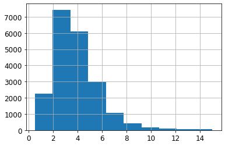

```python
# Python ≥3.5 is required
import sys
assert sys.version_info >= (3, 5)

# Scikit-Learn ≥0.20 is required
import sklearn
assert sklearn.__version__ >= "0.20"

# Common imports
import numpy as np
import os

# To plot pretty figures
%matplotlib inline
import matplotlib as mpl
import matplotlib.pyplot as plt
mpl.rc('axes', labelsize=14)
mpl.rc('xtick', labelsize=12)
mpl.rc('ytick', labelsize=12)

# Where to save the figures
IMAGES_PATH = r"E:\Jupyter\handson-ml2\images\end_to_end_project"
os.makedirs(IMAGES_PATH, exist_ok=True)

def save_fig(fig_id, tight_layout=True, fig_extension="png", resolution=300):
    path = os.path.join(IMAGES_PATH, fig_id + "." + fig_extension)
    print("Saving figure", fig_id)
    if tight_layout:
        plt.tight_layout()
    plt.savefig(path, format=fig_extension, dpi=resolution)

# Ignore useless warnings (see SciPy issue #5998)
import warnings
warnings.filterwarnings(action="ignore", message="^internal gelsd")
```

# 一、获取数据


```python
import pandas as pd
HOUSING_PATH=r'E:\Jupyter\handson-ml2\datasets\housing'
def load_housing_data(housing_path=HOUSING_PATH):
    csv_path = os.path.join(housing_path, "housing.csv")
    return pd.read_csv(csv_path)
```

## 1.快速查看数据结构


```python
housing = load_housing_data()
housing.head()
```


<div>
<style scoped>
    .dataframe tbody tr th:only-of-type {
        vertical-align: middle;
    }

    .dataframe tbody tr th {
        vertical-align: top;
    }

    .dataframe thead th {
        text-align: right;
    }
</style>
<table border="1" class="dataframe">
  <thead>
    <tr style="text-align: right;">
      <th></th>
      <th>longitude</th>
      <th>latitude</th>
      <th>housing_median_age</th>
      <th>total_rooms</th>
      <th>total_bedrooms</th>
      <th>population</th>
      <th>households</th>
      <th>median_income</th>
      <th>median_house_value</th>
      <th>ocean_proximity</th>
    </tr>
  </thead>
  <tbody>
    <tr>
      <th>0</th>
      <td>-122.23</td>
      <td>37.88</td>
      <td>41.0</td>
      <td>880.0</td>
      <td>129.0</td>
      <td>322.0</td>
      <td>126.0</td>
      <td>8.3252</td>
      <td>452600.0</td>
      <td>NEAR BAY</td>
    </tr>
    <tr>
      <th>1</th>
      <td>-122.22</td>
      <td>37.86</td>
      <td>21.0</td>
      <td>7099.0</td>
      <td>1106.0</td>
      <td>2401.0</td>
      <td>1138.0</td>
      <td>8.3014</td>
      <td>358500.0</td>
      <td>NEAR BAY</td>
    </tr>
    <tr>
      <th>2</th>
      <td>-122.24</td>
      <td>37.85</td>
      <td>52.0</td>
      <td>1467.0</td>
      <td>190.0</td>
      <td>496.0</td>
      <td>177.0</td>
      <td>7.2574</td>
      <td>352100.0</td>
      <td>NEAR BAY</td>
    </tr>
    <tr>
      <th>3</th>
      <td>-122.25</td>
      <td>37.85</td>
      <td>52.0</td>
      <td>1274.0</td>
      <td>235.0</td>
      <td>558.0</td>
      <td>219.0</td>
      <td>5.6431</td>
      <td>341300.0</td>
      <td>NEAR BAY</td>
    </tr>
    <tr>
      <th>4</th>
      <td>-122.25</td>
      <td>37.85</td>
      <td>52.0</td>
      <td>1627.0</td>
      <td>280.0</td>
      <td>565.0</td>
      <td>259.0</td>
      <td>3.8462</td>
      <td>342200.0</td>
      <td>NEAR BAY</td>
    </tr>
  </tbody>
</table>
</div>


```python
housing.info()
```

    <class 'pandas.core.frame.DataFrame'>
    RangeIndex: 20640 entries, 0 to 20639
    Data columns (total 10 columns):
     #   Column              Non-Null Count  Dtype  
    ---  ------              --------------  -----  
     0   longitude           20640 non-null  float64
     1   latitude            20640 non-null  float64
     2   housing_median_age  20640 non-null  float64
     3   total_rooms         20640 non-null  float64
     4   total_bedrooms      20433 non-null  float64
     5   population          20640 non-null  float64
     6   households          20640 non-null  float64
     7   median_income       20640 non-null  float64
     8   median_house_value  20640 non-null  float64
     9   ocean_proximity     20640 non-null  object 
    dtypes: float64(9), object(1)
    memory usage: 1.6+ MB
    


```python
housing["ocean_proximity"].value_counts()
```


    <1H OCEAN     9136
    INLAND        6551
    NEAR OCEAN    2658
    NEAR BAY      2290
    ISLAND           5
    Name: ocean_proximity, dtype: int64


```python
housing.describe()
```


<div>
<style scoped>
    .dataframe tbody tr th:only-of-type {
        vertical-align: middle;
    }

    .dataframe tbody tr th {
        vertical-align: top;
    }

    .dataframe thead th {
        text-align: right;
    }
</style>
<table border="1" class="dataframe">
  <thead>
    <tr style="text-align: right;">
      <th></th>
      <th>longitude</th>
      <th>latitude</th>
      <th>housing_median_age</th>
      <th>total_rooms</th>
      <th>total_bedrooms</th>
      <th>population</th>
      <th>households</th>
      <th>median_income</th>
      <th>median_house_value</th>
    </tr>
  </thead>
  <tbody>
    <tr>
      <th>count</th>
      <td>20640.000000</td>
      <td>20640.000000</td>
      <td>20640.000000</td>
      <td>20640.000000</td>
      <td>20433.000000</td>
      <td>20640.000000</td>
      <td>20640.000000</td>
      <td>20640.000000</td>
      <td>20640.000000</td>
    </tr>
    <tr>
      <th>mean</th>
      <td>-119.569704</td>
      <td>35.631861</td>
      <td>28.639486</td>
      <td>2635.763081</td>
      <td>537.870553</td>
      <td>1425.476744</td>
      <td>499.539680</td>
      <td>3.870671</td>
      <td>206855.816909</td>
    </tr>
    <tr>
      <th>std</th>
      <td>2.003532</td>
      <td>2.135952</td>
      <td>12.585558</td>
      <td>2181.615252</td>
      <td>421.385070</td>
      <td>1132.462122</td>
      <td>382.329753</td>
      <td>1.899822</td>
      <td>115395.615874</td>
    </tr>
    <tr>
      <th>min</th>
      <td>-124.350000</td>
      <td>32.540000</td>
      <td>1.000000</td>
      <td>2.000000</td>
      <td>1.000000</td>
      <td>3.000000</td>
      <td>1.000000</td>
      <td>0.499900</td>
      <td>14999.000000</td>
    </tr>
    <tr>
      <th>25%</th>
      <td>-121.800000</td>
      <td>33.930000</td>
      <td>18.000000</td>
      <td>1447.750000</td>
      <td>296.000000</td>
      <td>787.000000</td>
      <td>280.000000</td>
      <td>2.563400</td>
      <td>119600.000000</td>
    </tr>
    <tr>
      <th>50%</th>
      <td>-118.490000</td>
      <td>34.260000</td>
      <td>29.000000</td>
      <td>2127.000000</td>
      <td>435.000000</td>
      <td>1166.000000</td>
      <td>409.000000</td>
      <td>3.534800</td>
      <td>179700.000000</td>
    </tr>
    <tr>
      <th>75%</th>
      <td>-118.010000</td>
      <td>37.710000</td>
      <td>37.000000</td>
      <td>3148.000000</td>
      <td>647.000000</td>
      <td>1725.000000</td>
      <td>605.000000</td>
      <td>4.743250</td>
      <td>264725.000000</td>
    </tr>
    <tr>
      <th>max</th>
      <td>-114.310000</td>
      <td>41.950000</td>
      <td>52.000000</td>
      <td>39320.000000</td>
      <td>6445.000000</td>
      <td>35682.000000</td>
      <td>6082.000000</td>
      <td>15.000100</td>
      <td>500001.000000</td>
    </tr>
  </tbody>
</table>
</div>


```python
%matplotlib inline
import matplotlib.pyplot as plt
housing.hist(bins=50, figsize=(20,15))
save_fig("attribute_histogram_plots")
plt.show()
```

    Saving figure attribute_histogram_plots
    


## 2.创建测试集

### ①自己构造train_test_split与随机数


```python
import numpy as np
np.random.seed(42)

def split_train_test(data,test_ratio):
    shuffled_indices = np.random.permutation(len(data))
    test_set_size = int(len(data) * test_ratio)
    test_indices = shuffled_indices[:test_set_size]
    train_indices = shuffled_indices[test_set_size:]
    return data.iloc[train_indices],data.iloc[test_indices]

train_set,test_set = split_train_test(housing,0.2)
print(len(train_set))
print(len(test_set))
```

    16512
    4128
    

目前虽然可以正确分割，但若再运行一遍且删掉seed，会产生一个不同的数据集。

为了避免这种情况，解决方案有如下几点：

1.第一次运行程序后即保存测试集。

2.调用`np.random.premutation()`前设置随机数生成的种子。

但是这两种解决方案在下一次获取更新的数据时都会中断。为了即使在更新数据集之后也有一个稳定的训练测试分割，常用方法是每个实例都使用一个标识符来决定是否进入测试集（假设每个实例都有一个**唯一且不变**的标识符）。例如，先计算每个实例标识符的hash值。若hash值小于等于最大哈希值的20%，则将该实例放入测试集。

至于标识符列，可以选择使用行索引，也可以使用最稳定的特征，例如经纬度。


```python
from zlib import crc32

def test_set_check(identifier, test_ratio):
    return crc32(np.int64(identifier)) & 0xffffffff < test_ratio * 2**32

def split_train_test_by_id(data, test_ratio, id_column):
    ids = data[id_column]
    in_test_set = ids.apply(lambda id_: test_set_check(id_, test_ratio))
    return data.loc[~in_test_set], data.loc[in_test_set]

housing_with_id= housing.reset_index()   # adds an `index` column
train_set1, test_set1 = split_train_test_by_id(housing_with_id, 0.2, "index")
```


```python
test_set.head()
```


<div>
<style scoped>
    .dataframe tbody tr th:only-of-type {
        vertical-align: middle;
    }

    .dataframe tbody tr th {
        vertical-align: top;
    }

    .dataframe thead th {
        text-align: right;
    }
</style>
<table border="1" class="dataframe">
  <thead>
    <tr style="text-align: right;">
      <th></th>
      <th>longitude</th>
      <th>latitude</th>
      <th>housing_median_age</th>
      <th>total_rooms</th>
      <th>total_bedrooms</th>
      <th>population</th>
      <th>households</th>
      <th>median_income</th>
      <th>median_house_value</th>
      <th>ocean_proximity</th>
    </tr>
  </thead>
  <tbody>
    <tr>
      <th>20046</th>
      <td>-119.01</td>
      <td>36.06</td>
      <td>25.0</td>
      <td>1505.0</td>
      <td>NaN</td>
      <td>1392.0</td>
      <td>359.0</td>
      <td>1.6812</td>
      <td>47700.0</td>
      <td>INLAND</td>
    </tr>
    <tr>
      <th>3024</th>
      <td>-119.46</td>
      <td>35.14</td>
      <td>30.0</td>
      <td>2943.0</td>
      <td>NaN</td>
      <td>1565.0</td>
      <td>584.0</td>
      <td>2.5313</td>
      <td>45800.0</td>
      <td>INLAND</td>
    </tr>
    <tr>
      <th>15663</th>
      <td>-122.44</td>
      <td>37.80</td>
      <td>52.0</td>
      <td>3830.0</td>
      <td>NaN</td>
      <td>1310.0</td>
      <td>963.0</td>
      <td>3.4801</td>
      <td>500001.0</td>
      <td>NEAR BAY</td>
    </tr>
    <tr>
      <th>20484</th>
      <td>-118.72</td>
      <td>34.28</td>
      <td>17.0</td>
      <td>3051.0</td>
      <td>NaN</td>
      <td>1705.0</td>
      <td>495.0</td>
      <td>5.7376</td>
      <td>218600.0</td>
      <td>&lt;1H OCEAN</td>
    </tr>
    <tr>
      <th>9814</th>
      <td>-121.93</td>
      <td>36.62</td>
      <td>34.0</td>
      <td>2351.0</td>
      <td>NaN</td>
      <td>1063.0</td>
      <td>428.0</td>
      <td>3.7250</td>
      <td>278000.0</td>
      <td>NEAR OCEAN</td>
    </tr>
  </tbody>
</table>
</div>


```python
test_set1.head()
```


<div>
<style scoped>
    .dataframe tbody tr th:only-of-type {
        vertical-align: middle;
    }

    .dataframe tbody tr th {
        vertical-align: top;
    }

    .dataframe thead th {
        text-align: right;
    }
</style>
<table border="1" class="dataframe">
  <thead>
    <tr style="text-align: right;">
      <th></th>
      <th>index</th>
      <th>longitude</th>
      <th>latitude</th>
      <th>housing_median_age</th>
      <th>total_rooms</th>
      <th>total_bedrooms</th>
      <th>population</th>
      <th>households</th>
      <th>median_income</th>
      <th>median_house_value</th>
      <th>ocean_proximity</th>
    </tr>
  </thead>
  <tbody>
    <tr>
      <th>2</th>
      <td>2</td>
      <td>-122.24</td>
      <td>37.85</td>
      <td>52.0</td>
      <td>1467.0</td>
      <td>190.0</td>
      <td>496.0</td>
      <td>177.0</td>
      <td>7.2574</td>
      <td>352100.0</td>
      <td>NEAR BAY</td>
    </tr>
    <tr>
      <th>5</th>
      <td>5</td>
      <td>-122.25</td>
      <td>37.85</td>
      <td>52.0</td>
      <td>919.0</td>
      <td>213.0</td>
      <td>413.0</td>
      <td>193.0</td>
      <td>4.0368</td>
      <td>269700.0</td>
      <td>NEAR BAY</td>
    </tr>
    <tr>
      <th>12</th>
      <td>12</td>
      <td>-122.26</td>
      <td>37.85</td>
      <td>52.0</td>
      <td>2491.0</td>
      <td>474.0</td>
      <td>1098.0</td>
      <td>468.0</td>
      <td>3.0750</td>
      <td>213500.0</td>
      <td>NEAR BAY</td>
    </tr>
    <tr>
      <th>16</th>
      <td>16</td>
      <td>-122.27</td>
      <td>37.85</td>
      <td>52.0</td>
      <td>1966.0</td>
      <td>347.0</td>
      <td>793.0</td>
      <td>331.0</td>
      <td>2.7750</td>
      <td>152500.0</td>
      <td>NEAR BAY</td>
    </tr>
    <tr>
      <th>23</th>
      <td>23</td>
      <td>-122.27</td>
      <td>37.84</td>
      <td>52.0</td>
      <td>1688.0</td>
      <td>337.0</td>
      <td>853.0</td>
      <td>325.0</td>
      <td>2.1806</td>
      <td>99700.0</td>
      <td>NEAR BAY</td>
    </tr>
  </tbody>
</table>
</div>


```python
housing_with_id["id"] = housing["longitude"] * 1000 + housing["latitude"]
train_set2, test_set2 = split_train_test_by_id(housing_with_id, 0.2, "id")
test_set2.head()
```


<div>
<style scoped>
    .dataframe tbody tr th:only-of-type {
        vertical-align: middle;
    }

    .dataframe tbody tr th {
        vertical-align: top;
    }

    .dataframe thead th {
        text-align: right;
    }
</style>
<table border="1" class="dataframe">
  <thead>
    <tr style="text-align: right;">
      <th></th>
      <th>index</th>
      <th>longitude</th>
      <th>latitude</th>
      <th>housing_median_age</th>
      <th>total_rooms</th>
      <th>total_bedrooms</th>
      <th>population</th>
      <th>households</th>
      <th>median_income</th>
      <th>median_house_value</th>
      <th>ocean_proximity</th>
      <th>id</th>
    </tr>
  </thead>
  <tbody>
    <tr>
      <th>59</th>
      <td>59</td>
      <td>-122.29</td>
      <td>37.82</td>
      <td>2.0</td>
      <td>158.0</td>
      <td>43.0</td>
      <td>94.0</td>
      <td>57.0</td>
      <td>2.5625</td>
      <td>60000.0</td>
      <td>NEAR BAY</td>
      <td>-122252.18</td>
    </tr>
    <tr>
      <th>60</th>
      <td>60</td>
      <td>-122.29</td>
      <td>37.83</td>
      <td>52.0</td>
      <td>1121.0</td>
      <td>211.0</td>
      <td>554.0</td>
      <td>187.0</td>
      <td>3.3929</td>
      <td>75700.0</td>
      <td>NEAR BAY</td>
      <td>-122252.17</td>
    </tr>
    <tr>
      <th>61</th>
      <td>61</td>
      <td>-122.29</td>
      <td>37.82</td>
      <td>49.0</td>
      <td>135.0</td>
      <td>29.0</td>
      <td>86.0</td>
      <td>23.0</td>
      <td>6.1183</td>
      <td>75000.0</td>
      <td>NEAR BAY</td>
      <td>-122252.18</td>
    </tr>
    <tr>
      <th>62</th>
      <td>62</td>
      <td>-122.29</td>
      <td>37.81</td>
      <td>50.0</td>
      <td>760.0</td>
      <td>190.0</td>
      <td>377.0</td>
      <td>122.0</td>
      <td>0.9011</td>
      <td>86100.0</td>
      <td>NEAR BAY</td>
      <td>-122252.19</td>
    </tr>
    <tr>
      <th>67</th>
      <td>67</td>
      <td>-122.29</td>
      <td>37.80</td>
      <td>52.0</td>
      <td>1027.0</td>
      <td>244.0</td>
      <td>492.0</td>
      <td>147.0</td>
      <td>2.6094</td>
      <td>81300.0</td>
      <td>NEAR BAY</td>
      <td>-122252.20</td>
    </tr>
  </tbody>
</table>
</div>


### ②sklearn中的train_test_split


```python
from sklearn.model_selection import train_test_split

train_set,test_set = train_test_split(housing,test_size=0.2,random_state=42)
test_set.head()
```


<div>
<style scoped>
    .dataframe tbody tr th:only-of-type {
        vertical-align: middle;
    }

    .dataframe tbody tr th {
        vertical-align: top;
    }

    .dataframe thead th {
        text-align: right;
    }
</style>
<table border="1" class="dataframe">
  <thead>
    <tr style="text-align: right;">
      <th></th>
      <th>longitude</th>
      <th>latitude</th>
      <th>housing_median_age</th>
      <th>total_rooms</th>
      <th>total_bedrooms</th>
      <th>population</th>
      <th>households</th>
      <th>median_income</th>
      <th>median_house_value</th>
      <th>ocean_proximity</th>
    </tr>
  </thead>
  <tbody>
    <tr>
      <th>20046</th>
      <td>-119.01</td>
      <td>36.06</td>
      <td>25.0</td>
      <td>1505.0</td>
      <td>NaN</td>
      <td>1392.0</td>
      <td>359.0</td>
      <td>1.6812</td>
      <td>47700.0</td>
      <td>INLAND</td>
    </tr>
    <tr>
      <th>3024</th>
      <td>-119.46</td>
      <td>35.14</td>
      <td>30.0</td>
      <td>2943.0</td>
      <td>NaN</td>
      <td>1565.0</td>
      <td>584.0</td>
      <td>2.5313</td>
      <td>45800.0</td>
      <td>INLAND</td>
    </tr>
    <tr>
      <th>15663</th>
      <td>-122.44</td>
      <td>37.80</td>
      <td>52.0</td>
      <td>3830.0</td>
      <td>NaN</td>
      <td>1310.0</td>
      <td>963.0</td>
      <td>3.4801</td>
      <td>500001.0</td>
      <td>NEAR BAY</td>
    </tr>
    <tr>
      <th>20484</th>
      <td>-118.72</td>
      <td>34.28</td>
      <td>17.0</td>
      <td>3051.0</td>
      <td>NaN</td>
      <td>1705.0</td>
      <td>495.0</td>
      <td>5.7376</td>
      <td>218600.0</td>
      <td>&lt;1H OCEAN</td>
    </tr>
    <tr>
      <th>9814</th>
      <td>-121.93</td>
      <td>36.62</td>
      <td>34.0</td>
      <td>2351.0</td>
      <td>NaN</td>
      <td>1063.0</td>
      <td>428.0</td>
      <td>3.7250</td>
      <td>278000.0</td>
      <td>NEAR OCEAN</td>
    </tr>
  </tbody>
</table>
</div>


```python
housing['median_income'].hist()
plt.show()
```





目前为止，以及思考过纯随机的抽样方法，但如果数据集不够大，会有可能导致明显的抽样偏差。我们可以尝试分层抽样。


```python
housing["income_cat"] = pd.cut(housing["median_income"],
                           bins=[0.,1.5,3.0,4.5,6.,np.inf],
                           labels=[1,2,3,4,5])

housing["income_cat"].hist()
```


    <matplotlib.axes._subplots.AxesSubplot at 0x22b4dda8910>


```python
housing["income_cat"].value_counts()
```


    3    7236
    2    6581
    4    3639
    5    2362
    1     822
    Name: income_cat, dtype: int64


现在就可以根据收入类别进行分层抽样了。


```python
from sklearn.model_selection import StratifiedShuffleSplit
#分层随机分割交叉验证器可以将数据分割为训练集和测试集，
#不过它只提供训练集/测试集数据在原始数据集中的位置索引。

split = StratifiedShuffleSplit(n_splits=1,test_size=0.2,random_state=42)
for train_index,test_index in split.split(housing,housing["income_cat"]):
    strat_train_set = housing.loc[train_index]
    strat_test_set = housing.loc[test_index]
    
strat_train_set["income_cat"].value_counts()/len(strat_train_set)
```


    3    0.350594
    2    0.318859
    4    0.176296
    5    0.114402
    1    0.039850
    Name: income_cat, dtype: float64


```python
housing["income_cat"].value_counts() / len(housing)
```


    3    0.350581
    2    0.318847
    4    0.176308
    5    0.114438
    1    0.039826
    Name: income_cat, dtype: float64


```python
def income_cat_proportions(data):
    return data["income_cat"].value_counts() / len(data)

train_set, test_set = train_test_split(housing, test_size=0.2, random_state=42)

compare_props = pd.DataFrame({
    "Overall":income_cat_proportions(housing),
    "Stratified":income_cat_proportions(strat_train_set),
    "Random":income_cat_proportions(test_set),
}).sort_index()

compare_props["Rand. %error"] = 100 * compare_props["Random"] / compare_props["Overall"] - 100
compare_props["Strat. %error"] = 100 * compare_props["Stratified"] / compare_props["Overall"] - 100

compare_props
```


<div>
<style scoped>
    .dataframe tbody tr th:only-of-type {
        vertical-align: middle;
    }

    .dataframe tbody tr th {
        vertical-align: top;
    }

    .dataframe thead th {
        text-align: right;
    }
</style>
<table border="1" class="dataframe">
  <thead>
    <tr style="text-align: right;">
      <th></th>
      <th>Overall</th>
      <th>Stratified</th>
      <th>Random</th>
      <th>Rand. %error</th>
      <th>Strat. %error</th>
    </tr>
  </thead>
  <tbody>
    <tr>
      <th>1</th>
      <td>0.039826</td>
      <td>0.039850</td>
      <td>0.040213</td>
      <td>0.973236</td>
      <td>0.060827</td>
    </tr>
    <tr>
      <th>2</th>
      <td>0.318847</td>
      <td>0.318859</td>
      <td>0.324370</td>
      <td>1.732260</td>
      <td>0.003799</td>
    </tr>
    <tr>
      <th>3</th>
      <td>0.350581</td>
      <td>0.350594</td>
      <td>0.358527</td>
      <td>2.266446</td>
      <td>0.003455</td>
    </tr>
    <tr>
      <th>4</th>
      <td>0.176308</td>
      <td>0.176296</td>
      <td>0.167393</td>
      <td>-5.056334</td>
      <td>-0.006870</td>
    </tr>
    <tr>
      <th>5</th>
      <td>0.114438</td>
      <td>0.114402</td>
      <td>0.109496</td>
      <td>-4.318374</td>
      <td>-0.031753</td>
    </tr>
  </tbody>
</table>
</div>


由此可见，分层抽样的测试集中的比例分布与完整数据集中的分布几乎一致，而纯随机抽样的测试集结果则是有偏的。

现在就可以删除`income_cat`属性，将数据恢复原样了。


```python
for set_ in (strat_train_set, strat_test_set):
    set_.drop("income_cat", axis=1, inplace=True)
```

# 二、从数据探索和可视化中获得洞见

首先创建一个副本，这样可以随便尝试而不损害训练集


```python
housing = strat_train_set.copy()
```

## 1.将地理数据可视化


```python
housing.plot(kind="scatter",x="longitude",y="latitude")
```


    <matplotlib.axes._subplots.AxesSubplot at 0x22b4de9cc10>


将`alpha`设为0.1,可以更清楚地看出高密度数据点的位置


```python
housing.plot(kind="scatter",x="longitude",y="latitude",alpha=0.1)
save_fig("better_visualization_plot")
```

    Saving figure better_visualization_plot
    


每个圆的半径大小代表了每个区域的人口数量（选项s），颜色代表价格（选项c）。我们使用一个名为jet的预定义颜色表（选项cmap）来进行可视化，颜色范围从蓝（低）到红（高）。


```python
housing.plot(kind="scatter", x="longitude", y="latitude", alpha=0.4,
    s=housing["population"]/100, label="population", figsize=(10,7),
    c="median_house_value", cmap=plt.get_cmap("jet"), colorbar=True,
    sharex=False)
plt.legend()
save_fig("housing_prices_scatterplot")
```

    Saving figure housing_prices_scatterplot
    


```python
import matplotlib.image as mpimg
california_img=mpimg.imread(r"E:\Jupyter\handson-ml2\images\end_to_end_project\california.png")
ax = housing.plot(kind="scatter", x="longitude", y="latitude", figsize=(10,7),
                       s=housing['population']/100, label="Population",
                       c="median_house_value", cmap=plt.get_cmap("jet"),
                       colorbar=False, alpha=0.4,
                      )
plt.imshow(california_img, extent=[-124.55, -113.80, 32.45, 42.05], alpha=0.5,
           cmap=plt.get_cmap("jet"))
plt.ylabel("Latitude", fontsize=14)
plt.xlabel("Longitude", fontsize=14)

prices = housing["median_house_value"]
tick_values = np.linspace(prices.min(), prices.max(), 11)
cbar = plt.colorbar(ticks=tick_values/prices.max())
cbar.ax.set_yticklabels(["$%dk"%(round(v/1000)) for v in tick_values], fontsize=14)
cbar.set_label('Median House Value', fontsize=16)

plt.legend(fontsize=16)
save_fig("california_housing_prices_plot")
plt.show()
```

    Saving figure california_housing_prices_plot
    


## 2.寻找相关性
由于数据集不大，可以使用`corr()`方法轻松计算出每对属性之间的标准相关系数


```python
corr_matrix = housing.corr()
corr_matrix["median_house_value"].sort_values(ascending=False)
```


    median_house_value    1.000000
    median_income         0.687160
    total_rooms           0.135097
    housing_median_age    0.114110
    households            0.064506
    total_bedrooms        0.047689
    population           -0.026920
    longitude            -0.047432
    latitude             -0.142724
    Name: median_house_value, dtype: float64


相关系数仅测量线性相关性，所以它有可能遗漏非线性相关性。

还有一种方法可以检测属性之间的相关性，就是使用pandas的`scatter__matrix`函数，它会绘制出每个属性相对其他数值属性的相关性。


```python
from pandas.plotting import scatter_matrix

attributes=['median_house_value',"median_income","total_rooms","housing_median_age"]
scatter_matrix(housing[attributes],figsize=(12,8))
plt.show()
```


最有潜力能够预测房价中位数的属性是收入中位数，所以放大其相关性的散点图。


```python
housing.plot(kind="scatter", x="median_income", y="median_house_value",
             alpha=0.1)
plt.axis([0, 16, 0, 550000])
save_fig("income_vs_house_value_scatterplot")
```

    Saving figure income_vs_house_value_scatterplot
    


## 3.试验不同属性的组合


```python
housing["rooms_per_household"] = housing["total_rooms"]/housing["households"]
#每个家庭房间数
housing["bedrooms_per_room"] = housing["total_bedrooms"]/housing["total_rooms"]
#卧室占房间数目比
housing["population_per_household"]=housing["population"]/housing["households"]
#每个家庭人口数

corr_matrix = housing.corr()
corr_matrix["median_house_value"].sort_values(ascending=False)
```


    median_house_value          1.000000
    median_income               0.687160
    rooms_per_household         0.146285
    total_rooms                 0.135097
    housing_median_age          0.114110
    households                  0.064506
    total_bedrooms              0.047689
    population_per_household   -0.021985
    population                 -0.026920
    longitude                  -0.047432
    latitude                   -0.142724
    bedrooms_per_room          -0.259984
    Name: median_house_value, dtype: float64


```python
housing.plot(kind="scatter", x="rooms_per_household", y="median_house_value",
             alpha=0.2)
plt.axis([0, 5, 0, 520000])
plt.show()
```


```python
housing.describe()
```


<div>
<style scoped>
    .dataframe tbody tr th:only-of-type {
        vertical-align: middle;
    }

    .dataframe tbody tr th {
        vertical-align: top;
    }

    .dataframe thead th {
        text-align: right;
    }
</style>
<table border="1" class="dataframe">
  <thead>
    <tr style="text-align: right;">
      <th></th>
      <th>longitude</th>
      <th>latitude</th>
      <th>housing_median_age</th>
      <th>total_rooms</th>
      <th>total_bedrooms</th>
      <th>population</th>
      <th>households</th>
      <th>median_income</th>
      <th>median_house_value</th>
      <th>rooms_per_household</th>
      <th>bedrooms_per_room</th>
      <th>population_per_household</th>
    </tr>
  </thead>
  <tbody>
    <tr>
      <th>count</th>
      <td>16512.000000</td>
      <td>16512.000000</td>
      <td>16512.000000</td>
      <td>16512.000000</td>
      <td>16354.000000</td>
      <td>16512.000000</td>
      <td>16512.000000</td>
      <td>16512.000000</td>
      <td>16512.000000</td>
      <td>16512.000000</td>
      <td>16354.000000</td>
      <td>16512.000000</td>
    </tr>
    <tr>
      <th>mean</th>
      <td>-119.575834</td>
      <td>35.639577</td>
      <td>28.653101</td>
      <td>2622.728319</td>
      <td>534.973890</td>
      <td>1419.790819</td>
      <td>497.060380</td>
      <td>3.875589</td>
      <td>206990.920724</td>
      <td>5.440341</td>
      <td>0.212878</td>
      <td>3.096437</td>
    </tr>
    <tr>
      <th>std</th>
      <td>2.001860</td>
      <td>2.138058</td>
      <td>12.574726</td>
      <td>2138.458419</td>
      <td>412.699041</td>
      <td>1115.686241</td>
      <td>375.720845</td>
      <td>1.904950</td>
      <td>115703.014830</td>
      <td>2.611712</td>
      <td>0.057379</td>
      <td>11.584826</td>
    </tr>
    <tr>
      <th>min</th>
      <td>-124.350000</td>
      <td>32.540000</td>
      <td>1.000000</td>
      <td>6.000000</td>
      <td>2.000000</td>
      <td>3.000000</td>
      <td>2.000000</td>
      <td>0.499900</td>
      <td>14999.000000</td>
      <td>1.130435</td>
      <td>0.100000</td>
      <td>0.692308</td>
    </tr>
    <tr>
      <th>25%</th>
      <td>-121.800000</td>
      <td>33.940000</td>
      <td>18.000000</td>
      <td>1443.000000</td>
      <td>295.000000</td>
      <td>784.000000</td>
      <td>279.000000</td>
      <td>2.566775</td>
      <td>119800.000000</td>
      <td>4.442040</td>
      <td>0.175304</td>
      <td>2.431287</td>
    </tr>
    <tr>
      <th>50%</th>
      <td>-118.510000</td>
      <td>34.260000</td>
      <td>29.000000</td>
      <td>2119.500000</td>
      <td>433.000000</td>
      <td>1164.000000</td>
      <td>408.000000</td>
      <td>3.540900</td>
      <td>179500.000000</td>
      <td>5.232284</td>
      <td>0.203031</td>
      <td>2.817653</td>
    </tr>
    <tr>
      <th>75%</th>
      <td>-118.010000</td>
      <td>37.720000</td>
      <td>37.000000</td>
      <td>3141.000000</td>
      <td>644.000000</td>
      <td>1719.250000</td>
      <td>602.000000</td>
      <td>4.744475</td>
      <td>263900.000000</td>
      <td>6.056361</td>
      <td>0.239831</td>
      <td>3.281420</td>
    </tr>
    <tr>
      <th>max</th>
      <td>-114.310000</td>
      <td>41.950000</td>
      <td>52.000000</td>
      <td>39320.000000</td>
      <td>6210.000000</td>
      <td>35682.000000</td>
      <td>5358.000000</td>
      <td>15.000100</td>
      <td>500001.000000</td>
      <td>141.909091</td>
      <td>1.000000</td>
      <td>1243.333333</td>
    </tr>
  </tbody>
</table>
</div>


# 三、机器学习算法的数据准备


```python
housing = strat_train_set.drop("median_house_value",axis=1)
housing_labels = strat_train_set["median_house_value"].copy()
```

## 1.数据清洗


```python
housing.isnull().any(axis=1)
```


    17606    False
    18632    False
    14650    False
    3230     False
    3555     False
             ...  
    6563     False
    12053    False
    13908    False
    11159    False
    15775    False
    Length: 16512, dtype: bool


```python
sample_imcomplete_rows = housing[housing.isnull().any(axis=1)].head()
#显示哪些列存在缺失值
sample_imcomplete_rows
```


<div>
<style scoped>
    .dataframe tbody tr th:only-of-type {
        vertical-align: middle;
    }

    .dataframe tbody tr th {
        vertical-align: top;
    }

    .dataframe thead th {
        text-align: right;
    }
</style>
<table border="1" class="dataframe">
  <thead>
    <tr style="text-align: right;">
      <th></th>
      <th>longitude</th>
      <th>latitude</th>
      <th>housing_median_age</th>
      <th>total_rooms</th>
      <th>total_bedrooms</th>
      <th>population</th>
      <th>households</th>
      <th>median_income</th>
      <th>ocean_proximity</th>
    </tr>
  </thead>
  <tbody>
    <tr>
      <th>4629</th>
      <td>-118.30</td>
      <td>34.07</td>
      <td>18.0</td>
      <td>3759.0</td>
      <td>NaN</td>
      <td>3296.0</td>
      <td>1462.0</td>
      <td>2.2708</td>
      <td>&lt;1H OCEAN</td>
    </tr>
    <tr>
      <th>6068</th>
      <td>-117.86</td>
      <td>34.01</td>
      <td>16.0</td>
      <td>4632.0</td>
      <td>NaN</td>
      <td>3038.0</td>
      <td>727.0</td>
      <td>5.1762</td>
      <td>&lt;1H OCEAN</td>
    </tr>
    <tr>
      <th>17923</th>
      <td>-121.97</td>
      <td>37.35</td>
      <td>30.0</td>
      <td>1955.0</td>
      <td>NaN</td>
      <td>999.0</td>
      <td>386.0</td>
      <td>4.6328</td>
      <td>&lt;1H OCEAN</td>
    </tr>
    <tr>
      <th>13656</th>
      <td>-117.30</td>
      <td>34.05</td>
      <td>6.0</td>
      <td>2155.0</td>
      <td>NaN</td>
      <td>1039.0</td>
      <td>391.0</td>
      <td>1.6675</td>
      <td>INLAND</td>
    </tr>
    <tr>
      <th>19252</th>
      <td>-122.79</td>
      <td>38.48</td>
      <td>7.0</td>
      <td>6837.0</td>
      <td>NaN</td>
      <td>3468.0</td>
      <td>1405.0</td>
      <td>3.1662</td>
      <td>&lt;1H OCEAN</td>
    </tr>
  </tbody>
</table>
</div>


有如下三种方法可以解决部分值缺省：

1.放弃这些相应的区域

2.放弃整个属性

3.将缺省的值设为某个值(0，平均数或中位数等)。


```python
sample_imcomplete_rows.dropna(subset=['total_bedrooms'])#option 1
```


<div>
<style scoped>
    .dataframe tbody tr th:only-of-type {
        vertical-align: middle;
    }

    .dataframe tbody tr th {
        vertical-align: top;
    }

    .dataframe thead th {
        text-align: right;
    }
</style>
<table border="1" class="dataframe">
  <thead>
    <tr style="text-align: right;">
      <th></th>
      <th>longitude</th>
      <th>latitude</th>
      <th>housing_median_age</th>
      <th>total_rooms</th>
      <th>total_bedrooms</th>
      <th>population</th>
      <th>households</th>
      <th>median_income</th>
      <th>ocean_proximity</th>
    </tr>
  </thead>
  <tbody>
  </tbody>
</table>
</div>


```python
sample_imcomplete_rows.drop("total_bedrooms",axis=1)#option 2
```


<div>
<style scoped>
    .dataframe tbody tr th:only-of-type {
        vertical-align: middle;
    }

    .dataframe tbody tr th {
        vertical-align: top;
    }

    .dataframe thead th {
        text-align: right;
    }
</style>
<table border="1" class="dataframe">
  <thead>
    <tr style="text-align: right;">
      <th></th>
      <th>longitude</th>
      <th>latitude</th>
      <th>housing_median_age</th>
      <th>total_rooms</th>
      <th>population</th>
      <th>households</th>
      <th>median_income</th>
      <th>ocean_proximity</th>
    </tr>
  </thead>
  <tbody>
    <tr>
      <th>4629</th>
      <td>-118.30</td>
      <td>34.07</td>
      <td>18.0</td>
      <td>3759.0</td>
      <td>3296.0</td>
      <td>1462.0</td>
      <td>2.2708</td>
      <td>&lt;1H OCEAN</td>
    </tr>
    <tr>
      <th>6068</th>
      <td>-117.86</td>
      <td>34.01</td>
      <td>16.0</td>
      <td>4632.0</td>
      <td>3038.0</td>
      <td>727.0</td>
      <td>5.1762</td>
      <td>&lt;1H OCEAN</td>
    </tr>
    <tr>
      <th>17923</th>
      <td>-121.97</td>
      <td>37.35</td>
      <td>30.0</td>
      <td>1955.0</td>
      <td>999.0</td>
      <td>386.0</td>
      <td>4.6328</td>
      <td>&lt;1H OCEAN</td>
    </tr>
    <tr>
      <th>13656</th>
      <td>-117.30</td>
      <td>34.05</td>
      <td>6.0</td>
      <td>2155.0</td>
      <td>1039.0</td>
      <td>391.0</td>
      <td>1.6675</td>
      <td>INLAND</td>
    </tr>
    <tr>
      <th>19252</th>
      <td>-122.79</td>
      <td>38.48</td>
      <td>7.0</td>
      <td>6837.0</td>
      <td>3468.0</td>
      <td>1405.0</td>
      <td>3.1662</td>
      <td>&lt;1H OCEAN</td>
    </tr>
  </tbody>
</table>
</div>


```python
median = housing['total_bedrooms'].median()
sample_imcomplete_rows["total_bedrooms"].fillna(median,inplace=True)#option 3
sample_imcomplete_rows
```


<div>
<style scoped>
    .dataframe tbody tr th:only-of-type {
        vertical-align: middle;
    }

    .dataframe tbody tr th {
        vertical-align: top;
    }

    .dataframe thead th {
        text-align: right;
    }
</style>
<table border="1" class="dataframe">
  <thead>
    <tr style="text-align: right;">
      <th></th>
      <th>longitude</th>
      <th>latitude</th>
      <th>housing_median_age</th>
      <th>total_rooms</th>
      <th>total_bedrooms</th>
      <th>population</th>
      <th>households</th>
      <th>median_income</th>
      <th>ocean_proximity</th>
    </tr>
  </thead>
  <tbody>
    <tr>
      <th>4629</th>
      <td>-118.30</td>
      <td>34.07</td>
      <td>18.0</td>
      <td>3759.0</td>
      <td>433.0</td>
      <td>3296.0</td>
      <td>1462.0</td>
      <td>2.2708</td>
      <td>&lt;1H OCEAN</td>
    </tr>
    <tr>
      <th>6068</th>
      <td>-117.86</td>
      <td>34.01</td>
      <td>16.0</td>
      <td>4632.0</td>
      <td>433.0</td>
      <td>3038.0</td>
      <td>727.0</td>
      <td>5.1762</td>
      <td>&lt;1H OCEAN</td>
    </tr>
    <tr>
      <th>17923</th>
      <td>-121.97</td>
      <td>37.35</td>
      <td>30.0</td>
      <td>1955.0</td>
      <td>433.0</td>
      <td>999.0</td>
      <td>386.0</td>
      <td>4.6328</td>
      <td>&lt;1H OCEAN</td>
    </tr>
    <tr>
      <th>13656</th>
      <td>-117.30</td>
      <td>34.05</td>
      <td>6.0</td>
      <td>2155.0</td>
      <td>433.0</td>
      <td>1039.0</td>
      <td>391.0</td>
      <td>1.6675</td>
      <td>INLAND</td>
    </tr>
    <tr>
      <th>19252</th>
      <td>-122.79</td>
      <td>38.48</td>
      <td>7.0</td>
      <td>6837.0</td>
      <td>433.0</td>
      <td>3468.0</td>
      <td>1405.0</td>
      <td>3.1662</td>
      <td>&lt;1H OCEAN</td>
    </tr>
  </tbody>
</table>
</div>


Scikit-Learn提供了一个非常容易上手的类来处理缺失值：`SimpleImputer`


```python
from sklearn.impute import SimpleImputer
imputer = SimpleImputer(strategy='median')
```

由于中位数值只能在数值属性上计算，所以我们要创建一个没有文本属性`ocean_proximity`的数据副本


```python
housing_num = housing.drop("ocean_proximity",axis=1)
# alternatively: housing_num = housing.select_dtypes(include=[np.number])

imputer.fit(housing_num)#目前仅仅计算了中位数的值
print(imputer.statistics_)
print(housing_num.median().values)

X = imputer.transform(housing_num)#包含转换后特征的NumPy数组
```

    [-118.51     34.26     29.     2119.5     433.     1164.      408.
        3.5409]
    [-118.51     34.26     29.     2119.5     433.     1164.      408.
        3.5409]
    


```python
housing_tr = pd.DataFrame(X,columns=housing_num.columns,index=housing_num.index)
housing_tr.loc[sample_imcomplete_rows.index.values]
```


<div>
<style scoped>
    .dataframe tbody tr th:only-of-type {
        vertical-align: middle;
    }

    .dataframe tbody tr th {
        vertical-align: top;
    }

    .dataframe thead th {
        text-align: right;
    }
</style>
<table border="1" class="dataframe">
  <thead>
    <tr style="text-align: right;">
      <th></th>
      <th>longitude</th>
      <th>latitude</th>
      <th>housing_median_age</th>
      <th>total_rooms</th>
      <th>total_bedrooms</th>
      <th>population</th>
      <th>households</th>
      <th>median_income</th>
    </tr>
  </thead>
  <tbody>
    <tr>
      <th>4629</th>
      <td>-118.30</td>
      <td>34.07</td>
      <td>18.0</td>
      <td>3759.0</td>
      <td>433.0</td>
      <td>3296.0</td>
      <td>1462.0</td>
      <td>2.2708</td>
    </tr>
    <tr>
      <th>6068</th>
      <td>-117.86</td>
      <td>34.01</td>
      <td>16.0</td>
      <td>4632.0</td>
      <td>433.0</td>
      <td>3038.0</td>
      <td>727.0</td>
      <td>5.1762</td>
    </tr>
    <tr>
      <th>17923</th>
      <td>-121.97</td>
      <td>37.35</td>
      <td>30.0</td>
      <td>1955.0</td>
      <td>433.0</td>
      <td>999.0</td>
      <td>386.0</td>
      <td>4.6328</td>
    </tr>
    <tr>
      <th>13656</th>
      <td>-117.30</td>
      <td>34.05</td>
      <td>6.0</td>
      <td>2155.0</td>
      <td>433.0</td>
      <td>1039.0</td>
      <td>391.0</td>
      <td>1.6675</td>
    </tr>
    <tr>
      <th>19252</th>
      <td>-122.79</td>
      <td>38.48</td>
      <td>7.0</td>
      <td>6837.0</td>
      <td>433.0</td>
      <td>3468.0</td>
      <td>1405.0</td>
      <td>3.1662</td>
    </tr>
  </tbody>
</table>
</div>


```python
housing_tr.head()
```


<div>
<style scoped>
    .dataframe tbody tr th:only-of-type {
        vertical-align: middle;
    }

    .dataframe tbody tr th {
        vertical-align: top;
    }

    .dataframe thead th {
        text-align: right;
    }
</style>
<table border="1" class="dataframe">
  <thead>
    <tr style="text-align: right;">
      <th></th>
      <th>longitude</th>
      <th>latitude</th>
      <th>housing_median_age</th>
      <th>total_rooms</th>
      <th>total_bedrooms</th>
      <th>population</th>
      <th>households</th>
      <th>median_income</th>
    </tr>
  </thead>
  <tbody>
    <tr>
      <th>17606</th>
      <td>-121.89</td>
      <td>37.29</td>
      <td>38.0</td>
      <td>1568.0</td>
      <td>351.0</td>
      <td>710.0</td>
      <td>339.0</td>
      <td>2.7042</td>
    </tr>
    <tr>
      <th>18632</th>
      <td>-121.93</td>
      <td>37.05</td>
      <td>14.0</td>
      <td>679.0</td>
      <td>108.0</td>
      <td>306.0</td>
      <td>113.0</td>
      <td>6.4214</td>
    </tr>
    <tr>
      <th>14650</th>
      <td>-117.20</td>
      <td>32.77</td>
      <td>31.0</td>
      <td>1952.0</td>
      <td>471.0</td>
      <td>936.0</td>
      <td>462.0</td>
      <td>2.8621</td>
    </tr>
    <tr>
      <th>3230</th>
      <td>-119.61</td>
      <td>36.31</td>
      <td>25.0</td>
      <td>1847.0</td>
      <td>371.0</td>
      <td>1460.0</td>
      <td>353.0</td>
      <td>1.8839</td>
    </tr>
    <tr>
      <th>3555</th>
      <td>-118.59</td>
      <td>34.23</td>
      <td>17.0</td>
      <td>6592.0</td>
      <td>1525.0</td>
      <td>4459.0</td>
      <td>1463.0</td>
      <td>3.0347</td>
    </tr>
  </tbody>
</table>
</div>


## 2.处理文本和分类属性


```python
housing_cat = housing[['ocean_proximity']]
housing_cat.head()
```


<div>
<style scoped>
    .dataframe tbody tr th:only-of-type {
        vertical-align: middle;
    }

    .dataframe tbody tr th {
        vertical-align: top;
    }

    .dataframe thead th {
        text-align: right;
    }
</style>
<table border="1" class="dataframe">
  <thead>
    <tr style="text-align: right;">
      <th></th>
      <th>ocean_proximity</th>
    </tr>
  </thead>
  <tbody>
    <tr>
      <th>17606</th>
      <td>&lt;1H OCEAN</td>
    </tr>
    <tr>
      <th>18632</th>
      <td>&lt;1H OCEAN</td>
    </tr>
    <tr>
      <th>14650</th>
      <td>NEAR OCEAN</td>
    </tr>
    <tr>
      <th>3230</th>
      <td>INLAND</td>
    </tr>
    <tr>
      <th>3555</th>
      <td>&lt;1H OCEAN</td>
    </tr>
  </tbody>
</table>
</div>


```python
housing_cat.value_counts()
```


    ocean_proximity
    <1H OCEAN          7276
    INLAND             5263
    NEAR OCEAN         2124
    NEAR BAY           1847
    ISLAND                2
    dtype: int64


### a.OrdinalEncoder


```python
from sklearn.preprocessing import OrdinalEncoder

ordinal_encoder = OrdinalEncoder()
housing_cat_encoded = ordinal_encoder.fit_transform(housing_cat)
housing_cat_encoded[:10]
```


    array([[0.],
           [0.],
           [4.],
           [1.],
           [0.],
           [1.],
           [0.],
           [1.],
           [0.],
           [0.]])


```python
ordinal_encoder.categories_
```


    [array(['<1H OCEAN', 'INLAND', 'ISLAND', 'NEAR BAY', 'NEAR OCEAN'],
           dtype=object)]


这会让算法认为两个相近的值比两个离得较远的值更为相似一些。
### b.OneHotEncoder


```python
from sklearn.preprocessing import OneHotEncoder

cat_encoder = OneHotEncoder()
housing_cat_1hot = cat_encoder.fit_transform(housing_cat)
housing_cat_1hot.toarray()
```


    array([[1., 0., 0., 0., 0.],
           [1., 0., 0., 0., 0.],
           [0., 0., 0., 0., 1.],
           ...,
           [0., 1., 0., 0., 0.],
           [1., 0., 0., 0., 0.],
           [0., 0., 0., 1., 0.]])


```python
cat_encoder.categories_
```


    [array(['<1H OCEAN', 'INLAND', 'ISLAND', 'NEAR BAY', 'NEAR OCEAN'],
           dtype=object)]


## 3.自定义转换器


```python
from sklearn.base import BaseEstimator,TransformerMixin

rooms_ix,bedrooms_ix,population_ix,households_ix=3,4,5,6

class CombinedAttributesAdder(BaseEstimator,TransformerMixin):
    def __init__(self,add_bedrooms_per_room = True):#no *args or ** kargs
        self.add_bedrooms_per_room = add_bedrooms_per_room
        
    def fit(self,X,y=None):
        return self
    
    def transform(self,X):
        rooms_per_household = X[:, rooms_ix] / X[:, households_ix]
        population_per_household = X[:, population_ix] / X[:, households_ix]
        if self.add_bedrooms_per_room:
            bedrooms_per_room = X[:, bedrooms_ix] / X[:, rooms_ix]
            return np.c_[X, rooms_per_household, population_per_household,
                         bedrooms_per_room]
        else:
            return np.c_[X, rooms_per_household, population_per_household]
        
attr_adder = CombinedAttributesAdder(add_bedrooms_per_room=False)
housing_extra_attribs = attr_adder.transform(housing.values)

housing_extra_attribs = pd.DataFrame(
    housing_extra_attribs,
    columns=list(housing.columns)+["rooms_per_household", "population_per_household"],
    index=housing.index)
housing_extra_attribs.head()
```


<div>
<style scoped>
    .dataframe tbody tr th:only-of-type {
        vertical-align: middle;
    }

    .dataframe tbody tr th {
        vertical-align: top;
    }

    .dataframe thead th {
        text-align: right;
    }
</style>
<table border="1" class="dataframe">
  <thead>
    <tr style="text-align: right;">
      <th></th>
      <th>longitude</th>
      <th>latitude</th>
      <th>housing_median_age</th>
      <th>total_rooms</th>
      <th>total_bedrooms</th>
      <th>population</th>
      <th>households</th>
      <th>median_income</th>
      <th>ocean_proximity</th>
      <th>rooms_per_household</th>
      <th>population_per_household</th>
    </tr>
  </thead>
  <tbody>
    <tr>
      <th>17606</th>
      <td>-121.89</td>
      <td>37.29</td>
      <td>38</td>
      <td>1568</td>
      <td>351</td>
      <td>710</td>
      <td>339</td>
      <td>2.7042</td>
      <td>&lt;1H OCEAN</td>
      <td>4.62537</td>
      <td>2.0944</td>
    </tr>
    <tr>
      <th>18632</th>
      <td>-121.93</td>
      <td>37.05</td>
      <td>14</td>
      <td>679</td>
      <td>108</td>
      <td>306</td>
      <td>113</td>
      <td>6.4214</td>
      <td>&lt;1H OCEAN</td>
      <td>6.00885</td>
      <td>2.70796</td>
    </tr>
    <tr>
      <th>14650</th>
      <td>-117.2</td>
      <td>32.77</td>
      <td>31</td>
      <td>1952</td>
      <td>471</td>
      <td>936</td>
      <td>462</td>
      <td>2.8621</td>
      <td>NEAR OCEAN</td>
      <td>4.22511</td>
      <td>2.02597</td>
    </tr>
    <tr>
      <th>3230</th>
      <td>-119.61</td>
      <td>36.31</td>
      <td>25</td>
      <td>1847</td>
      <td>371</td>
      <td>1460</td>
      <td>353</td>
      <td>1.8839</td>
      <td>INLAND</td>
      <td>5.23229</td>
      <td>4.13598</td>
    </tr>
    <tr>
      <th>3555</th>
      <td>-118.59</td>
      <td>34.23</td>
      <td>17</td>
      <td>6592</td>
      <td>1525</td>
      <td>4459</td>
      <td>1463</td>
      <td>3.0347</td>
      <td>&lt;1H OCEAN</td>
      <td>4.50581</td>
      <td>3.04785</td>
    </tr>
  </tbody>
</table>
</div>


## 4.转换流水线


```python
from sklearn.pipeline import Pipeline
from sklearn.preprocessing import StandardScaler

num_pipeline = Pipeline([
    ('imputer',SimpleImputer(strategy='median')),
    ('attribs_adder',CombinedAttributesAdder()),
    ('std_scaler',StandardScaler()),
])

housing_num_tr = num_pipeline.fit_transform(housing_num)
housing_num_tr
```


    array([[-1.15604281,  0.77194962,  0.74333089, ..., -0.31205452,
            -0.08649871,  0.15531753],
           [-1.17602483,  0.6596948 , -1.1653172 , ...,  0.21768338,
            -0.03353391, -0.83628902],
           [ 1.18684903, -1.34218285,  0.18664186, ..., -0.46531516,
            -0.09240499,  0.4222004 ],
           ...,
           [ 1.58648943, -0.72478134, -1.56295222, ...,  0.3469342 ,
            -0.03055414, -0.52177644],
           [ 0.78221312, -0.85106801,  0.18664186, ...,  0.02499488,
             0.06150916, -0.30340741],
           [-1.43579109,  0.99645926,  1.85670895, ..., -0.22852947,
            -0.09586294,  0.10180567]])


目前为止，我们分别处理了类别列和数值列。拥有一个能够处理所有列的转换器会更方便，将适当的转换应用于每个列。


```python
from sklearn.compose import ColumnTransformer
num_attribs = list(housing_num)
cat_attribs = ['ocean_proximity']

full_pipeline = ColumnTransformer([
    ("num",num_pipeline,num_attribs),
    ('cat',OneHotEncoder(),cat_attribs)
])


#若我们只想转换数字列并保持其余列不变，可以将代码改成如下:
"""
full_pipeline = ColumnTransformer([
    ("num",num_pipeline,num_attribs),
],remainder='passthrough')
"""

#若我们只想转换数字列并删除其余列，可以将代码改成如下:
"""
full_pipeline = ColumnTransformer([
    ("num",num_pipeline,num_attribs),
])
"""

housing_prepared = full_pipeline.fit_transform(housing)
print(housing_prepared)
print(housing_prepared.shape)
```

    [[-1.15604281  0.77194962  0.74333089 ...  0.          0.
       0.        ]
     [-1.17602483  0.6596948  -1.1653172  ...  0.          0.
       0.        ]
     [ 1.18684903 -1.34218285  0.18664186 ...  0.          0.
       1.        ]
     ...
     [ 1.58648943 -0.72478134 -1.56295222 ...  0.          0.
       0.        ]
     [ 0.78221312 -0.85106801  0.18664186 ...  0.          0.
       0.        ]
     [-1.43579109  0.99645926  1.85670895 ...  0.          1.
       0.        ]]
    (16512, 16)
    

# 四、选择和训练模型
## 1.训练和评估训练集


```python
from sklearn.linear_model import LinearRegression

lin_reg = LinearRegression()
lin_reg.fit(housing_prepared,housing_labels)
```


    LinearRegression()


```python
some_data = housing.iloc[:5]
some_labels = housing_labels.iloc[:5]
some_data_prepared = full_pipeline.transform(some_data)

print("Predictions:", lin_reg.predict(some_data_prepared))
print("Labels:", list(some_labels))
```

    Predictions: [210644.60459286 317768.80697211 210956.43331178  59218.98886849
     189747.55849879]
    Labels: [286600.0, 340600.0, 196900.0, 46300.0, 254500.0]
    


```python
from sklearn.metrics import mean_squared_error

housing_predictions = lin_reg.predict(housing_prepared)
lin_mse = mean_squared_error(housing_labels,housing_predictions)
lin_rmse = np.sqrt(lin_mse)
lin_rmse
```


    68628.19819848922


```python
from sklearn.metrics import mean_absolute_error

lin_mae = mean_absolute_error(housing_labels, housing_predictions)
lin_mae
```


    49439.895990018966


```python
from sklearn.tree import DecisionTreeRegressor

tree_reg = DecisionTreeRegressor(random_state=42)
tree_reg.fit(housing_prepared, housing_labels)
```


    DecisionTreeRegressor(random_state=42)


```python
housing_predictions = tree_reg.predict(housing_prepared)
tree_mse = mean_squared_error(housing_labels, housing_predictions)
tree_rmse = np.sqrt(tree_mse)
tree_rmse
```


    0.0


## 2.使用交叉验证来更好地进行评估

### a.决策树


```python
from sklearn.model_selection import cross_val_score

scores = cross_val_score(tree_reg,housing_prepared,housing_labels,
                         scoring='neg_mean_squared_error',cv=10)
tree_rmse_scores = np.sqrt(-scores)

def display_scores(scores):
    print("Scores:", scores)
    print("Mean:", scores.mean())
    print("Standard deviation:", scores.std())

display_scores(tree_rmse_scores)
```

    Scores: [70194.33680785 66855.16363941 72432.58244769 70758.73896782
     71115.88230639 75585.14172901 70262.86139133 70273.6325285
     75366.87952553 71231.65726027]
    Mean: 71407.68766037929
    Standard deviation: 2439.4345041191004
    

### b.线性回归


```python
lin_scores = cross_val_score(lin_reg, housing_prepared, housing_labels,
                             scoring="neg_mean_squared_error", cv=10)
lin_rmse_scores = np.sqrt(-lin_scores)
display_scores(lin_rmse_scores)
```

    Scores: [66773.97885472 66961.35334671 70348.53369788 74742.90821745
     68031.13388938 71193.84183426 64968.92806931 68281.61137997
     71548.40088036 67665.10082067]
    Mean: 69051.57909907165
    Standard deviation: 2732.723069207482
    

### c.随机森林


```python
from sklearn.ensemble import RandomForestRegressor

forest_reg = RandomForestRegressor(n_estimators=100, random_state=42)
forest_reg.fit(housing_prepared, housing_labels)

housing_predictions = forest_reg.predict(housing_prepared)
forest_mse = mean_squared_error(housing_labels, housing_predictions)
forest_rmse = np.sqrt(forest_mse)
forest_rmse
```


    18603.515021376355


```python
forest_scores = cross_val_score(forest_reg, housing_prepared, housing_labels,
                                scoring="neg_mean_squared_error", cv=10)
forest_rmse_scores = np.sqrt(-forest_scores)
display_scores(forest_rmse_scores)
```

    Scores: [49519.80364233 47461.9115823  50029.02762854 52325.28068953
     49308.39426421 53446.37892622 48634.8036574  47585.73832311
     53490.10699751 50021.5852922 ]
    Mean: 50182.303100336096
    Standard deviation: 2097.0810550985693
    

### d.支持向量机


```python
from sklearn.svm import SVR

svm_reg = SVR(kernel="linear")
svm_reg.fit(housing_prepared, housing_labels)
housing_predictions = svm_reg.predict(housing_prepared)
svm_mse = mean_squared_error(housing_labels, housing_predictions)
svm_rmse = np.sqrt(svm_mse)
svm_rmse
```


    111094.6308539982


```python
svm_scores = cross_val_score(svm_reg, housing_prepared, housing_labels,
                                scoring="neg_mean_squared_error", cv=10)
svm_rmse_scores = np.sqrt(-svm_scores)
display_scores(svm_rmse_scores)
```

    Scores: [105342.09141998 112489.24624123 110092.35042753 113403.22892482
     110638.90119657 115675.8320024  110703.56887243 114476.89008206
     113756.17971227 111520.1120808 ]
    Mean: 111809.84009600841
    Standard deviation: 2762.393664321567
    

## 3.保存模型


```python
import joblib

joblib.dump(svm_reg,'my_model.pkl')
```


    ['my_model.pkl']


# 五、微调模型
## 1.网格搜索


```python
from sklearn.model_selection import GridSearchCV


param_grid = [
    # try 12 (3×4) combinations of hyperparameters
    {'n_estimators': [3, 10, 30], 'max_features': [2, 4, 6, 8]},
    # then try 6 (2×3) combinations with bootstrap set as False
    {'bootstrap': [False], 'n_estimators': [3, 10], 'max_features': [2, 3, 4]},
  ]

forest_reg = RandomForestRegressor(random_state=42)
# train across 5 folds, that's a total of (12+6)*5=90 rounds of training 
grid_search = GridSearchCV(forest_reg, param_grid, cv=5,
                           scoring='neg_mean_squared_error',
                           return_train_score=True)
grid_search.fit(housing_prepared, housing_labels)
```


    GridSearchCV(cv=5, estimator=RandomForestRegressor(random_state=42),
                 param_grid=[{'max_features': [2, 4, 6, 8],
                              'n_estimators': [3, 10, 30]},
                             {'bootstrap': [False], 'max_features': [2, 3, 4],
                              'n_estimators': [3, 10]}],
                 return_train_score=True, scoring='neg_mean_squared_error')


```python
grid_search.best_params_
```


    {'max_features': 8, 'n_estimators': 30}


```python
grid_search.best_estimator_
```


    RandomForestRegressor(max_features=8, n_estimators=30, random_state=42)


```python
cvres = grid_search.cv_results_
for mean_score, params in zip(cvres["mean_test_score"], cvres["params"]):
    print(np.sqrt(-mean_score), params)
```

    63669.11631261028 {'max_features': 2, 'n_estimators': 3}
    55627.099719926795 {'max_features': 2, 'n_estimators': 10}
    53384.57275149205 {'max_features': 2, 'n_estimators': 30}
    60965.950449450494 {'max_features': 4, 'n_estimators': 3}
    52741.04704299915 {'max_features': 4, 'n_estimators': 10}
    50377.40461678399 {'max_features': 4, 'n_estimators': 30}
    58663.93866579625 {'max_features': 6, 'n_estimators': 3}
    52006.19873526564 {'max_features': 6, 'n_estimators': 10}
    50146.51167415009 {'max_features': 6, 'n_estimators': 30}
    57869.25276169646 {'max_features': 8, 'n_estimators': 3}
    51711.127883959234 {'max_features': 8, 'n_estimators': 10}
    49682.273345071546 {'max_features': 8, 'n_estimators': 30}
    62895.06951262424 {'bootstrap': False, 'max_features': 2, 'n_estimators': 3}
    54658.176157539405 {'bootstrap': False, 'max_features': 2, 'n_estimators': 10}
    59470.40652318466 {'bootstrap': False, 'max_features': 3, 'n_estimators': 3}
    52724.9822587892 {'bootstrap': False, 'max_features': 3, 'n_estimators': 10}
    57490.5691951261 {'bootstrap': False, 'max_features': 4, 'n_estimators': 3}
    51009.495668875716 {'bootstrap': False, 'max_features': 4, 'n_estimators': 10}
    


```python
pd.DataFrame(grid_search.cv_results_)
```


<div>
<style scoped>
    .dataframe tbody tr th:only-of-type {
        vertical-align: middle;
    }

    .dataframe tbody tr th {
        vertical-align: top;
    }

    .dataframe thead th {
        text-align: right;
    }
</style>
<table border="1" class="dataframe">
  <thead>
    <tr style="text-align: right;">
      <th></th>
      <th>mean_fit_time</th>
      <th>std_fit_time</th>
      <th>mean_score_time</th>
      <th>std_score_time</th>
      <th>param_max_features</th>
      <th>param_n_estimators</th>
      <th>param_bootstrap</th>
      <th>params</th>
      <th>split0_test_score</th>
      <th>split1_test_score</th>
      <th>...</th>
      <th>mean_test_score</th>
      <th>std_test_score</th>
      <th>rank_test_score</th>
      <th>split0_train_score</th>
      <th>split1_train_score</th>
      <th>split2_train_score</th>
      <th>split3_train_score</th>
      <th>split4_train_score</th>
      <th>mean_train_score</th>
      <th>std_train_score</th>
    </tr>
  </thead>
  <tbody>
    <tr>
      <th>0</th>
      <td>0.051135</td>
      <td>0.000647</td>
      <td>0.002893</td>
      <td>4.902012e-04</td>
      <td>2</td>
      <td>3</td>
      <td>NaN</td>
      <td>{'max_features': 2, 'n_estimators': 3}</td>
      <td>-3.837622e+09</td>
      <td>-4.147108e+09</td>
      <td>...</td>
      <td>-4.053756e+09</td>
      <td>1.519591e+08</td>
      <td>18</td>
      <td>-1.064113e+09</td>
      <td>-1.105142e+09</td>
      <td>-1.116550e+09</td>
      <td>-1.112342e+09</td>
      <td>-1.129650e+09</td>
      <td>-1.105559e+09</td>
      <td>2.220402e+07</td>
    </tr>
    <tr>
      <th>1</th>
      <td>0.169416</td>
      <td>0.003771</td>
      <td>0.007607</td>
      <td>4.841330e-04</td>
      <td>2</td>
      <td>10</td>
      <td>NaN</td>
      <td>{'max_features': 2, 'n_estimators': 10}</td>
      <td>-3.047771e+09</td>
      <td>-3.254861e+09</td>
      <td>...</td>
      <td>-3.094374e+09</td>
      <td>1.327062e+08</td>
      <td>11</td>
      <td>-5.927175e+08</td>
      <td>-5.870952e+08</td>
      <td>-5.776964e+08</td>
      <td>-5.716332e+08</td>
      <td>-5.802501e+08</td>
      <td>-5.818785e+08</td>
      <td>7.345821e+06</td>
    </tr>
    <tr>
      <th>2</th>
      <td>0.505160</td>
      <td>0.002457</td>
      <td>0.021343</td>
      <td>4.780561e-04</td>
      <td>2</td>
      <td>30</td>
      <td>NaN</td>
      <td>{'max_features': 2, 'n_estimators': 30}</td>
      <td>-2.689185e+09</td>
      <td>-3.021086e+09</td>
      <td>...</td>
      <td>-2.849913e+09</td>
      <td>1.626875e+08</td>
      <td>9</td>
      <td>-4.381089e+08</td>
      <td>-4.391272e+08</td>
      <td>-4.371702e+08</td>
      <td>-4.376955e+08</td>
      <td>-4.452654e+08</td>
      <td>-4.394734e+08</td>
      <td>2.966320e+06</td>
    </tr>
    <tr>
      <th>3</th>
      <td>0.081666</td>
      <td>0.003038</td>
      <td>0.002806</td>
      <td>3.714818e-04</td>
      <td>4</td>
      <td>3</td>
      <td>NaN</td>
      <td>{'max_features': 4, 'n_estimators': 3}</td>
      <td>-3.730181e+09</td>
      <td>-3.786886e+09</td>
      <td>...</td>
      <td>-3.716847e+09</td>
      <td>1.631510e+08</td>
      <td>16</td>
      <td>-9.865163e+08</td>
      <td>-1.012565e+09</td>
      <td>-9.169425e+08</td>
      <td>-1.037400e+09</td>
      <td>-9.707739e+08</td>
      <td>-9.848396e+08</td>
      <td>4.084607e+07</td>
    </tr>
    <tr>
      <th>4</th>
      <td>0.264048</td>
      <td>0.001362</td>
      <td>0.007585</td>
      <td>4.824197e-04</td>
      <td>4</td>
      <td>10</td>
      <td>NaN</td>
      <td>{'max_features': 4, 'n_estimators': 10}</td>
      <td>-2.666283e+09</td>
      <td>-2.784511e+09</td>
      <td>...</td>
      <td>-2.781618e+09</td>
      <td>1.268607e+08</td>
      <td>8</td>
      <td>-5.097115e+08</td>
      <td>-5.162820e+08</td>
      <td>-4.962893e+08</td>
      <td>-5.436192e+08</td>
      <td>-5.160297e+08</td>
      <td>-5.163863e+08</td>
      <td>1.542862e+07</td>
    </tr>
    <tr>
      <th>5</th>
      <td>0.787531</td>
      <td>0.003521</td>
      <td>0.020944</td>
      <td>5.917394e-07</td>
      <td>4</td>
      <td>30</td>
      <td>NaN</td>
      <td>{'max_features': 4, 'n_estimators': 30}</td>
      <td>-2.387153e+09</td>
      <td>-2.588448e+09</td>
      <td>...</td>
      <td>-2.537883e+09</td>
      <td>1.214614e+08</td>
      <td>3</td>
      <td>-3.838835e+08</td>
      <td>-3.880268e+08</td>
      <td>-3.790867e+08</td>
      <td>-4.040957e+08</td>
      <td>-3.845520e+08</td>
      <td>-3.879289e+08</td>
      <td>8.571233e+06</td>
    </tr>
    <tr>
      <th>6</th>
      <td>0.106178</td>
      <td>0.002664</td>
      <td>0.002793</td>
      <td>3.992319e-04</td>
      <td>6</td>
      <td>3</td>
      <td>NaN</td>
      <td>{'max_features': 6, 'n_estimators': 3}</td>
      <td>-3.119657e+09</td>
      <td>-3.586319e+09</td>
      <td>...</td>
      <td>-3.441458e+09</td>
      <td>1.893056e+08</td>
      <td>14</td>
      <td>-9.245343e+08</td>
      <td>-8.886939e+08</td>
      <td>-9.353135e+08</td>
      <td>-9.009801e+08</td>
      <td>-8.624664e+08</td>
      <td>-9.023976e+08</td>
      <td>2.591445e+07</td>
    </tr>
    <tr>
      <th>7</th>
      <td>0.352271</td>
      <td>0.001775</td>
      <td>0.007894</td>
      <td>1.836714e-04</td>
      <td>6</td>
      <td>10</td>
      <td>NaN</td>
      <td>{'max_features': 6, 'n_estimators': 10}</td>
      <td>-2.549663e+09</td>
      <td>-2.782039e+09</td>
      <td>...</td>
      <td>-2.704645e+09</td>
      <td>1.471569e+08</td>
      <td>6</td>
      <td>-4.980344e+08</td>
      <td>-5.045869e+08</td>
      <td>-4.994664e+08</td>
      <td>-4.990325e+08</td>
      <td>-5.055542e+08</td>
      <td>-5.013349e+08</td>
      <td>3.100456e+06</td>
    </tr>
    <tr>
      <th>8</th>
      <td>1.064749</td>
      <td>0.007041</td>
      <td>0.021943</td>
      <td>6.304534e-04</td>
      <td>6</td>
      <td>30</td>
      <td>NaN</td>
      <td>{'max_features': 6, 'n_estimators': 30}</td>
      <td>-2.370010e+09</td>
      <td>-2.583638e+09</td>
      <td>...</td>
      <td>-2.514673e+09</td>
      <td>1.285080e+08</td>
      <td>2</td>
      <td>-3.838538e+08</td>
      <td>-3.804711e+08</td>
      <td>-3.805218e+08</td>
      <td>-3.856095e+08</td>
      <td>-3.901917e+08</td>
      <td>-3.841296e+08</td>
      <td>3.617057e+06</td>
    </tr>
    <tr>
      <th>9</th>
      <td>0.133162</td>
      <td>0.001340</td>
      <td>0.002195</td>
      <td>3.985194e-04</td>
      <td>8</td>
      <td>3</td>
      <td>NaN</td>
      <td>{'max_features': 8, 'n_estimators': 3}</td>
      <td>-3.353504e+09</td>
      <td>-3.348552e+09</td>
      <td>...</td>
      <td>-3.348850e+09</td>
      <td>1.241939e+08</td>
      <td>13</td>
      <td>-9.228123e+08</td>
      <td>-8.553031e+08</td>
      <td>-8.603321e+08</td>
      <td>-8.881964e+08</td>
      <td>-9.151287e+08</td>
      <td>-8.883545e+08</td>
      <td>2.750227e+07</td>
    </tr>
    <tr>
      <th>10</th>
      <td>0.448987</td>
      <td>0.004617</td>
      <td>0.007594</td>
      <td>4.909205e-04</td>
      <td>8</td>
      <td>10</td>
      <td>NaN</td>
      <td>{'max_features': 8, 'n_estimators': 10}</td>
      <td>-2.571970e+09</td>
      <td>-2.718994e+09</td>
      <td>...</td>
      <td>-2.674041e+09</td>
      <td>1.392777e+08</td>
      <td>5</td>
      <td>-4.932416e+08</td>
      <td>-4.815238e+08</td>
      <td>-4.730979e+08</td>
      <td>-5.155367e+08</td>
      <td>-4.985555e+08</td>
      <td>-4.923911e+08</td>
      <td>1.459294e+07</td>
    </tr>
    <tr>
      <th>11</th>
      <td>1.358745</td>
      <td>0.008240</td>
      <td>0.021559</td>
      <td>8.057724e-04</td>
      <td>8</td>
      <td>30</td>
      <td>NaN</td>
      <td>{'max_features': 8, 'n_estimators': 30}</td>
      <td>-2.357390e+09</td>
      <td>-2.546640e+09</td>
      <td>...</td>
      <td>-2.468328e+09</td>
      <td>1.091662e+08</td>
      <td>1</td>
      <td>-3.841658e+08</td>
      <td>-3.744500e+08</td>
      <td>-3.773239e+08</td>
      <td>-3.882250e+08</td>
      <td>-3.810005e+08</td>
      <td>-3.810330e+08</td>
      <td>4.871017e+06</td>
    </tr>
    <tr>
      <th>12</th>
      <td>0.078891</td>
      <td>0.001271</td>
      <td>0.002992</td>
      <td>9.536743e-08</td>
      <td>2</td>
      <td>3</td>
      <td>False</td>
      <td>{'bootstrap': False, 'max_features': 2, 'n_est...</td>
      <td>-3.785816e+09</td>
      <td>-4.166012e+09</td>
      <td>...</td>
      <td>-3.955790e+09</td>
      <td>1.900964e+08</td>
      <td>17</td>
      <td>-0.000000e+00</td>
      <td>-0.000000e+00</td>
      <td>-0.000000e+00</td>
      <td>-0.000000e+00</td>
      <td>-0.000000e+00</td>
      <td>0.000000e+00</td>
      <td>0.000000e+00</td>
    </tr>
    <tr>
      <th>13</th>
      <td>0.262122</td>
      <td>0.001872</td>
      <td>0.008782</td>
      <td>4.016270e-04</td>
      <td>2</td>
      <td>10</td>
      <td>False</td>
      <td>{'bootstrap': False, 'max_features': 2, 'n_est...</td>
      <td>-2.810721e+09</td>
      <td>-3.107789e+09</td>
      <td>...</td>
      <td>-2.987516e+09</td>
      <td>1.539234e+08</td>
      <td>10</td>
      <td>-6.056477e-02</td>
      <td>-0.000000e+00</td>
      <td>-0.000000e+00</td>
      <td>-0.000000e+00</td>
      <td>-2.967449e+00</td>
      <td>-6.056027e-01</td>
      <td>1.181156e+00</td>
    </tr>
    <tr>
      <th>14</th>
      <td>0.103066</td>
      <td>0.002724</td>
      <td>0.003599</td>
      <td>4.866179e-04</td>
      <td>3</td>
      <td>3</td>
      <td>False</td>
      <td>{'bootstrap': False, 'max_features': 3, 'n_est...</td>
      <td>-3.618324e+09</td>
      <td>-3.441527e+09</td>
      <td>...</td>
      <td>-3.536729e+09</td>
      <td>7.795057e+07</td>
      <td>15</td>
      <td>-0.000000e+00</td>
      <td>-0.000000e+00</td>
      <td>-0.000000e+00</td>
      <td>-0.000000e+00</td>
      <td>-6.072840e+01</td>
      <td>-1.214568e+01</td>
      <td>2.429136e+01</td>
    </tr>
    <tr>
      <th>15</th>
      <td>0.338739</td>
      <td>0.002383</td>
      <td>0.008401</td>
      <td>4.761108e-04</td>
      <td>3</td>
      <td>10</td>
      <td>False</td>
      <td>{'bootstrap': False, 'max_features': 3, 'n_est...</td>
      <td>-2.757999e+09</td>
      <td>-2.851737e+09</td>
      <td>...</td>
      <td>-2.779924e+09</td>
      <td>6.286720e+07</td>
      <td>7</td>
      <td>-2.089484e+01</td>
      <td>-0.000000e+00</td>
      <td>-0.000000e+00</td>
      <td>-0.000000e+00</td>
      <td>-5.465556e+00</td>
      <td>-5.272080e+00</td>
      <td>8.093117e+00</td>
    </tr>
    <tr>
      <th>16</th>
      <td>0.125841</td>
      <td>0.001473</td>
      <td>0.003192</td>
      <td>3.988505e-04</td>
      <td>4</td>
      <td>3</td>
      <td>False</td>
      <td>{'bootstrap': False, 'max_features': 4, 'n_est...</td>
      <td>-3.134040e+09</td>
      <td>-3.559375e+09</td>
      <td>...</td>
      <td>-3.305166e+09</td>
      <td>1.879165e+08</td>
      <td>12</td>
      <td>-0.000000e+00</td>
      <td>-0.000000e+00</td>
      <td>-0.000000e+00</td>
      <td>-0.000000e+00</td>
      <td>-0.000000e+00</td>
      <td>0.000000e+00</td>
      <td>0.000000e+00</td>
    </tr>
    <tr>
      <th>17</th>
      <td>0.414752</td>
      <td>0.002206</td>
      <td>0.008481</td>
      <td>4.401121e-04</td>
      <td>4</td>
      <td>10</td>
      <td>False</td>
      <td>{'bootstrap': False, 'max_features': 4, 'n_est...</td>
      <td>-2.525578e+09</td>
      <td>-2.710011e+09</td>
      <td>...</td>
      <td>-2.601969e+09</td>
      <td>1.088048e+08</td>
      <td>4</td>
      <td>-0.000000e+00</td>
      <td>-1.514119e-02</td>
      <td>-0.000000e+00</td>
      <td>-0.000000e+00</td>
      <td>-0.000000e+00</td>
      <td>-3.028238e-03</td>
      <td>6.056477e-03</td>
    </tr>
  </tbody>
</table>
<p>18 rows × 23 columns</p>
</div>


## 2.随机搜索


```python
from sklearn.model_selection import RandomizedSearchCV
from scipy.stats import randint

param_distribs = {
        'n_estimators': randint(low=1, high=200),
        'max_features': randint(low=1, high=8),
    }

forest_reg = RandomForestRegressor(random_state=42)
rnd_search = RandomizedSearchCV(forest_reg, param_distributions=param_distribs,
                                n_iter=10, cv=5, scoring='neg_mean_squared_error', random_state=42)
rnd_search.fit(housing_prepared, housing_labels)
```


    RandomizedSearchCV(cv=5, estimator=RandomForestRegressor(random_state=42),
                       param_distributions={'max_features': <scipy.stats._distn_infrastructure.rv_frozen object at 0x0000022B8870C2E0>,
                                            'n_estimators': <scipy.stats._distn_infrastructure.rv_frozen object at 0x0000022B851CFA90>},
                       random_state=42, scoring='neg_mean_squared_error')


```python
cvres = rnd_search.cv_results_
for mean_score, params in zip(cvres["mean_test_score"], cvres["params"]):
    print(np.sqrt(-mean_score), params)
print(rnd_search.best_estimator_)
```

    49150.70756927707 {'max_features': 7, 'n_estimators': 180}
    51389.889203389284 {'max_features': 5, 'n_estimators': 15}
    50796.155224308866 {'max_features': 3, 'n_estimators': 72}
    50835.13360315349 {'max_features': 5, 'n_estimators': 21}
    49280.9449827171 {'max_features': 7, 'n_estimators': 122}
    50774.90662363929 {'max_features': 3, 'n_estimators': 75}
    50682.78888164288 {'max_features': 3, 'n_estimators': 88}
    49608.99608105296 {'max_features': 5, 'n_estimators': 100}
    50473.61930350219 {'max_features': 3, 'n_estimators': 150}
    64429.84143294435 {'max_features': 5, 'n_estimators': 2}
    RandomForestRegressor(max_features=7, n_estimators=180, random_state=42)
    

## 3.分析最佳模型及其误差


```python
feature_importances = grid_search.best_estimator_.feature_importances_
feature_importances
```


    array([7.33442355e-02, 6.29090705e-02, 4.11437985e-02, 1.46726854e-02,
           1.41064835e-02, 1.48742809e-02, 1.42575993e-02, 3.66158981e-01,
           5.64191792e-02, 1.08792957e-01, 5.33510773e-02, 1.03114883e-02,
           1.64780994e-01, 6.02803867e-05, 1.96041560e-03, 2.85647464e-03])


```python
extra_attribs = ["rooms_per_hhold", "pop_per_hhold", "bedrooms_per_room"]
cat_encoder = full_pipeline.named_transformers_["cat"]
cat_one_hot_attribs = list(cat_encoder.categories_[0])
attributes = num_attribs + extra_attribs + cat_one_hot_attribs
sorted(zip(feature_importances, attributes), reverse=True)
```


    [(0.36615898061813423, 'median_income'),
     (0.16478099356159054, 'INLAND'),
     (0.10879295677551575, 'pop_per_hhold'),
     (0.07334423551601243, 'longitude'),
     (0.06290907048262032, 'latitude'),
     (0.056419179181954014, 'rooms_per_hhold'),
     (0.053351077347675815, 'bedrooms_per_room'),
     (0.04114379847872964, 'housing_median_age'),
     (0.014874280890402769, 'population'),
     (0.014672685420543239, 'total_rooms'),
     (0.014257599323407808, 'households'),
     (0.014106483453584104, 'total_bedrooms'),
     (0.010311488326303788, '<1H OCEAN'),
     (0.0028564746373201584, 'NEAR OCEAN'),
     (0.0019604155994780706, 'NEAR BAY'),
     (6.0280386727366e-05, 'ISLAND')]


## 4.通过测试集评估系统


```python
final_model = grid_search.best_estimator_

X_test = strat_test_set.drop("median_house_value", axis=1)
y_test = strat_test_set["median_house_value"].copy()

X_test_prepared = full_pipeline.transform(X_test)
final_predictions = final_model.predict(X_test_prepared)

final_mse = mean_squared_error(y_test, final_predictions)
final_rmse = np.sqrt(final_mse)

final_rmse
```


    47730.22690385927


```python
from scipy import stats

confidence = 0.95
squared_errors = (final_predictions - y_test) ** 2
np.sqrt(stats.t.interval(confidence, len(squared_errors) - 1,
                         loc=squared_errors.mean(),
                         scale=stats.sem(squared_errors)))
```


    array([45685.10470776, 49691.25001878])


```python
m = len(squared_errors)
mean = squared_errors.mean()
tscore = stats.t.ppf((1 + confidence) / 2, df=m - 1)
tmargin = tscore * squared_errors.std(ddof=1) / np.sqrt(m)
np.sqrt(mean - tmargin), np.sqrt(mean + tmargin)
```


    (45685.10470776, 49691.25001877858)


```python
zscore = stats.norm.ppf((1 + confidence) / 2)
zmargin = zscore * squared_errors.std(ddof=1) / np.sqrt(m)
np.sqrt(mean - zmargin), np.sqrt(mean + zmargin)
```


    (45685.717918136455, 49690.68623889413)


# 六、额外示例
## Example SciPy distributions for `RandomizedSearchCV`


```python
from scipy.stats import geom, expon
geom_distrib=geom(0.5).rvs(10000, random_state=42)
expon_distrib=expon(scale=1).rvs(10000, random_state=42)
plt.hist(geom_distrib, bins=50)
plt.show()
plt.hist(expon_distrib, bins=50)
plt.show()
```


# 七、课后习题
## 1.
使用不同的超参数，如`kernel="linear"`(具有C超参数的多种值)或`kernel="rbf"`(C超参数和gamma超参数的多种值)，尝试一个SVM。


```python
from sklearn.model_selection import GridSearchCV

param_grid = [
        {'kernel': ['linear'], 'C': [10., 30., 100., 300., 1000., 3000., 10000., 30000.0]},
        {'kernel': ['rbf'], 'C': [1.0, 3.0, 10., 30., 100., 300., 1000.0],
         'gamma': [0.01, 0.03, 0.1, 0.3, 1.0, 3.0]},
    ]

svm_reg = SVR()
grid_search = GridSearchCV(svm_reg,param_grid,cv=5,scoring='neg_mean_squared_error',verbose=2)
grid_search.fit(housing_prepared,housing_labels)
```

    Fitting 5 folds for each of 50 candidates, totalling 250 fits
    [CV] C=10.0, kernel=linear ...........................................
    

    [Parallel(n_jobs=1)]: Using backend SequentialBackend with 1 concurrent workers.
    

    [CV] ............................ C=10.0, kernel=linear, total=   4.3s
    [CV] C=10.0, kernel=linear ...........................................
    

    [Parallel(n_jobs=1)]: Done   1 out of   1 | elapsed:    4.2s remaining:    0.0s
    

    [CV] ............................ C=10.0, kernel=linear, total=   4.3s
    [CV] C=10.0, kernel=linear ...........................................
    [CV] ............................ C=10.0, kernel=linear, total=   4.4s
    [CV] C=10.0, kernel=linear ...........................................
    [CV] ............................ C=10.0, kernel=linear, total=   4.3s
    [CV] C=10.0, kernel=linear ...........................................
    [CV] ............................ C=10.0, kernel=linear, total=   4.3s
    [CV] C=30.0, kernel=linear ...........................................
    [CV] ............................ C=30.0, kernel=linear, total=   4.2s
    [CV] C=30.0, kernel=linear ...........................................
    [CV] ............................ C=30.0, kernel=linear, total=   4.2s
    [CV] C=30.0, kernel=linear ...........................................
    [CV] ............................ C=30.0, kernel=linear, total=   4.3s
    [CV] C=30.0, kernel=linear ...........................................
    [CV] ............................ C=30.0, kernel=linear, total=   4.3s
    [CV] C=30.0, kernel=linear ...........................................
    [CV] ............................ C=30.0, kernel=linear, total=   4.2s
    [CV] C=100.0, kernel=linear ..........................................
    [CV] ........................... C=100.0, kernel=linear, total=   4.2s
    [CV] C=100.0, kernel=linear ..........................................
    [CV] ........................... C=100.0, kernel=linear, total=   4.2s
    [CV] C=100.0, kernel=linear ..........................................
    [CV] ........................... C=100.0, kernel=linear, total=   4.3s
    [CV] C=100.0, kernel=linear ..........................................
    [CV] ........................... C=100.0, kernel=linear, total=   4.2s
    [CV] C=100.0, kernel=linear ..........................................
    [CV] ........................... C=100.0, kernel=linear, total=   4.2s
    [CV] C=300.0, kernel=linear ..........................................
    [CV] ........................... C=300.0, kernel=linear, total=   4.3s
    [CV] C=300.0, kernel=linear ..........................................
    [CV] ........................... C=300.0, kernel=linear, total=   4.3s
    [CV] C=300.0, kernel=linear ..........................................
    [CV] ........................... C=300.0, kernel=linear, total=   4.3s
    [CV] C=300.0, kernel=linear ..........................................
    [CV] ........................... C=300.0, kernel=linear, total=   4.3s
    [CV] C=300.0, kernel=linear ..........................................
    [CV] ........................... C=300.0, kernel=linear, total=   4.3s
    [CV] C=1000.0, kernel=linear .........................................
    [CV] .......................... C=1000.0, kernel=linear, total=   4.4s
    [CV] C=1000.0, kernel=linear .........................................
    [CV] .......................... C=1000.0, kernel=linear, total=   4.4s
    [CV] C=1000.0, kernel=linear .........................................
    [CV] .......................... C=1000.0, kernel=linear, total=   4.4s
    [CV] C=1000.0, kernel=linear .........................................
    [CV] .......................... C=1000.0, kernel=linear, total=   4.5s
    [CV] C=1000.0, kernel=linear .........................................
    [CV] .......................... C=1000.0, kernel=linear, total=   4.4s
    [CV] C=3000.0, kernel=linear .........................................
    [CV] .......................... C=3000.0, kernel=linear, total=   4.8s
    [CV] C=3000.0, kernel=linear .........................................
    [CV] .......................... C=3000.0, kernel=linear, total=   4.7s
    [CV] C=3000.0, kernel=linear .........................................
    [CV] .......................... C=3000.0, kernel=linear, total=   4.8s
    [CV] C=3000.0, kernel=linear .........................................
    [CV] .......................... C=3000.0, kernel=linear, total=   4.8s
    [CV] C=3000.0, kernel=linear .........................................
    [CV] .......................... C=3000.0, kernel=linear, total=   4.7s
    [CV] C=10000.0, kernel=linear ........................................
    [CV] ......................... C=10000.0, kernel=linear, total=   6.3s
    [CV] C=10000.0, kernel=linear ........................................
    [CV] ......................... C=10000.0, kernel=linear, total=   6.4s
    [CV] C=10000.0, kernel=linear ........................................
    [CV] ......................... C=10000.0, kernel=linear, total=   6.5s
    [CV] C=10000.0, kernel=linear ........................................
    [CV] ......................... C=10000.0, kernel=linear, total=   5.9s
    [CV] C=10000.0, kernel=linear ........................................
    [CV] ......................... C=10000.0, kernel=linear, total=   5.8s
    [CV] C=30000.0, kernel=linear ........................................
    [CV] ......................... C=30000.0, kernel=linear, total=  10.0s
    [CV] C=30000.0, kernel=linear ........................................
    [CV] ......................... C=30000.0, kernel=linear, total=  10.2s
    [CV] C=30000.0, kernel=linear ........................................
    [CV] ......................... C=30000.0, kernel=linear, total=  10.7s
    [CV] C=30000.0, kernel=linear ........................................
    [CV] ......................... C=30000.0, kernel=linear, total=  10.3s
    [CV] C=30000.0, kernel=linear ........................................
    [CV] ......................... C=30000.0, kernel=linear, total=   9.2s
    [CV] C=1.0, gamma=0.01, kernel=rbf ...................................
    [CV] .................... C=1.0, gamma=0.01, kernel=rbf, total=   7.3s
    [CV] C=1.0, gamma=0.01, kernel=rbf ...................................
    [CV] .................... C=1.0, gamma=0.01, kernel=rbf, total=   7.3s
    [CV] C=1.0, gamma=0.01, kernel=rbf ...................................
    [CV] .................... C=1.0, gamma=0.01, kernel=rbf, total=   7.4s
    [CV] C=1.0, gamma=0.01, kernel=rbf ...................................
    [CV] .................... C=1.0, gamma=0.01, kernel=rbf, total=   7.3s
    [CV] C=1.0, gamma=0.01, kernel=rbf ...................................
    [CV] .................... C=1.0, gamma=0.01, kernel=rbf, total=   7.3s
    [CV] C=1.0, gamma=0.03, kernel=rbf ...................................
    [CV] .................... C=1.0, gamma=0.03, kernel=rbf, total=   7.3s
    [CV] C=1.0, gamma=0.03, kernel=rbf ...................................
    [CV] .................... C=1.0, gamma=0.03, kernel=rbf, total=   7.3s
    [CV] C=1.0, gamma=0.03, kernel=rbf ...................................
    [CV] .................... C=1.0, gamma=0.03, kernel=rbf, total=   7.3s
    [CV] C=1.0, gamma=0.03, kernel=rbf ...................................
    [CV] .................... C=1.0, gamma=0.03, kernel=rbf, total=   7.4s
    [CV] C=1.0, gamma=0.03, kernel=rbf ...................................
    [CV] .................... C=1.0, gamma=0.03, kernel=rbf, total=   7.7s
    [CV] C=1.0, gamma=0.1, kernel=rbf ....................................
    [CV] ..................... C=1.0, gamma=0.1, kernel=rbf, total=   7.2s
    [CV] C=1.0, gamma=0.1, kernel=rbf ....................................
    [CV] ..................... C=1.0, gamma=0.1, kernel=rbf, total=   7.2s
    [CV] C=1.0, gamma=0.1, kernel=rbf ....................................
    [CV] ..................... C=1.0, gamma=0.1, kernel=rbf, total=   7.2s
    [CV] C=1.0, gamma=0.1, kernel=rbf ....................................
    [CV] ..................... C=1.0, gamma=0.1, kernel=rbf, total=   7.2s
    [CV] C=1.0, gamma=0.1, kernel=rbf ....................................
    [CV] ..................... C=1.0, gamma=0.1, kernel=rbf, total=   7.3s
    [CV] C=1.0, gamma=0.3, kernel=rbf ....................................
    [CV] ..................... C=1.0, gamma=0.3, kernel=rbf, total=   7.0s
    [CV] C=1.0, gamma=0.3, kernel=rbf ....................................
    [CV] ..................... C=1.0, gamma=0.3, kernel=rbf, total=   7.0s
    [CV] C=1.0, gamma=0.3, kernel=rbf ....................................
    [CV] ..................... C=1.0, gamma=0.3, kernel=rbf, total=   7.0s
    [CV] C=1.0, gamma=0.3, kernel=rbf ....................................
    [CV] ..................... C=1.0, gamma=0.3, kernel=rbf, total=   7.0s
    [CV] C=1.0, gamma=0.3, kernel=rbf ....................................
    [CV] ..................... C=1.0, gamma=0.3, kernel=rbf, total=   7.0s
    [CV] C=1.0, gamma=1.0, kernel=rbf ....................................
    [CV] ..................... C=1.0, gamma=1.0, kernel=rbf, total=   6.8s
    [CV] C=1.0, gamma=1.0, kernel=rbf ....................................
    [CV] ..................... C=1.0, gamma=1.0, kernel=rbf, total=   6.8s
    [CV] C=1.0, gamma=1.0, kernel=rbf ....................................
    [CV] ..................... C=1.0, gamma=1.0, kernel=rbf, total=   6.8s
    [CV] C=1.0, gamma=1.0, kernel=rbf ....................................
    [CV] ..................... C=1.0, gamma=1.0, kernel=rbf, total=   6.8s
    [CV] C=1.0, gamma=1.0, kernel=rbf ....................................
    [CV] ..................... C=1.0, gamma=1.0, kernel=rbf, total=   6.8s
    [CV] C=1.0, gamma=3.0, kernel=rbf ....................................
    [CV] ..................... C=1.0, gamma=3.0, kernel=rbf, total=   7.5s
    [CV] C=1.0, gamma=3.0, kernel=rbf ....................................
    [CV] ..................... C=1.0, gamma=3.0, kernel=rbf, total=   7.6s
    [CV] C=1.0, gamma=3.0, kernel=rbf ....................................
    [CV] ..................... C=1.0, gamma=3.0, kernel=rbf, total=   7.6s
    [CV] C=1.0, gamma=3.0, kernel=rbf ....................................
    [CV] ..................... C=1.0, gamma=3.0, kernel=rbf, total=   7.5s
    [CV] C=1.0, gamma=3.0, kernel=rbf ....................................
    [CV] ..................... C=1.0, gamma=3.0, kernel=rbf, total=   7.6s
    [CV] C=3.0, gamma=0.01, kernel=rbf ...................................
    [CV] .................... C=3.0, gamma=0.01, kernel=rbf, total=   7.3s
    [CV] C=3.0, gamma=0.01, kernel=rbf ...................................
    [CV] .................... C=3.0, gamma=0.01, kernel=rbf, total=   7.3s
    [CV] C=3.0, gamma=0.01, kernel=rbf ...................................
    [CV] .................... C=3.0, gamma=0.01, kernel=rbf, total=   7.4s
    [CV] C=3.0, gamma=0.01, kernel=rbf ...................................
    [CV] .................... C=3.0, gamma=0.01, kernel=rbf, total=   7.3s
    [CV] C=3.0, gamma=0.01, kernel=rbf ...................................
    [CV] .................... C=3.0, gamma=0.01, kernel=rbf, total=   7.3s
    [CV] C=3.0, gamma=0.03, kernel=rbf ...................................
    [CV] .................... C=3.0, gamma=0.03, kernel=rbf, total=   7.3s
    [CV] C=3.0, gamma=0.03, kernel=rbf ...................................
    [CV] .................... C=3.0, gamma=0.03, kernel=rbf, total=   7.3s
    [CV] C=3.0, gamma=0.03, kernel=rbf ...................................
    [CV] .................... C=3.0, gamma=0.03, kernel=rbf, total=   7.3s
    [CV] C=3.0, gamma=0.03, kernel=rbf ...................................
    [CV] .................... C=3.0, gamma=0.03, kernel=rbf, total=   7.3s
    [CV] C=3.0, gamma=0.03, kernel=rbf ...................................
    [CV] .................... C=3.0, gamma=0.03, kernel=rbf, total=   7.3s
    [CV] C=3.0, gamma=0.1, kernel=rbf ....................................
    [CV] ..................... C=3.0, gamma=0.1, kernel=rbf, total=   7.2s
    [CV] C=3.0, gamma=0.1, kernel=rbf ....................................
    [CV] ..................... C=3.0, gamma=0.1, kernel=rbf, total=   7.2s
    [CV] C=3.0, gamma=0.1, kernel=rbf ....................................
    [CV] ..................... C=3.0, gamma=0.1, kernel=rbf, total=   7.2s
    [CV] C=3.0, gamma=0.1, kernel=rbf ....................................
    [CV] ..................... C=3.0, gamma=0.1, kernel=rbf, total=   7.2s
    [CV] C=3.0, gamma=0.1, kernel=rbf ....................................
    [CV] ..................... C=3.0, gamma=0.1, kernel=rbf, total=   7.2s
    [CV] C=3.0, gamma=0.3, kernel=rbf ....................................
    [CV] ..................... C=3.0, gamma=0.3, kernel=rbf, total=   7.0s
    [CV] C=3.0, gamma=0.3, kernel=rbf ....................................
    [CV] ..................... C=3.0, gamma=0.3, kernel=rbf, total=   7.0s
    [CV] C=3.0, gamma=0.3, kernel=rbf ....................................
    [CV] ..................... C=3.0, gamma=0.3, kernel=rbf, total=   7.0s
    [CV] C=3.0, gamma=0.3, kernel=rbf ....................................
    [CV] ..................... C=3.0, gamma=0.3, kernel=rbf, total=   7.0s
    [CV] C=3.0, gamma=0.3, kernel=rbf ....................................
    [CV] ..................... C=3.0, gamma=0.3, kernel=rbf, total=   7.0s
    [CV] C=3.0, gamma=1.0, kernel=rbf ....................................
    [CV] ..................... C=3.0, gamma=1.0, kernel=rbf, total=   6.8s
    [CV] C=3.0, gamma=1.0, kernel=rbf ....................................
    [CV] ..................... C=3.0, gamma=1.0, kernel=rbf, total=   6.8s
    [CV] C=3.0, gamma=1.0, kernel=rbf ....................................
    [CV] ..................... C=3.0, gamma=1.0, kernel=rbf, total=   6.8s
    [CV] C=3.0, gamma=1.0, kernel=rbf ....................................
    [CV] ..................... C=3.0, gamma=1.0, kernel=rbf, total=   6.9s
    [CV] C=3.0, gamma=1.0, kernel=rbf ....................................
    [CV] ..................... C=3.0, gamma=1.0, kernel=rbf, total=   6.8s
    [CV] C=3.0, gamma=3.0, kernel=rbf ....................................
    [CV] ..................... C=3.0, gamma=3.0, kernel=rbf, total=   7.5s
    [CV] C=3.0, gamma=3.0, kernel=rbf ....................................
    [CV] ..................... C=3.0, gamma=3.0, kernel=rbf, total=   7.6s
    [CV] C=3.0, gamma=3.0, kernel=rbf ....................................
    [CV] ..................... C=3.0, gamma=3.0, kernel=rbf, total=   7.6s
    [CV] C=3.0, gamma=3.0, kernel=rbf ....................................
    [CV] ..................... C=3.0, gamma=3.0, kernel=rbf, total=   7.5s
    [CV] C=3.0, gamma=3.0, kernel=rbf ....................................
    [CV] ..................... C=3.0, gamma=3.0, kernel=rbf, total=   7.5s
    [CV] C=10.0, gamma=0.01, kernel=rbf ..................................
    [CV] ................... C=10.0, gamma=0.01, kernel=rbf, total=   7.4s
    [CV] C=10.0, gamma=0.01, kernel=rbf ..................................
    [CV] ................... C=10.0, gamma=0.01, kernel=rbf, total=   7.3s
    [CV] C=10.0, gamma=0.01, kernel=rbf ..................................
    [CV] ................... C=10.0, gamma=0.01, kernel=rbf, total=   7.3s
    [CV] C=10.0, gamma=0.01, kernel=rbf ..................................
    [CV] ................... C=10.0, gamma=0.01, kernel=rbf, total=   7.2s
    [CV] C=10.0, gamma=0.01, kernel=rbf ..................................
    [CV] ................... C=10.0, gamma=0.01, kernel=rbf, total=   7.2s
    [CV] C=10.0, gamma=0.03, kernel=rbf ..................................
    [CV] ................... C=10.0, gamma=0.03, kernel=rbf, total=   7.2s
    [CV] C=10.0, gamma=0.03, kernel=rbf ..................................
    [CV] ................... C=10.0, gamma=0.03, kernel=rbf, total=   7.2s
    [CV] C=10.0, gamma=0.03, kernel=rbf ..................................
    [CV] ................... C=10.0, gamma=0.03, kernel=rbf, total=   7.3s
    [CV] C=10.0, gamma=0.03, kernel=rbf ..................................
    [CV] ................... C=10.0, gamma=0.03, kernel=rbf, total=   7.2s
    [CV] C=10.0, gamma=0.03, kernel=rbf ..................................
    [CV] ................... C=10.0, gamma=0.03, kernel=rbf, total=   7.2s
    [CV] C=10.0, gamma=0.1, kernel=rbf ...................................
    [CV] .................... C=10.0, gamma=0.1, kernel=rbf, total=   7.1s
    [CV] C=10.0, gamma=0.1, kernel=rbf ...................................
    [CV] .................... C=10.0, gamma=0.1, kernel=rbf, total=   7.1s
    [CV] C=10.0, gamma=0.1, kernel=rbf ...................................
    [CV] .................... C=10.0, gamma=0.1, kernel=rbf, total=   7.1s
    [CV] C=10.0, gamma=0.1, kernel=rbf ...................................
    [CV] .................... C=10.0, gamma=0.1, kernel=rbf, total=   7.2s
    [CV] C=10.0, gamma=0.1, kernel=rbf ...................................
    [CV] .................... C=10.0, gamma=0.1, kernel=rbf, total=   7.2s
    [CV] C=10.0, gamma=0.3, kernel=rbf ...................................
    [CV] .................... C=10.0, gamma=0.3, kernel=rbf, total=   7.0s
    [CV] C=10.0, gamma=0.3, kernel=rbf ...................................
    [CV] .................... C=10.0, gamma=0.3, kernel=rbf, total=   7.0s
    [CV] C=10.0, gamma=0.3, kernel=rbf ...................................
    [CV] .................... C=10.0, gamma=0.3, kernel=rbf, total=   7.0s
    [CV] C=10.0, gamma=0.3, kernel=rbf ...................................
    [CV] .................... C=10.0, gamma=0.3, kernel=rbf, total=   7.1s
    [CV] C=10.0, gamma=0.3, kernel=rbf ...................................
    [CV] .................... C=10.0, gamma=0.3, kernel=rbf, total=   7.0s
    [CV] C=10.0, gamma=1.0, kernel=rbf ...................................
    [CV] .................... C=10.0, gamma=1.0, kernel=rbf, total=   6.8s
    [CV] C=10.0, gamma=1.0, kernel=rbf ...................................
    [CV] .................... C=10.0, gamma=1.0, kernel=rbf, total=   6.8s
    [CV] C=10.0, gamma=1.0, kernel=rbf ...................................
    [CV] .................... C=10.0, gamma=1.0, kernel=rbf, total=   6.8s
    [CV] C=10.0, gamma=1.0, kernel=rbf ...................................
    [CV] .................... C=10.0, gamma=1.0, kernel=rbf, total=   6.8s
    [CV] C=10.0, gamma=1.0, kernel=rbf ...................................
    [CV] .................... C=10.0, gamma=1.0, kernel=rbf, total=   6.8s
    [CV] C=10.0, gamma=3.0, kernel=rbf ...................................
    [CV] .................... C=10.0, gamma=3.0, kernel=rbf, total=   7.5s
    [CV] C=10.0, gamma=3.0, kernel=rbf ...................................
    [CV] .................... C=10.0, gamma=3.0, kernel=rbf, total=   7.5s
    [CV] C=10.0, gamma=3.0, kernel=rbf ...................................
    [CV] .................... C=10.0, gamma=3.0, kernel=rbf, total=   7.5s
    [CV] C=10.0, gamma=3.0, kernel=rbf ...................................
    [CV] .................... C=10.0, gamma=3.0, kernel=rbf, total=   7.5s
    [CV] C=10.0, gamma=3.0, kernel=rbf ...................................
    [CV] .................... C=10.0, gamma=3.0, kernel=rbf, total=   7.5s
    [CV] C=30.0, gamma=0.01, kernel=rbf ..................................
    [CV] ................... C=30.0, gamma=0.01, kernel=rbf, total=   7.2s
    [CV] C=30.0, gamma=0.01, kernel=rbf ..................................
    [CV] ................... C=30.0, gamma=0.01, kernel=rbf, total=   7.3s
    [CV] C=30.0, gamma=0.01, kernel=rbf ..................................
    [CV] ................... C=30.0, gamma=0.01, kernel=rbf, total=   7.2s
    [CV] C=30.0, gamma=0.01, kernel=rbf ..................................
    [CV] ................... C=30.0, gamma=0.01, kernel=rbf, total=   7.3s
    [CV] C=30.0, gamma=0.01, kernel=rbf ..................................
    [CV] ................... C=30.0, gamma=0.01, kernel=rbf, total=   7.3s
    [CV] C=30.0, gamma=0.03, kernel=rbf ..................................
    [CV] ................... C=30.0, gamma=0.03, kernel=rbf, total=   7.3s
    [CV] C=30.0, gamma=0.03, kernel=rbf ..................................
    [CV] ................... C=30.0, gamma=0.03, kernel=rbf, total=   7.0s
    [CV] C=30.0, gamma=0.03, kernel=rbf ..................................
    [CV] ................... C=30.0, gamma=0.03, kernel=rbf, total=   7.1s
    [CV] C=30.0, gamma=0.03, kernel=rbf ..................................
    [CV] ................... C=30.0, gamma=0.03, kernel=rbf, total=   6.9s
    [CV] C=30.0, gamma=0.03, kernel=rbf ..................................
    [CV] ................... C=30.0, gamma=0.03, kernel=rbf, total=   7.0s
    [CV] C=30.0, gamma=0.1, kernel=rbf ...................................
    [CV] .................... C=30.0, gamma=0.1, kernel=rbf, total=   6.9s
    [CV] C=30.0, gamma=0.1, kernel=rbf ...................................
    [CV] .................... C=30.0, gamma=0.1, kernel=rbf, total=   6.9s
    [CV] C=30.0, gamma=0.1, kernel=rbf ...................................
    [CV] .................... C=30.0, gamma=0.1, kernel=rbf, total=   6.9s
    [CV] C=30.0, gamma=0.1, kernel=rbf ...................................
    [CV] .................... C=30.0, gamma=0.1, kernel=rbf, total=   6.9s
    [CV] C=30.0, gamma=0.1, kernel=rbf ...................................
    [CV] .................... C=30.0, gamma=0.1, kernel=rbf, total=   6.9s
    [CV] C=30.0, gamma=0.3, kernel=rbf ...................................
    [CV] .................... C=30.0, gamma=0.3, kernel=rbf, total=   6.7s
    [CV] C=30.0, gamma=0.3, kernel=rbf ...................................
    [CV] .................... C=30.0, gamma=0.3, kernel=rbf, total=   6.7s
    [CV] C=30.0, gamma=0.3, kernel=rbf ...................................
    [CV] .................... C=30.0, gamma=0.3, kernel=rbf, total=   6.7s
    [CV] C=30.0, gamma=0.3, kernel=rbf ...................................
    [CV] .................... C=30.0, gamma=0.3, kernel=rbf, total=   6.7s
    [CV] C=30.0, gamma=0.3, kernel=rbf ...................................
    [CV] .................... C=30.0, gamma=0.3, kernel=rbf, total=   6.7s
    [CV] C=30.0, gamma=1.0, kernel=rbf ...................................
    [CV] .................... C=30.0, gamma=1.0, kernel=rbf, total=   6.5s
    [CV] C=30.0, gamma=1.0, kernel=rbf ...................................
    [CV] .................... C=30.0, gamma=1.0, kernel=rbf, total=   6.6s
    [CV] C=30.0, gamma=1.0, kernel=rbf ...................................
    [CV] .................... C=30.0, gamma=1.0, kernel=rbf, total=   6.6s
    [CV] C=30.0, gamma=1.0, kernel=rbf ...................................
    [CV] .................... C=30.0, gamma=1.0, kernel=rbf, total=   6.6s
    [CV] C=30.0, gamma=1.0, kernel=rbf ...................................
    [CV] .................... C=30.0, gamma=1.0, kernel=rbf, total=   6.5s
    [CV] C=30.0, gamma=3.0, kernel=rbf ...................................
    [CV] .................... C=30.0, gamma=3.0, kernel=rbf, total=   7.2s
    [CV] C=30.0, gamma=3.0, kernel=rbf ...................................
    [CV] .................... C=30.0, gamma=3.0, kernel=rbf, total=   7.3s
    [CV] C=30.0, gamma=3.0, kernel=rbf ...................................
    [CV] .................... C=30.0, gamma=3.0, kernel=rbf, total=   7.3s
    [CV] C=30.0, gamma=3.0, kernel=rbf ...................................
    [CV] .................... C=30.0, gamma=3.0, kernel=rbf, total=   7.3s
    [CV] C=30.0, gamma=3.0, kernel=rbf ...................................
    [CV] .................... C=30.0, gamma=3.0, kernel=rbf, total=   7.3s
    [CV] C=100.0, gamma=0.01, kernel=rbf .................................
    [CV] .................. C=100.0, gamma=0.01, kernel=rbf, total=   7.0s
    [CV] C=100.0, gamma=0.01, kernel=rbf .................................
    [CV] .................. C=100.0, gamma=0.01, kernel=rbf, total=   7.0s
    [CV] C=100.0, gamma=0.01, kernel=rbf .................................
    [CV] .................. C=100.0, gamma=0.01, kernel=rbf, total=   7.0s
    [CV] C=100.0, gamma=0.01, kernel=rbf .................................
    [CV] .................. C=100.0, gamma=0.01, kernel=rbf, total=   7.0s
    [CV] C=100.0, gamma=0.01, kernel=rbf .................................
    [CV] .................. C=100.0, gamma=0.01, kernel=rbf, total=   7.1s
    [CV] C=100.0, gamma=0.03, kernel=rbf .................................
    [CV] .................. C=100.0, gamma=0.03, kernel=rbf, total=   7.1s
    [CV] C=100.0, gamma=0.03, kernel=rbf .................................
    [CV] .................. C=100.0, gamma=0.03, kernel=rbf, total=   7.1s
    [CV] C=100.0, gamma=0.03, kernel=rbf .................................
    [CV] .................. C=100.0, gamma=0.03, kernel=rbf, total=   7.1s
    [CV] C=100.0, gamma=0.03, kernel=rbf .................................
    [CV] .................. C=100.0, gamma=0.03, kernel=rbf, total=   7.1s
    [CV] C=100.0, gamma=0.03, kernel=rbf .................................
    [CV] .................. C=100.0, gamma=0.03, kernel=rbf, total=   7.1s
    [CV] C=100.0, gamma=0.1, kernel=rbf ..................................
    [CV] ................... C=100.0, gamma=0.1, kernel=rbf, total=   7.0s
    [CV] C=100.0, gamma=0.1, kernel=rbf ..................................
    [CV] ................... C=100.0, gamma=0.1, kernel=rbf, total=   7.0s
    [CV] C=100.0, gamma=0.1, kernel=rbf ..................................
    [CV] ................... C=100.0, gamma=0.1, kernel=rbf, total=   7.0s
    [CV] C=100.0, gamma=0.1, kernel=rbf ..................................
    [CV] ................... C=100.0, gamma=0.1, kernel=rbf, total=   7.0s
    [CV] C=100.0, gamma=0.1, kernel=rbf ..................................
    [CV] ................... C=100.0, gamma=0.1, kernel=rbf, total=   7.4s
    [CV] C=100.0, gamma=0.3, kernel=rbf ..................................
    [CV] ................... C=100.0, gamma=0.3, kernel=rbf, total=   7.2s
    [CV] C=100.0, gamma=0.3, kernel=rbf ..................................
    [CV] ................... C=100.0, gamma=0.3, kernel=rbf, total=   7.0s
    [CV] C=100.0, gamma=0.3, kernel=rbf ..................................
    [CV] ................... C=100.0, gamma=0.3, kernel=rbf, total=   6.9s
    [CV] C=100.0, gamma=0.3, kernel=rbf ..................................
    [CV] ................... C=100.0, gamma=0.3, kernel=rbf, total=   6.9s
    [CV] C=100.0, gamma=0.3, kernel=rbf ..................................
    [CV] ................... C=100.0, gamma=0.3, kernel=rbf, total=   6.9s
    [CV] C=100.0, gamma=1.0, kernel=rbf ..................................
    [CV] ................... C=100.0, gamma=1.0, kernel=rbf, total=   6.7s
    [CV] C=100.0, gamma=1.0, kernel=rbf ..................................
    [CV] ................... C=100.0, gamma=1.0, kernel=rbf, total=   6.8s
    [CV] C=100.0, gamma=1.0, kernel=rbf ..................................
    [CV] ................... C=100.0, gamma=1.0, kernel=rbf, total=   6.7s
    [CV] C=100.0, gamma=1.0, kernel=rbf ..................................
    [CV] ................... C=100.0, gamma=1.0, kernel=rbf, total=   6.7s
    [CV] C=100.0, gamma=1.0, kernel=rbf ..................................
    [CV] ................... C=100.0, gamma=1.0, kernel=rbf, total=   6.8s
    [CV] C=100.0, gamma=3.0, kernel=rbf ..................................
    [CV] ................... C=100.0, gamma=3.0, kernel=rbf, total=   7.5s
    [CV] C=100.0, gamma=3.0, kernel=rbf ..................................
    [CV] ................... C=100.0, gamma=3.0, kernel=rbf, total=   7.5s
    [CV] C=100.0, gamma=3.0, kernel=rbf ..................................
    [CV] ................... C=100.0, gamma=3.0, kernel=rbf, total=   7.5s
    [CV] C=100.0, gamma=3.0, kernel=rbf ..................................
    [CV] ................... C=100.0, gamma=3.0, kernel=rbf, total=   7.5s
    [CV] C=100.0, gamma=3.0, kernel=rbf ..................................
    [CV] ................... C=100.0, gamma=3.0, kernel=rbf, total=   8.5s
    [CV] C=300.0, gamma=0.01, kernel=rbf .................................
    [CV] .................. C=300.0, gamma=0.01, kernel=rbf, total=   7.2s
    [CV] C=300.0, gamma=0.01, kernel=rbf .................................
    [CV] .................. C=300.0, gamma=0.01, kernel=rbf, total=   7.2s
    [CV] C=300.0, gamma=0.01, kernel=rbf .................................
    [CV] .................. C=300.0, gamma=0.01, kernel=rbf, total=   7.1s
    [CV] C=300.0, gamma=0.01, kernel=rbf .................................
    [CV] .................. C=300.0, gamma=0.01, kernel=rbf, total=   7.1s
    [CV] C=300.0, gamma=0.01, kernel=rbf .................................
    [CV] .................. C=300.0, gamma=0.01, kernel=rbf, total=   7.2s
    [CV] C=300.0, gamma=0.03, kernel=rbf .................................
    [CV] .................. C=300.0, gamma=0.03, kernel=rbf, total=   7.0s
    [CV] C=300.0, gamma=0.03, kernel=rbf .................................
    [CV] .................. C=300.0, gamma=0.03, kernel=rbf, total=   7.0s
    [CV] C=300.0, gamma=0.03, kernel=rbf .................................
    [CV] .................. C=300.0, gamma=0.03, kernel=rbf, total=   6.9s
    [CV] C=300.0, gamma=0.03, kernel=rbf .................................
    [CV] .................. C=300.0, gamma=0.03, kernel=rbf, total=   7.0s
    [CV] C=300.0, gamma=0.03, kernel=rbf .................................
    [CV] .................. C=300.0, gamma=0.03, kernel=rbf, total=   6.9s
    [CV] C=300.0, gamma=0.1, kernel=rbf ..................................
    [CV] ................... C=300.0, gamma=0.1, kernel=rbf, total=   6.9s
    [CV] C=300.0, gamma=0.1, kernel=rbf ..................................
    [CV] ................... C=300.0, gamma=0.1, kernel=rbf, total=   6.8s
    [CV] C=300.0, gamma=0.1, kernel=rbf ..................................
    [CV] ................... C=300.0, gamma=0.1, kernel=rbf, total=   6.9s
    [CV] C=300.0, gamma=0.1, kernel=rbf ..................................
    [CV] ................... C=300.0, gamma=0.1, kernel=rbf, total=   6.8s
    [CV] C=300.0, gamma=0.1, kernel=rbf ..................................
    [CV] ................... C=300.0, gamma=0.1, kernel=rbf, total=   6.8s
    [CV] C=300.0, gamma=0.3, kernel=rbf ..................................
    [CV] ................... C=300.0, gamma=0.3, kernel=rbf, total=   6.8s
    [CV] C=300.0, gamma=0.3, kernel=rbf ..................................
    [CV] ................... C=300.0, gamma=0.3, kernel=rbf, total=   7.0s
    [CV] C=300.0, gamma=0.3, kernel=rbf ..................................
    [CV] ................... C=300.0, gamma=0.3, kernel=rbf, total=   7.0s
    [CV] C=300.0, gamma=0.3, kernel=rbf ..................................
    [CV] ................... C=300.0, gamma=0.3, kernel=rbf, total=   7.5s
    [CV] C=300.0, gamma=0.3, kernel=rbf ..................................
    [CV] ................... C=300.0, gamma=0.3, kernel=rbf, total=   6.8s
    [CV] C=300.0, gamma=1.0, kernel=rbf ..................................
    [CV] ................... C=300.0, gamma=1.0, kernel=rbf, total=   6.8s
    [CV] C=300.0, gamma=1.0, kernel=rbf ..................................
    [CV] ................... C=300.0, gamma=1.0, kernel=rbf, total=   6.6s
    [CV] C=300.0, gamma=1.0, kernel=rbf ..................................
    [CV] ................... C=300.0, gamma=1.0, kernel=rbf, total=   7.8s
    [CV] C=300.0, gamma=1.0, kernel=rbf ..................................
    [CV] ................... C=300.0, gamma=1.0, kernel=rbf, total=   6.9s
    [CV] C=300.0, gamma=1.0, kernel=rbf ..................................
    [CV] ................... C=300.0, gamma=1.0, kernel=rbf, total=   6.7s
    [CV] C=300.0, gamma=3.0, kernel=rbf ..................................
    [CV] ................... C=300.0, gamma=3.0, kernel=rbf, total=   7.5s
    [CV] C=300.0, gamma=3.0, kernel=rbf ..................................
    [CV] ................... C=300.0, gamma=3.0, kernel=rbf, total=   7.5s
    [CV] C=300.0, gamma=3.0, kernel=rbf ..................................
    [CV] ................... C=300.0, gamma=3.0, kernel=rbf, total=   7.5s
    [CV] C=300.0, gamma=3.0, kernel=rbf ..................................
    [CV] ................... C=300.0, gamma=3.0, kernel=rbf, total=   7.9s
    [CV] C=300.0, gamma=3.0, kernel=rbf ..................................
    [CV] ................... C=300.0, gamma=3.0, kernel=rbf, total=   7.7s
    [CV] C=1000.0, gamma=0.01, kernel=rbf ................................
    [CV] ................. C=1000.0, gamma=0.01, kernel=rbf, total=   6.8s
    [CV] C=1000.0, gamma=0.01, kernel=rbf ................................
    [CV] ................. C=1000.0, gamma=0.01, kernel=rbf, total=   6.8s
    [CV] C=1000.0, gamma=0.01, kernel=rbf ................................
    [CV] ................. C=1000.0, gamma=0.01, kernel=rbf, total=   6.8s
    [CV] C=1000.0, gamma=0.01, kernel=rbf ................................
    [CV] ................. C=1000.0, gamma=0.01, kernel=rbf, total=   6.8s
    [CV] C=1000.0, gamma=0.01, kernel=rbf ................................
    [CV] ................. C=1000.0, gamma=0.01, kernel=rbf, total=   6.8s
    [CV] C=1000.0, gamma=0.03, kernel=rbf ................................
    [CV] ................. C=1000.0, gamma=0.03, kernel=rbf, total=   6.7s
    [CV] C=1000.0, gamma=0.03, kernel=rbf ................................
    [CV] ................. C=1000.0, gamma=0.03, kernel=rbf, total=   6.7s
    [CV] C=1000.0, gamma=0.03, kernel=rbf ................................
    [CV] ................. C=1000.0, gamma=0.03, kernel=rbf, total=   6.7s
    [CV] C=1000.0, gamma=0.03, kernel=rbf ................................
    [CV] ................. C=1000.0, gamma=0.03, kernel=rbf, total=   6.7s
    [CV] C=1000.0, gamma=0.03, kernel=rbf ................................
    [CV] ................. C=1000.0, gamma=0.03, kernel=rbf, total=   6.7s
    [CV] C=1000.0, gamma=0.1, kernel=rbf .................................
    [CV] .................. C=1000.0, gamma=0.1, kernel=rbf, total=   6.6s
    [CV] C=1000.0, gamma=0.1, kernel=rbf .................................
    [CV] .................. C=1000.0, gamma=0.1, kernel=rbf, total=   6.7s
    [CV] C=1000.0, gamma=0.1, kernel=rbf .................................
    [CV] .................. C=1000.0, gamma=0.1, kernel=rbf, total=   6.7s
    [CV] C=1000.0, gamma=0.1, kernel=rbf .................................
    [CV] .................. C=1000.0, gamma=0.1, kernel=rbf, total=   6.7s
    [CV] C=1000.0, gamma=0.1, kernel=rbf .................................
    [CV] .................. C=1000.0, gamma=0.1, kernel=rbf, total=   6.7s
    [CV] C=1000.0, gamma=0.3, kernel=rbf .................................
    [CV] .................. C=1000.0, gamma=0.3, kernel=rbf, total=   6.7s
    [CV] C=1000.0, gamma=0.3, kernel=rbf .................................
    [CV] .................. C=1000.0, gamma=0.3, kernel=rbf, total=   6.7s
    [CV] C=1000.0, gamma=0.3, kernel=rbf .................................
    [CV] .................. C=1000.0, gamma=0.3, kernel=rbf, total=   6.7s
    [CV] C=1000.0, gamma=0.3, kernel=rbf .................................
    [CV] .................. C=1000.0, gamma=0.3, kernel=rbf, total=   6.6s
    [CV] C=1000.0, gamma=0.3, kernel=rbf .................................
    [CV] .................. C=1000.0, gamma=0.3, kernel=rbf, total=   6.6s
    [CV] C=1000.0, gamma=1.0, kernel=rbf .................................
    [CV] .................. C=1000.0, gamma=1.0, kernel=rbf, total=   6.6s
    [CV] C=1000.0, gamma=1.0, kernel=rbf .................................
    [CV] .................. C=1000.0, gamma=1.0, kernel=rbf, total=   6.7s
    [CV] C=1000.0, gamma=1.0, kernel=rbf .................................
    [CV] .................. C=1000.0, gamma=1.0, kernel=rbf, total=   6.7s
    [CV] C=1000.0, gamma=1.0, kernel=rbf .................................
    [CV] .................. C=1000.0, gamma=1.0, kernel=rbf, total=   6.7s
    [CV] C=1000.0, gamma=1.0, kernel=rbf .................................
    [CV] .................. C=1000.0, gamma=1.0, kernel=rbf, total=   6.7s
    [CV] C=1000.0, gamma=3.0, kernel=rbf .................................
    [CV] .................. C=1000.0, gamma=3.0, kernel=rbf, total=   7.5s
    [CV] C=1000.0, gamma=3.0, kernel=rbf .................................
    [CV] .................. C=1000.0, gamma=3.0, kernel=rbf, total=   7.5s
    [CV] C=1000.0, gamma=3.0, kernel=rbf .................................
    [CV] .................. C=1000.0, gamma=3.0, kernel=rbf, total=   7.4s
    [CV] C=1000.0, gamma=3.0, kernel=rbf .................................
    [CV] .................. C=1000.0, gamma=3.0, kernel=rbf, total=   7.4s
    [CV] C=1000.0, gamma=3.0, kernel=rbf .................................
    [CV] .................. C=1000.0, gamma=3.0, kernel=rbf, total=   7.4s
    

    [Parallel(n_jobs=1)]: Done 250 out of 250 | elapsed: 28.3min finished
    


    GridSearchCV(cv=5, estimator=SVR(),
                 param_grid=[{'C': [10.0, 30.0, 100.0, 300.0, 1000.0, 3000.0,
                                    10000.0, 30000.0],
                              'kernel': ['linear']},
                             {'C': [1.0, 3.0, 10.0, 30.0, 100.0, 300.0, 1000.0],
                              'gamma': [0.01, 0.03, 0.1, 0.3, 1.0, 3.0],
                              'kernel': ['rbf']}],
                 scoring='neg_mean_squared_error', verbose=2)


```python
negative_mse = grid_search.best_score_
rmse = np.sqrt(-negative_mse)
rmse
```


    70363.84006944533


```python
grid_search.best_params_
```


    {'C': 30000.0, 'kernel': 'linear'}


## 2.
尝试用`RandomizedSearchCV`替换`GridSearchCV`


```python

```

## 3.
尝试在准备流水线中添加一个转换器，从而只选出最重要的属性。


```python
from sklearn.base import BaseEstimator, TransformerMixin

def indices_of_top_k(arr,k):
    return np.sort(np.argpartition(np.array(arr),-k)[-k:])

class TopFeatureSelector(BaseEstimator, TransformerMixin):
    def __init__(self, feature_importances, k):
        self.feature_importances = feature_importances
        self.k = k
    def fit(self, X, y=None):
        self.feature_indices_ = indices_of_top_k(self.feature_importances, self.k)
        return self
    def transform(self, X):
        return X[:, self.feature_indices_]
```


```python
k = 5

top_k_feature_indices = indices_of_top_k(feature_importances, k)
top_k_feature_indices
```


    array([ 0,  1,  7,  9, 12], dtype=int64)


```python
np.array(attributes)[top_k_feature_indices]
```


    array(['longitude', 'latitude', 'median_income', 'pop_per_hhold',
           'INLAND'], dtype='<U18')


```python
sorted(zip(feature_importances, attributes), reverse=True)[:k]
```


    [(0.36615898061813423, 'median_income'),
     (0.16478099356159054, 'INLAND'),
     (0.10879295677551575, 'pop_per_hhold'),
     (0.07334423551601243, 'longitude'),
     (0.06290907048262032, 'latitude')]


```python
preparation_and_feature_selection_pipeline = Pipeline([
    ('preparation', full_pipeline),
    ('feature_selection', TopFeatureSelector(feature_importances, k))
])
```


```python
housing_prepared_top_k_features = preparation_and_feature_selection_pipeline.fit_transform(housing)
housing_prepared_top_k_features[0:3]
```


    array([[-1.15604281,  0.77194962, -0.61493744, -0.08649871,  0.        ],
           [-1.17602483,  0.6596948 ,  1.33645936, -0.03353391,  0.        ],
           [ 1.18684903, -1.34218285, -0.5320456 , -0.09240499,  0.        ]])


```python
housing_prepared[0:3, top_k_feature_indices]
```


    array([[-1.15604281,  0.77194962, -0.61493744, -0.08649871,  0.        ],
           [-1.17602483,  0.6596948 ,  1.33645936, -0.03353391,  0.        ],
           [ 1.18684903, -1.34218285, -0.5320456 , -0.09240499,  0.        ]])


## 4.
尝试创建一个覆盖完整的数据准备和最终预测的流水线


```python
prepare_select_and_predict_pipeline = Pipeline([
    ('preparation', full_pipeline),
    ('feature_selection', TopFeatureSelector(feature_importances, k)),
    ('svm_reg', SVR())
])
```


```python
prepare_select_and_predict_pipeline.fit(housing, housing_labels)
```


    Pipeline(steps=[('preparation',
                     ColumnTransformer(transformers=[('num',
                                                      Pipeline(steps=[('imputer',
                                                                       SimpleImputer(strategy='median')),
                                                                      ('attribs_adder',
                                                                       CombinedAttributesAdder()),
                                                                      ('std_scaler',
                                                                       StandardScaler())]),
                                                      ['longitude', 'latitude',
                                                       'housing_median_age',
                                                       'total_rooms',
                                                       'total_bedrooms',
                                                       'population', 'households',
                                                       'median_income']),
                                                     ('cat', OneHotEncoder(),
                                                      ['ocean_proximity'])])),
                    ('feature_selection',
                     TopFeatureSelector(feature_importances=array([7.33442355e-02, 6.29090705e-02, 4.11437985e-02, 1.46726854e-02,
           1.41064835e-02, 1.48742809e-02, 1.42575993e-02, 3.66158981e-01,
           5.64191792e-02, 1.08792957e-01, 5.33510773e-02, 1.03114883e-02,
           1.64780994e-01, 6.02803867e-05, 1.96041560e-03, 2.85647464e-03]),
                                        k=5)),
                    ('svm_reg', SVR())])


```python
some_data = housing.iloc[:4]
some_labels = housing_labels.iloc[:4]

print("Predictions:\t", prepare_select_and_predict_pipeline.predict(some_data))
print("Labels:\t\t", list(some_labels))
```

    Predictions:	 [179092.11181607 180910.02890706 179209.8619433  177815.51957279]
    Labels:		 [286600.0, 340600.0, 196900.0, 46300.0]
    

## 5.
使用`GridSearchCV`自动探索一些准备选项


```python
param_grid = [{
    'preparation__num__imputer__strategy': ['mean', 'median', 'most_frequent'],
    'feature_selection__k': list(range(1, len(feature_importances) + 1))
}]

grid_search_prep = GridSearchCV(prepare_select_and_predict_pipeline, param_grid, cv=5,
                                scoring='neg_mean_squared_error', verbose=2)
grid_search_prep.fit(housing, housing_labels)
```

    Fitting 5 folds for each of 48 candidates, totalling 240 fits
    [CV] feature_selection__k=1, preparation__num__imputer__strategy=mean 
    

    [Parallel(n_jobs=1)]: Using backend SequentialBackend with 1 concurrent workers.
    

    [CV]  feature_selection__k=1, preparation__num__imputer__strategy=mean, total=   5.0s
    [CV] feature_selection__k=1, preparation__num__imputer__strategy=mean 
    

    [Parallel(n_jobs=1)]: Done   1 out of   1 | elapsed:    4.9s remaining:    0.0s
    

    [CV]  feature_selection__k=1, preparation__num__imputer__strategy=mean, total=   5.0s
    [CV] feature_selection__k=1, preparation__num__imputer__strategy=mean 
    [CV]  feature_selection__k=1, preparation__num__imputer__strategy=mean, total=   5.0s
    [CV] feature_selection__k=1, preparation__num__imputer__strategy=mean 
    [CV]  feature_selection__k=1, preparation__num__imputer__strategy=mean, total=   5.0s
    [CV] feature_selection__k=1, preparation__num__imputer__strategy=mean 
    [CV]  feature_selection__k=1, preparation__num__imputer__strategy=mean, total=   5.0s
    [CV] feature_selection__k=1, preparation__num__imputer__strategy=median 
    [CV]  feature_selection__k=1, preparation__num__imputer__strategy=median, total=   5.0s
    [CV] feature_selection__k=1, preparation__num__imputer__strategy=median 
    [CV]  feature_selection__k=1, preparation__num__imputer__strategy=median, total=   5.0s
    [CV] feature_selection__k=1, preparation__num__imputer__strategy=median 
    [CV]  feature_selection__k=1, preparation__num__imputer__strategy=median, total=   5.0s
    [CV] feature_selection__k=1, preparation__num__imputer__strategy=median 
    [CV]  feature_selection__k=1, preparation__num__imputer__strategy=median, total=   5.0s
    [CV] feature_selection__k=1, preparation__num__imputer__strategy=median 
    [CV]  feature_selection__k=1, preparation__num__imputer__strategy=median, total=   5.1s
    [CV] feature_selection__k=1, preparation__num__imputer__strategy=most_frequent 
    [CV]  feature_selection__k=1, preparation__num__imputer__strategy=most_frequent, total=   5.2s
    [CV] feature_selection__k=1, preparation__num__imputer__strategy=most_frequent 
    [CV]  feature_selection__k=1, preparation__num__imputer__strategy=most_frequent, total=   5.0s
    [CV] feature_selection__k=1, preparation__num__imputer__strategy=most_frequent 
    [CV]  feature_selection__k=1, preparation__num__imputer__strategy=most_frequent, total=   5.0s
    [CV] feature_selection__k=1, preparation__num__imputer__strategy=most_frequent 
    [CV]  feature_selection__k=1, preparation__num__imputer__strategy=most_frequent, total=   5.0s
    [CV] feature_selection__k=1, preparation__num__imputer__strategy=most_frequent 
    [CV]  feature_selection__k=1, preparation__num__imputer__strategy=most_frequent, total=   5.0s
    [CV] feature_selection__k=2, preparation__num__imputer__strategy=mean 
    [CV]  feature_selection__k=2, preparation__num__imputer__strategy=mean, total=   5.3s
    [CV] feature_selection__k=2, preparation__num__imputer__strategy=mean 
    [CV]  feature_selection__k=2, preparation__num__imputer__strategy=mean, total=   5.3s
    [CV] feature_selection__k=2, preparation__num__imputer__strategy=mean 
    [CV]  feature_selection__k=2, preparation__num__imputer__strategy=mean, total=   5.3s
    [CV] feature_selection__k=2, preparation__num__imputer__strategy=mean 
    [CV]  feature_selection__k=2, preparation__num__imputer__strategy=mean, total=   5.4s
    [CV] feature_selection__k=2, preparation__num__imputer__strategy=mean 
    [CV]  feature_selection__k=2, preparation__num__imputer__strategy=mean, total=   5.3s
    [CV] feature_selection__k=2, preparation__num__imputer__strategy=median 
    [CV]  feature_selection__k=2, preparation__num__imputer__strategy=median, total=   5.4s
    [CV] feature_selection__k=2, preparation__num__imputer__strategy=median 
    [CV]  feature_selection__k=2, preparation__num__imputer__strategy=median, total=   5.3s
    [CV] feature_selection__k=2, preparation__num__imputer__strategy=median 
    [CV]  feature_selection__k=2, preparation__num__imputer__strategy=median, total=   5.3s
    [CV] feature_selection__k=2, preparation__num__imputer__strategy=median 
    [CV]  feature_selection__k=2, preparation__num__imputer__strategy=median, total=   5.3s
    [CV] feature_selection__k=2, preparation__num__imputer__strategy=median 
    [CV]  feature_selection__k=2, preparation__num__imputer__strategy=median, total=   5.3s
    [CV] feature_selection__k=2, preparation__num__imputer__strategy=most_frequent 
    [CV]  feature_selection__k=2, preparation__num__imputer__strategy=most_frequent, total=   5.3s
    [CV] feature_selection__k=2, preparation__num__imputer__strategy=most_frequent 
    [CV]  feature_selection__k=2, preparation__num__imputer__strategy=most_frequent, total=   5.3s
    [CV] feature_selection__k=2, preparation__num__imputer__strategy=most_frequent 
    [CV]  feature_selection__k=2, preparation__num__imputer__strategy=most_frequent, total=   5.3s
    [CV] feature_selection__k=2, preparation__num__imputer__strategy=most_frequent 
    [CV]  feature_selection__k=2, preparation__num__imputer__strategy=most_frequent, total=   5.3s
    [CV] feature_selection__k=2, preparation__num__imputer__strategy=most_frequent 
    [CV]  feature_selection__k=2, preparation__num__imputer__strategy=most_frequent, total=   5.3s
    [CV] feature_selection__k=3, preparation__num__imputer__strategy=mean 
    [CV]  feature_selection__k=3, preparation__num__imputer__strategy=mean, total=   5.6s
    [CV] feature_selection__k=3, preparation__num__imputer__strategy=mean 
    [CV]  feature_selection__k=3, preparation__num__imputer__strategy=mean, total=   5.5s
    [CV] feature_selection__k=3, preparation__num__imputer__strategy=mean 
    [CV]  feature_selection__k=3, preparation__num__imputer__strategy=mean, total=   5.5s
    [CV] feature_selection__k=3, preparation__num__imputer__strategy=mean 
    [CV]  feature_selection__k=3, preparation__num__imputer__strategy=mean, total=   5.6s
    [CV] feature_selection__k=3, preparation__num__imputer__strategy=mean 
    [CV]  feature_selection__k=3, preparation__num__imputer__strategy=mean, total=   5.7s
    [CV] feature_selection__k=3, preparation__num__imputer__strategy=median 
    [CV]  feature_selection__k=3, preparation__num__imputer__strategy=median, total=   5.6s
    [CV] feature_selection__k=3, preparation__num__imputer__strategy=median 
    [CV]  feature_selection__k=3, preparation__num__imputer__strategy=median, total=   5.6s
    [CV] feature_selection__k=3, preparation__num__imputer__strategy=median 
    [CV]  feature_selection__k=3, preparation__num__imputer__strategy=median, total=   5.6s
    [CV] feature_selection__k=3, preparation__num__imputer__strategy=median 
    [CV]  feature_selection__k=3, preparation__num__imputer__strategy=median, total=   5.6s
    [CV] feature_selection__k=3, preparation__num__imputer__strategy=median 
    [CV]  feature_selection__k=3, preparation__num__imputer__strategy=median, total=   5.5s
    [CV] feature_selection__k=3, preparation__num__imputer__strategy=most_frequent 
    [CV]  feature_selection__k=3, preparation__num__imputer__strategy=most_frequent, total=   5.6s
    [CV] feature_selection__k=3, preparation__num__imputer__strategy=most_frequent 
    [CV]  feature_selection__k=3, preparation__num__imputer__strategy=most_frequent, total=   5.6s
    [CV] feature_selection__k=3, preparation__num__imputer__strategy=most_frequent 
    [CV]  feature_selection__k=3, preparation__num__imputer__strategy=most_frequent, total=   5.7s
    [CV] feature_selection__k=3, preparation__num__imputer__strategy=most_frequent 
    [CV]  feature_selection__k=3, preparation__num__imputer__strategy=most_frequent, total=   5.6s
    [CV] feature_selection__k=3, preparation__num__imputer__strategy=most_frequent 
    [CV]  feature_selection__k=3, preparation__num__imputer__strategy=most_frequent, total=   5.6s
    [CV] feature_selection__k=4, preparation__num__imputer__strategy=mean 
    [CV]  feature_selection__k=4, preparation__num__imputer__strategy=mean, total=   5.7s
    [CV] feature_selection__k=4, preparation__num__imputer__strategy=mean 
    [CV]  feature_selection__k=4, preparation__num__imputer__strategy=mean, total=   5.6s
    [CV] feature_selection__k=4, preparation__num__imputer__strategy=mean 
    [CV]  feature_selection__k=4, preparation__num__imputer__strategy=mean, total=   5.7s
    [CV] feature_selection__k=4, preparation__num__imputer__strategy=mean 
    [CV]  feature_selection__k=4, preparation__num__imputer__strategy=mean, total=   5.7s
    [CV] feature_selection__k=4, preparation__num__imputer__strategy=mean 
    [CV]  feature_selection__k=4, preparation__num__imputer__strategy=mean, total=   5.7s
    [CV] feature_selection__k=4, preparation__num__imputer__strategy=median 
    [CV]  feature_selection__k=4, preparation__num__imputer__strategy=median, total=   5.7s
    [CV] feature_selection__k=4, preparation__num__imputer__strategy=median 
    [CV]  feature_selection__k=4, preparation__num__imputer__strategy=median, total=   5.6s
    [CV] feature_selection__k=4, preparation__num__imputer__strategy=median 
    [CV]  feature_selection__k=4, preparation__num__imputer__strategy=median, total=   5.7s
    [CV] feature_selection__k=4, preparation__num__imputer__strategy=median 
    [CV]  feature_selection__k=4, preparation__num__imputer__strategy=median, total=   5.7s
    [CV] feature_selection__k=4, preparation__num__imputer__strategy=median 
    [CV]  feature_selection__k=4, preparation__num__imputer__strategy=median, total=   5.6s
    [CV] feature_selection__k=4, preparation__num__imputer__strategy=most_frequent 
    [CV]  feature_selection__k=4, preparation__num__imputer__strategy=most_frequent, total=   5.7s
    [CV] feature_selection__k=4, preparation__num__imputer__strategy=most_frequent 
    [CV]  feature_selection__k=4, preparation__num__imputer__strategy=most_frequent, total=   5.7s
    [CV] feature_selection__k=4, preparation__num__imputer__strategy=most_frequent 
    [CV]  feature_selection__k=4, preparation__num__imputer__strategy=most_frequent, total=   5.6s
    [CV] feature_selection__k=4, preparation__num__imputer__strategy=most_frequent 
    [CV]  feature_selection__k=4, preparation__num__imputer__strategy=most_frequent, total=   5.7s
    [CV] feature_selection__k=4, preparation__num__imputer__strategy=most_frequent 
    [CV]  feature_selection__k=4, preparation__num__imputer__strategy=most_frequent, total=   7.5s
    [CV] feature_selection__k=5, preparation__num__imputer__strategy=mean 
    [CV]  feature_selection__k=5, preparation__num__imputer__strategy=mean, total=   7.0s
    [CV] feature_selection__k=5, preparation__num__imputer__strategy=mean 
    [CV]  feature_selection__k=5, preparation__num__imputer__strategy=mean, total=   6.5s
    [CV] feature_selection__k=5, preparation__num__imputer__strategy=mean 
    [CV]  feature_selection__k=5, preparation__num__imputer__strategy=mean, total=   6.4s
    [CV] feature_selection__k=5, preparation__num__imputer__strategy=mean 
    [CV]  feature_selection__k=5, preparation__num__imputer__strategy=mean, total=   6.4s
    [CV] feature_selection__k=5, preparation__num__imputer__strategy=mean 
    [CV]  feature_selection__k=5, preparation__num__imputer__strategy=mean, total=   6.4s
    [CV] feature_selection__k=5, preparation__num__imputer__strategy=median 
    [CV]  feature_selection__k=5, preparation__num__imputer__strategy=median, total=   6.4s
    [CV] feature_selection__k=5, preparation__num__imputer__strategy=median 
    [CV]  feature_selection__k=5, preparation__num__imputer__strategy=median, total=   6.5s
    [CV] feature_selection__k=5, preparation__num__imputer__strategy=median 
    [CV]  feature_selection__k=5, preparation__num__imputer__strategy=median, total=   6.5s
    [CV] feature_selection__k=5, preparation__num__imputer__strategy=median 
    [CV]  feature_selection__k=5, preparation__num__imputer__strategy=median, total=   6.6s
    [CV] feature_selection__k=5, preparation__num__imputer__strategy=median 
    [CV]  feature_selection__k=5, preparation__num__imputer__strategy=median, total=   6.5s
    [CV] feature_selection__k=5, preparation__num__imputer__strategy=most_frequent 
    [CV]  feature_selection__k=5, preparation__num__imputer__strategy=most_frequent, total=   6.5s
    [CV] feature_selection__k=5, preparation__num__imputer__strategy=most_frequent 
    [CV]  feature_selection__k=5, preparation__num__imputer__strategy=most_frequent, total=   6.5s
    [CV] feature_selection__k=5, preparation__num__imputer__strategy=most_frequent 
    [CV]  feature_selection__k=5, preparation__num__imputer__strategy=most_frequent, total=   6.5s
    [CV] feature_selection__k=5, preparation__num__imputer__strategy=most_frequent 
    [CV]  feature_selection__k=5, preparation__num__imputer__strategy=most_frequent, total=   6.5s
    [CV] feature_selection__k=5, preparation__num__imputer__strategy=most_frequent 
    [CV]  feature_selection__k=5, preparation__num__imputer__strategy=most_frequent, total=   6.4s
    [CV] feature_selection__k=6, preparation__num__imputer__strategy=mean 
    [CV]  feature_selection__k=6, preparation__num__imputer__strategy=mean, total=   6.3s
    [CV] feature_selection__k=6, preparation__num__imputer__strategy=mean 
    [CV]  feature_selection__k=6, preparation__num__imputer__strategy=mean, total=   6.4s
    [CV] feature_selection__k=6, preparation__num__imputer__strategy=mean 
    [CV]  feature_selection__k=6, preparation__num__imputer__strategy=mean, total=   6.4s
    [CV] feature_selection__k=6, preparation__num__imputer__strategy=mean 
    [CV]  feature_selection__k=6, preparation__num__imputer__strategy=mean, total=   6.6s
    [CV] feature_selection__k=6, preparation__num__imputer__strategy=mean 
    [CV]  feature_selection__k=6, preparation__num__imputer__strategy=mean, total=   6.4s
    [CV] feature_selection__k=6, preparation__num__imputer__strategy=median 
    [CV]  feature_selection__k=6, preparation__num__imputer__strategy=median, total=   6.5s
    [CV] feature_selection__k=6, preparation__num__imputer__strategy=median 
    [CV]  feature_selection__k=6, preparation__num__imputer__strategy=median, total=   6.1s
    [CV] feature_selection__k=6, preparation__num__imputer__strategy=median 
    [CV]  feature_selection__k=6, preparation__num__imputer__strategy=median, total=   6.1s
    [CV] feature_selection__k=6, preparation__num__imputer__strategy=median 
    [CV]  feature_selection__k=6, preparation__num__imputer__strategy=median, total=   6.0s
    [CV] feature_selection__k=6, preparation__num__imputer__strategy=median 
    [CV]  feature_selection__k=6, preparation__num__imputer__strategy=median, total=   5.9s
    [CV] feature_selection__k=6, preparation__num__imputer__strategy=most_frequent 
    [CV]  feature_selection__k=6, preparation__num__imputer__strategy=most_frequent, total=   5.9s
    [CV] feature_selection__k=6, preparation__num__imputer__strategy=most_frequent 
    [CV]  feature_selection__k=6, preparation__num__imputer__strategy=most_frequent, total=   6.2s
    [CV] feature_selection__k=6, preparation__num__imputer__strategy=most_frequent 
    [CV]  feature_selection__k=6, preparation__num__imputer__strategy=most_frequent, total=   6.4s
    [CV] feature_selection__k=6, preparation__num__imputer__strategy=most_frequent 
    [CV]  feature_selection__k=6, preparation__num__imputer__strategy=most_frequent, total=   6.0s
    [CV] feature_selection__k=6, preparation__num__imputer__strategy=most_frequent 
    [CV]  feature_selection__k=6, preparation__num__imputer__strategy=most_frequent, total=   7.5s
    [CV] feature_selection__k=7, preparation__num__imputer__strategy=mean 
    [CV]  feature_selection__k=7, preparation__num__imputer__strategy=mean, total=   7.0s
    [CV] feature_selection__k=7, preparation__num__imputer__strategy=mean 
    [CV]  feature_selection__k=7, preparation__num__imputer__strategy=mean, total=   6.7s
    [CV] feature_selection__k=7, preparation__num__imputer__strategy=mean 
    [CV]  feature_selection__k=7, preparation__num__imputer__strategy=mean, total=   6.5s
    [CV] feature_selection__k=7, preparation__num__imputer__strategy=mean 
    [CV]  feature_selection__k=7, preparation__num__imputer__strategy=mean, total=   6.3s
    [CV] feature_selection__k=7, preparation__num__imputer__strategy=mean 
    [CV]  feature_selection__k=7, preparation__num__imputer__strategy=mean, total=   6.4s
    [CV] feature_selection__k=7, preparation__num__imputer__strategy=median 
    [CV]  feature_selection__k=7, preparation__num__imputer__strategy=median, total=   6.7s
    [CV] feature_selection__k=7, preparation__num__imputer__strategy=median 
    [CV]  feature_selection__k=7, preparation__num__imputer__strategy=median, total=   6.6s
    [CV] feature_selection__k=7, preparation__num__imputer__strategy=median 
    [CV]  feature_selection__k=7, preparation__num__imputer__strategy=median, total=   6.7s
    [CV] feature_selection__k=7, preparation__num__imputer__strategy=median 
    [CV]  feature_selection__k=7, preparation__num__imputer__strategy=median, total=   6.6s
    [CV] feature_selection__k=7, preparation__num__imputer__strategy=median 
    [CV]  feature_selection__k=7, preparation__num__imputer__strategy=median, total=   6.7s
    [CV] feature_selection__k=7, preparation__num__imputer__strategy=most_frequent 
    [CV]  feature_selection__k=7, preparation__num__imputer__strategy=most_frequent, total=   6.8s
    [CV] feature_selection__k=7, preparation__num__imputer__strategy=most_frequent 
    [CV]  feature_selection__k=7, preparation__num__imputer__strategy=most_frequent, total=   6.9s
    [CV] feature_selection__k=7, preparation__num__imputer__strategy=most_frequent 
    [CV]  feature_selection__k=7, preparation__num__imputer__strategy=most_frequent, total=   6.7s
    [CV] feature_selection__k=7, preparation__num__imputer__strategy=most_frequent 
    [CV]  feature_selection__k=7, preparation__num__imputer__strategy=most_frequent, total=   7.2s
    [CV] feature_selection__k=7, preparation__num__imputer__strategy=most_frequent 
    [CV]  feature_selection__k=7, preparation__num__imputer__strategy=most_frequent, total=   7.2s
    [CV] feature_selection__k=8, preparation__num__imputer__strategy=mean 
    [CV]  feature_selection__k=8, preparation__num__imputer__strategy=mean, total=   6.4s
    [CV] feature_selection__k=8, preparation__num__imputer__strategy=mean 
    [CV]  feature_selection__k=8, preparation__num__imputer__strategy=mean, total=   6.8s
    [CV] feature_selection__k=8, preparation__num__imputer__strategy=mean 
    [CV]  feature_selection__k=8, preparation__num__imputer__strategy=mean, total=   6.4s
    [CV] feature_selection__k=8, preparation__num__imputer__strategy=mean 
    [CV]  feature_selection__k=8, preparation__num__imputer__strategy=mean, total=   6.3s
    [CV] feature_selection__k=8, preparation__num__imputer__strategy=mean 
    [CV]  feature_selection__k=8, preparation__num__imputer__strategy=mean, total=   6.4s
    [CV] feature_selection__k=8, preparation__num__imputer__strategy=median 
    [CV]  feature_selection__k=8, preparation__num__imputer__strategy=median, total=   6.3s
    [CV] feature_selection__k=8, preparation__num__imputer__strategy=median 
    [CV]  feature_selection__k=8, preparation__num__imputer__strategy=median, total=   6.4s
    [CV] feature_selection__k=8, preparation__num__imputer__strategy=median 
    [CV]  feature_selection__k=8, preparation__num__imputer__strategy=median, total=   6.5s
    [CV] feature_selection__k=8, preparation__num__imputer__strategy=median 
    [CV]  feature_selection__k=8, preparation__num__imputer__strategy=median, total=   6.2s
    [CV] feature_selection__k=8, preparation__num__imputer__strategy=median 
    [CV]  feature_selection__k=8, preparation__num__imputer__strategy=median, total=   6.0s
    [CV] feature_selection__k=8, preparation__num__imputer__strategy=most_frequent 
    [CV]  feature_selection__k=8, preparation__num__imputer__strategy=most_frequent, total=   6.1s
    [CV] feature_selection__k=8, preparation__num__imputer__strategy=most_frequent 
    [CV]  feature_selection__k=8, preparation__num__imputer__strategy=most_frequent, total=   6.2s
    [CV] feature_selection__k=8, preparation__num__imputer__strategy=most_frequent 
    [CV]  feature_selection__k=8, preparation__num__imputer__strategy=most_frequent, total=   6.2s
    [CV] feature_selection__k=8, preparation__num__imputer__strategy=most_frequent 
    [CV]  feature_selection__k=8, preparation__num__imputer__strategy=most_frequent, total=   6.2s
    [CV] feature_selection__k=8, preparation__num__imputer__strategy=most_frequent 
    [CV]  feature_selection__k=8, preparation__num__imputer__strategy=most_frequent, total=   6.3s
    [CV] feature_selection__k=9, preparation__num__imputer__strategy=mean 
    [CV]  feature_selection__k=9, preparation__num__imputer__strategy=mean, total=   6.3s
    [CV] feature_selection__k=9, preparation__num__imputer__strategy=mean 
    [CV]  feature_selection__k=9, preparation__num__imputer__strategy=mean, total=   6.3s
    [CV] feature_selection__k=9, preparation__num__imputer__strategy=mean 
    [CV]  feature_selection__k=9, preparation__num__imputer__strategy=mean, total=   6.3s
    [CV] feature_selection__k=9, preparation__num__imputer__strategy=mean 
    [CV]  feature_selection__k=9, preparation__num__imputer__strategy=mean, total=   6.8s
    [CV] feature_selection__k=9, preparation__num__imputer__strategy=mean 
    [CV]  feature_selection__k=9, preparation__num__imputer__strategy=mean, total=   7.0s
    [CV] feature_selection__k=9, preparation__num__imputer__strategy=median 
    [CV]  feature_selection__k=9, preparation__num__imputer__strategy=median, total=   7.0s
    [CV] feature_selection__k=9, preparation__num__imputer__strategy=median 
    [CV]  feature_selection__k=9, preparation__num__imputer__strategy=median, total=   6.9s
    [CV] feature_selection__k=9, preparation__num__imputer__strategy=median 
    [CV]  feature_selection__k=9, preparation__num__imputer__strategy=median, total=   7.0s
    [CV] feature_selection__k=9, preparation__num__imputer__strategy=median 
    [CV]  feature_selection__k=9, preparation__num__imputer__strategy=median, total=   7.0s
    [CV] feature_selection__k=9, preparation__num__imputer__strategy=median 
    [CV]  feature_selection__k=9, preparation__num__imputer__strategy=median, total=   7.0s
    [CV] feature_selection__k=9, preparation__num__imputer__strategy=most_frequent 
    [CV]  feature_selection__k=9, preparation__num__imputer__strategy=most_frequent, total=   7.2s
    [CV] feature_selection__k=9, preparation__num__imputer__strategy=most_frequent 
    [CV]  feature_selection__k=9, preparation__num__imputer__strategy=most_frequent, total=   7.1s
    [CV] feature_selection__k=9, preparation__num__imputer__strategy=most_frequent 
    [CV]  feature_selection__k=9, preparation__num__imputer__strategy=most_frequent, total=   7.1s
    [CV] feature_selection__k=9, preparation__num__imputer__strategy=most_frequent 
    [CV]  feature_selection__k=9, preparation__num__imputer__strategy=most_frequent, total=   7.1s
    [CV] feature_selection__k=9, preparation__num__imputer__strategy=most_frequent 
    [CV]  feature_selection__k=9, preparation__num__imputer__strategy=most_frequent, total=   7.4s
    [CV] feature_selection__k=10, preparation__num__imputer__strategy=mean 
    [CV]  feature_selection__k=10, preparation__num__imputer__strategy=mean, total=   7.6s
    [CV] feature_selection__k=10, preparation__num__imputer__strategy=mean 
    [CV]  feature_selection__k=10, preparation__num__imputer__strategy=mean, total=   7.3s
    [CV] feature_selection__k=10, preparation__num__imputer__strategy=mean 
    [CV]  feature_selection__k=10, preparation__num__imputer__strategy=mean, total=   7.3s
    [CV] feature_selection__k=10, preparation__num__imputer__strategy=mean 
    [CV]  feature_selection__k=10, preparation__num__imputer__strategy=mean, total=   7.5s
    [CV] feature_selection__k=10, preparation__num__imputer__strategy=mean 
    [CV]  feature_selection__k=10, preparation__num__imputer__strategy=mean, total=   7.3s
    [CV] feature_selection__k=10, preparation__num__imputer__strategy=median 
    [CV]  feature_selection__k=10, preparation__num__imputer__strategy=median, total=   7.4s
    [CV] feature_selection__k=10, preparation__num__imputer__strategy=median 
    [CV]  feature_selection__k=10, preparation__num__imputer__strategy=median, total=   7.2s
    [CV] feature_selection__k=10, preparation__num__imputer__strategy=median 
    [CV]  feature_selection__k=10, preparation__num__imputer__strategy=median, total=   6.6s
    [CV] feature_selection__k=10, preparation__num__imputer__strategy=median 
    [CV]  feature_selection__k=10, preparation__num__imputer__strategy=median, total=   6.6s
    [CV] feature_selection__k=10, preparation__num__imputer__strategy=median 
    [CV]  feature_selection__k=10, preparation__num__imputer__strategy=median, total=   6.8s
    [CV] feature_selection__k=10, preparation__num__imputer__strategy=most_frequent 
    [CV]  feature_selection__k=10, preparation__num__imputer__strategy=most_frequent, total=   6.6s
    [CV] feature_selection__k=10, preparation__num__imputer__strategy=most_frequent 
    [CV]  feature_selection__k=10, preparation__num__imputer__strategy=most_frequent, total=   6.6s
    [CV] feature_selection__k=10, preparation__num__imputer__strategy=most_frequent 
    [CV]  feature_selection__k=10, preparation__num__imputer__strategy=most_frequent, total=   6.7s
    [CV] feature_selection__k=10, preparation__num__imputer__strategy=most_frequent 
    [CV]  feature_selection__k=10, preparation__num__imputer__strategy=most_frequent, total=   6.6s
    [CV] feature_selection__k=10, preparation__num__imputer__strategy=most_frequent 
    [CV]  feature_selection__k=10, preparation__num__imputer__strategy=most_frequent, total=   6.2s
    [CV] feature_selection__k=11, preparation__num__imputer__strategy=mean 
    [CV]  feature_selection__k=11, preparation__num__imputer__strategy=mean, total=   6.3s
    [CV] feature_selection__k=11, preparation__num__imputer__strategy=mean 
    [CV]  feature_selection__k=11, preparation__num__imputer__strategy=mean, total=   6.3s
    [CV] feature_selection__k=11, preparation__num__imputer__strategy=mean 
    [CV]  feature_selection__k=11, preparation__num__imputer__strategy=mean, total=   6.3s
    [CV] feature_selection__k=11, preparation__num__imputer__strategy=mean 
    [CV]  feature_selection__k=11, preparation__num__imputer__strategy=mean, total=   6.3s
    [CV] feature_selection__k=11, preparation__num__imputer__strategy=mean 
    [CV]  feature_selection__k=11, preparation__num__imputer__strategy=mean, total=   6.3s
    [CV] feature_selection__k=11, preparation__num__imputer__strategy=median 
    [CV]  feature_selection__k=11, preparation__num__imputer__strategy=median, total=   6.3s
    [CV] feature_selection__k=11, preparation__num__imputer__strategy=median 
    [CV]  feature_selection__k=11, preparation__num__imputer__strategy=median, total=   6.5s
    [CV] feature_selection__k=11, preparation__num__imputer__strategy=median 
    [CV]  feature_selection__k=11, preparation__num__imputer__strategy=median, total=   6.3s
    [CV] feature_selection__k=11, preparation__num__imputer__strategy=median 
    [CV]  feature_selection__k=11, preparation__num__imputer__strategy=median, total=   6.4s
    [CV] feature_selection__k=11, preparation__num__imputer__strategy=median 
    [CV]  feature_selection__k=11, preparation__num__imputer__strategy=median, total=   6.4s
    [CV] feature_selection__k=11, preparation__num__imputer__strategy=most_frequent 
    [CV]  feature_selection__k=11, preparation__num__imputer__strategy=most_frequent, total=   6.3s
    [CV] feature_selection__k=11, preparation__num__imputer__strategy=most_frequent 
    [CV]  feature_selection__k=11, preparation__num__imputer__strategy=most_frequent, total=   6.2s
    [CV] feature_selection__k=11, preparation__num__imputer__strategy=most_frequent 
    [CV]  feature_selection__k=11, preparation__num__imputer__strategy=most_frequent, total=   6.3s
    [CV] feature_selection__k=11, preparation__num__imputer__strategy=most_frequent 
    [CV]  feature_selection__k=11, preparation__num__imputer__strategy=most_frequent, total=   6.3s
    [CV] feature_selection__k=11, preparation__num__imputer__strategy=most_frequent 
    [CV]  feature_selection__k=11, preparation__num__imputer__strategy=most_frequent, total=   6.3s
    [CV] feature_selection__k=12, preparation__num__imputer__strategy=mean 
    [CV]  feature_selection__k=12, preparation__num__imputer__strategy=mean, total=   6.4s
    [CV] feature_selection__k=12, preparation__num__imputer__strategy=mean 
    [CV]  feature_selection__k=12, preparation__num__imputer__strategy=mean, total=   6.4s
    [CV] feature_selection__k=12, preparation__num__imputer__strategy=mean 
    [CV]  feature_selection__k=12, preparation__num__imputer__strategy=mean, total=   6.5s
    [CV] feature_selection__k=12, preparation__num__imputer__strategy=mean 
    [CV]  feature_selection__k=12, preparation__num__imputer__strategy=mean, total=   6.4s
    [CV] feature_selection__k=12, preparation__num__imputer__strategy=mean 
    [CV]  feature_selection__k=12, preparation__num__imputer__strategy=mean, total=   6.5s
    [CV] feature_selection__k=12, preparation__num__imputer__strategy=median 
    [CV]  feature_selection__k=12, preparation__num__imputer__strategy=median, total=   6.4s
    [CV] feature_selection__k=12, preparation__num__imputer__strategy=median 
    [CV]  feature_selection__k=12, preparation__num__imputer__strategy=median, total=   6.4s
    [CV] feature_selection__k=12, preparation__num__imputer__strategy=median 
    [CV]  feature_selection__k=12, preparation__num__imputer__strategy=median, total=   6.4s
    [CV] feature_selection__k=12, preparation__num__imputer__strategy=median 
    [CV]  feature_selection__k=12, preparation__num__imputer__strategy=median, total=   6.4s
    [CV] feature_selection__k=12, preparation__num__imputer__strategy=median 
    [CV]  feature_selection__k=12, preparation__num__imputer__strategy=median, total=   6.4s
    [CV] feature_selection__k=12, preparation__num__imputer__strategy=most_frequent 
    [CV]  feature_selection__k=12, preparation__num__imputer__strategy=most_frequent, total=   6.4s
    [CV] feature_selection__k=12, preparation__num__imputer__strategy=most_frequent 
    [CV]  feature_selection__k=12, preparation__num__imputer__strategy=most_frequent, total=   6.4s
    [CV] feature_selection__k=12, preparation__num__imputer__strategy=most_frequent 
    [CV]  feature_selection__k=12, preparation__num__imputer__strategy=most_frequent, total=   6.4s
    [CV] feature_selection__k=12, preparation__num__imputer__strategy=most_frequent 
    [CV]  feature_selection__k=12, preparation__num__imputer__strategy=most_frequent, total=   6.6s
    [CV] feature_selection__k=12, preparation__num__imputer__strategy=most_frequent 
    [CV]  feature_selection__k=12, preparation__num__imputer__strategy=most_frequent, total=   6.4s
    [CV] feature_selection__k=13, preparation__num__imputer__strategy=mean 
    [CV]  feature_selection__k=13, preparation__num__imputer__strategy=mean, total=   6.7s
    [CV] feature_selection__k=13, preparation__num__imputer__strategy=mean 
    [CV]  feature_selection__k=13, preparation__num__imputer__strategy=mean, total=   6.8s
    [CV] feature_selection__k=13, preparation__num__imputer__strategy=mean 
    [CV]  feature_selection__k=13, preparation__num__imputer__strategy=mean, total=   7.5s
    [CV] feature_selection__k=13, preparation__num__imputer__strategy=mean 
    [CV]  feature_selection__k=13, preparation__num__imputer__strategy=mean, total=   8.7s
    [CV] feature_selection__k=13, preparation__num__imputer__strategy=mean 
    [CV]  feature_selection__k=13, preparation__num__imputer__strategy=mean, total=   8.8s
    [CV] feature_selection__k=13, preparation__num__imputer__strategy=median 
    [CV]  feature_selection__k=13, preparation__num__imputer__strategy=median, total=   7.5s
    [CV] feature_selection__k=13, preparation__num__imputer__strategy=median 
    [CV]  feature_selection__k=13, preparation__num__imputer__strategy=median, total=   8.3s
    [CV] feature_selection__k=13, preparation__num__imputer__strategy=median 
    [CV]  feature_selection__k=13, preparation__num__imputer__strategy=median, total=   6.8s
    [CV] feature_selection__k=13, preparation__num__imputer__strategy=median 
    [CV]  feature_selection__k=13, preparation__num__imputer__strategy=median, total=   6.8s
    [CV] feature_selection__k=13, preparation__num__imputer__strategy=median 
    [CV]  feature_selection__k=13, preparation__num__imputer__strategy=median, total=   6.7s
    [CV] feature_selection__k=13, preparation__num__imputer__strategy=most_frequent 
    [CV]  feature_selection__k=13, preparation__num__imputer__strategy=most_frequent, total=   6.8s
    [CV] feature_selection__k=13, preparation__num__imputer__strategy=most_frequent 
    [CV]  feature_selection__k=13, preparation__num__imputer__strategy=most_frequent, total=   6.9s
    [CV] feature_selection__k=13, preparation__num__imputer__strategy=most_frequent 
    [CV]  feature_selection__k=13, preparation__num__imputer__strategy=most_frequent, total=   9.2s
    [CV] feature_selection__k=13, preparation__num__imputer__strategy=most_frequent 
    [CV]  feature_selection__k=13, preparation__num__imputer__strategy=most_frequent, total=   8.0s
    [CV] feature_selection__k=13, preparation__num__imputer__strategy=most_frequent 
    [CV]  feature_selection__k=13, preparation__num__imputer__strategy=most_frequent, total=   7.4s
    [CV] feature_selection__k=14, preparation__num__imputer__strategy=mean 
    [CV]  feature_selection__k=14, preparation__num__imputer__strategy=mean, total=   7.7s
    [CV] feature_selection__k=14, preparation__num__imputer__strategy=mean 
    [CV]  feature_selection__k=14, preparation__num__imputer__strategy=mean, total=   7.2s
    [CV] feature_selection__k=14, preparation__num__imputer__strategy=mean 
    [CV]  feature_selection__k=14, preparation__num__imputer__strategy=mean, total=   7.2s
    [CV] feature_selection__k=14, preparation__num__imputer__strategy=mean 
    [CV]  feature_selection__k=14, preparation__num__imputer__strategy=mean, total=   7.1s
    [CV] feature_selection__k=14, preparation__num__imputer__strategy=mean 
    [CV]  feature_selection__k=14, preparation__num__imputer__strategy=mean, total=   7.1s
    [CV] feature_selection__k=14, preparation__num__imputer__strategy=median 
    [CV]  feature_selection__k=14, preparation__num__imputer__strategy=median, total=   7.1s
    [CV] feature_selection__k=14, preparation__num__imputer__strategy=median 
    [CV]  feature_selection__k=14, preparation__num__imputer__strategy=median, total=   7.1s
    [CV] feature_selection__k=14, preparation__num__imputer__strategy=median 
    [CV]  feature_selection__k=14, preparation__num__imputer__strategy=median, total=   7.0s
    [CV] feature_selection__k=14, preparation__num__imputer__strategy=median 
    [CV]  feature_selection__k=14, preparation__num__imputer__strategy=median, total=   7.1s
    [CV] feature_selection__k=14, preparation__num__imputer__strategy=median 
    [CV]  feature_selection__k=14, preparation__num__imputer__strategy=median, total=   7.1s
    [CV] feature_selection__k=14, preparation__num__imputer__strategy=most_frequent 
    [CV]  feature_selection__k=14, preparation__num__imputer__strategy=most_frequent, total=   7.4s
    [CV] feature_selection__k=14, preparation__num__imputer__strategy=most_frequent 
    [CV]  feature_selection__k=14, preparation__num__imputer__strategy=most_frequent, total=   7.2s
    [CV] feature_selection__k=14, preparation__num__imputer__strategy=most_frequent 
    [CV]  feature_selection__k=14, preparation__num__imputer__strategy=most_frequent, total=   7.1s
    [CV] feature_selection__k=14, preparation__num__imputer__strategy=most_frequent 
    [CV]  feature_selection__k=14, preparation__num__imputer__strategy=most_frequent, total=   7.2s
    [CV] feature_selection__k=14, preparation__num__imputer__strategy=most_frequent 
    [CV]  feature_selection__k=14, preparation__num__imputer__strategy=most_frequent, total=   7.4s
    [CV] feature_selection__k=15, preparation__num__imputer__strategy=mean 
    [CV]  feature_selection__k=15, preparation__num__imputer__strategy=mean, total=   7.6s
    [CV] feature_selection__k=15, preparation__num__imputer__strategy=mean 
    [CV]  feature_selection__k=15, preparation__num__imputer__strategy=mean, total=   7.4s
    [CV] feature_selection__k=15, preparation__num__imputer__strategy=mean 
    [CV]  feature_selection__k=15, preparation__num__imputer__strategy=mean, total=   7.2s
    [CV] feature_selection__k=15, preparation__num__imputer__strategy=mean 
    [CV]  feature_selection__k=15, preparation__num__imputer__strategy=mean, total=   7.2s
    [CV] feature_selection__k=15, preparation__num__imputer__strategy=mean 
    [CV]  feature_selection__k=15, preparation__num__imputer__strategy=mean, total=   7.2s
    [CV] feature_selection__k=15, preparation__num__imputer__strategy=median 
    [CV]  feature_selection__k=15, preparation__num__imputer__strategy=median, total=   7.5s
    [CV] feature_selection__k=15, preparation__num__imputer__strategy=median 
    [CV]  feature_selection__k=15, preparation__num__imputer__strategy=median, total=   7.4s
    [CV] feature_selection__k=15, preparation__num__imputer__strategy=median 
    [CV]  feature_selection__k=15, preparation__num__imputer__strategy=median, total=   7.3s
    [CV] feature_selection__k=15, preparation__num__imputer__strategy=median 
    [CV]  feature_selection__k=15, preparation__num__imputer__strategy=median, total=   7.2s
    [CV] feature_selection__k=15, preparation__num__imputer__strategy=median 
    [CV]  feature_selection__k=15, preparation__num__imputer__strategy=median, total=   7.3s
    [CV] feature_selection__k=15, preparation__num__imputer__strategy=most_frequent 
    [CV]  feature_selection__k=15, preparation__num__imputer__strategy=most_frequent, total=   7.2s
    [CV] feature_selection__k=15, preparation__num__imputer__strategy=most_frequent 
    [CV]  feature_selection__k=15, preparation__num__imputer__strategy=most_frequent, total=   7.2s
    [CV] feature_selection__k=15, preparation__num__imputer__strategy=most_frequent 
    [CV]  feature_selection__k=15, preparation__num__imputer__strategy=most_frequent, total=   7.2s
    [CV] feature_selection__k=15, preparation__num__imputer__strategy=most_frequent 
    [CV]  feature_selection__k=15, preparation__num__imputer__strategy=most_frequent, total=   7.2s
    [CV] feature_selection__k=15, preparation__num__imputer__strategy=most_frequent 
    [CV]  feature_selection__k=15, preparation__num__imputer__strategy=most_frequent, total=   7.4s
    [CV] feature_selection__k=16, preparation__num__imputer__strategy=mean 
    [CV]  feature_selection__k=16, preparation__num__imputer__strategy=mean, total=   7.4s
    [CV] feature_selection__k=16, preparation__num__imputer__strategy=mean 
    [CV]  feature_selection__k=16, preparation__num__imputer__strategy=mean, total=   7.4s
    [CV] feature_selection__k=16, preparation__num__imputer__strategy=mean 
    [CV]  feature_selection__k=16, preparation__num__imputer__strategy=mean, total=   7.3s
    [CV] feature_selection__k=16, preparation__num__imputer__strategy=mean 
    [CV]  feature_selection__k=16, preparation__num__imputer__strategy=mean, total=   7.4s
    [CV] feature_selection__k=16, preparation__num__imputer__strategy=mean 
    [CV]  feature_selection__k=16, preparation__num__imputer__strategy=mean, total=   7.3s
    [CV] feature_selection__k=16, preparation__num__imputer__strategy=median 
    [CV]  feature_selection__k=16, preparation__num__imputer__strategy=median, total=   7.5s
    [CV] feature_selection__k=16, preparation__num__imputer__strategy=median 
    [CV]  feature_selection__k=16, preparation__num__imputer__strategy=median, total=   7.6s
    [CV] feature_selection__k=16, preparation__num__imputer__strategy=median 
    [CV]  feature_selection__k=16, preparation__num__imputer__strategy=median, total=   7.5s
    [CV] feature_selection__k=16, preparation__num__imputer__strategy=median 
    [CV]  feature_selection__k=16, preparation__num__imputer__strategy=median, total=   7.4s
    [CV] feature_selection__k=16, preparation__num__imputer__strategy=median 
    [CV]  feature_selection__k=16, preparation__num__imputer__strategy=median, total=   7.4s
    [CV] feature_selection__k=16, preparation__num__imputer__strategy=most_frequent 
    [CV]  feature_selection__k=16, preparation__num__imputer__strategy=most_frequent, total=   7.5s
    [CV] feature_selection__k=16, preparation__num__imputer__strategy=most_frequent 
    [CV]  feature_selection__k=16, preparation__num__imputer__strategy=most_frequent, total=   7.4s
    [CV] feature_selection__k=16, preparation__num__imputer__strategy=most_frequent 
    [CV]  feature_selection__k=16, preparation__num__imputer__strategy=most_frequent, total=   7.4s
    [CV] feature_selection__k=16, preparation__num__imputer__strategy=most_frequent 
    [CV]  feature_selection__k=16, preparation__num__imputer__strategy=most_frequent, total=   7.4s
    [CV] feature_selection__k=16, preparation__num__imputer__strategy=most_frequent 
    [CV]  feature_selection__k=16, preparation__num__imputer__strategy=most_frequent, total=   7.4s
    

    [Parallel(n_jobs=1)]: Done 240 out of 240 | elapsed: 25.9min finished
    


    GridSearchCV(cv=5,
                 estimator=Pipeline(steps=[('preparation',
                                            ColumnTransformer(transformers=[('num',
                                                                             Pipeline(steps=[('imputer',
                                                                                              SimpleImputer(strategy='median')),
                                                                                             ('attribs_adder',
                                                                                              CombinedAttributesAdder()),
                                                                                             ('std_scaler',
                                                                                              StandardScaler())]),
                                                                             ['longitude',
                                                                              'latitude',
                                                                              'housing_median_age',
                                                                              'total_rooms',
                                                                              'total_bedrooms',
                                                                              'population',
                                                                              'households',
                                                                              'median_inc...
           1.41064835e-02, 1.48742809e-02, 1.42575993e-02, 3.66158981e-01,
           5.64191792e-02, 1.08792957e-01, 5.33510773e-02, 1.03114883e-02,
           1.64780994e-01, 6.02803867e-05, 1.96041560e-03, 2.85647464e-03]),
                                                               k=5)),
                                           ('svm_reg', SVR())]),
                 param_grid=[{'feature_selection__k': [1, 2, 3, 4, 5, 6, 7, 8, 9,
                                                       10, 11, 12, 13, 14, 15, 16],
                              'preparation__num__imputer__strategy': ['mean',
                                                                      'median',
                                                                      'most_frequent']}],
                 scoring='neg_mean_squared_error', verbose=2)


```python
grid_search_prep.best_params_
```


    {'feature_selection__k': 3, 'preparation__num__imputer__strategy': 'mean'}


