```python
# Python ≥3.5 is required
import sys
assert sys.version_info >= (3, 5)

# Scikit-Learn ≥0.20 is required
import sklearn
assert sklearn.__version__ >= "0.20"

# Common imports
import numpy as np
import os

# to make this notebook's output stable across runs
np.random.seed(42)

# To plot pretty figures
%matplotlib inline
import matplotlib as mpl
import matplotlib.pyplot as plt
mpl.rc('axes', labelsize=14)
mpl.rc('xtick', labelsize=12)
mpl.rc('ytick', labelsize=12)

# Where to save the figures
IMAGES_PATH = r"E:\Jupyter\handson-ml2\images\training_linear_models"

def save_fig(fig_id, tight_layout=True, fig_extension="png", resolution=300):
    path = os.path.join(IMAGES_PATH, fig_id + "." + fig_extension)
    print("Saving figure", fig_id)
    if tight_layout:
        plt.tight_layout()
    plt.savefig(path, format=fig_extension, dpi=resolution)

# Ignore useless warnings (see SciPy issue #5998)
import warnings
warnings.filterwarnings(action="ignore", message="^internal gelsd")
```

# 一、线性回归
$y=\theta_0+\theta_1x_1+\theta_2x_2+...+\theta_nx_n$（n个特征）

$x^{(i)}=(X_1^{(i)},X_2^{(i)},...,X_n^{(i)})$（每一行代表样本，每一列代表特征）

$\hat y^{(i)}=\theta_0+\theta_1X_1^{(i)}+\theta_2X_2^{(i)}+...+\theta_nX_n^{(i)}$

$\theta=(\theta_0,\theta_1,\theta_2,...,\theta_n)^T$

$\hat y^{(i)}=\theta_0X_0^{(i)}+\theta_1X_1^{(i)}+\theta_2X_2^{(i)}+...+\theta_nX_n^{(i)}$,即$X_0^{(i)}≡1$
 
$X^{(i)}=(X_0^{(i)},X_1^{(i)},X_2^{(i)},...,X_n^{(i)})$

$\hat y^{(i)}=X^{(i)}·\theta$

$X_b=\begin{pmatrix}
1&X_1^{(1)}&X_2^{(1)}&...&X_n^{(1)}\\
1&X_1^{(2)}&X_2^{(2)}&...&X_n^{(2)}\\
...&&&&...\\
1&X_1^{(m)}&X_2^{(m)}&...&X_n^{(m)}\\
\end{pmatrix}$(n个特征,m个样本)

$\theta=\begin{pmatrix}
\theta_0\\
\theta_1\\
\theta_2\\
...\\
\theta_n\\
\end{pmatrix}$($\theta_0是截距(intercept)也是偏置项，\theta_1至\theta_n是系数(coefficients)$)

$\hat y^{(i)}=X_b·\theta$


目标：使$\sum_{i=1}^m(y^{(i)}-\hat y^{(i)})^2$尽可能小

所以此时的目标：使$(y-X_b·\theta)^T(y-X_b·\theta)$尽可能小<br/>
该<font color="blue">正规方程解(Normal Equation)</font>为<font color="red">$\theta=(X_b^TX_b)^{-1}X_b^Ty$</font><br/>
问题：时间复杂度高：$O(n^3)$(优化后为$O(n^{2.4})$)<br/>
优点：不需要对数据做归一化处理

## 1.标准方程

公式：<font color="red">$\theta=(X_b^TX_b)^{-1}X_b^Ty$</font><br/>


```python
import numpy as np

X = 2 * np.random.rand(100,1)
y = 4 + 3 * X + np.random.randn(100,1)

plt.plot(X,y,'b.')
plt.xlabel("$x_1$", fontsize=18)
plt.ylabel("$y$", rotation=0, fontsize=18)
plt.axis([0, 2, 0, 15])
save_fig("generated_data_plot")
plt.show()
```

    Saving figure generated_data_plot
    


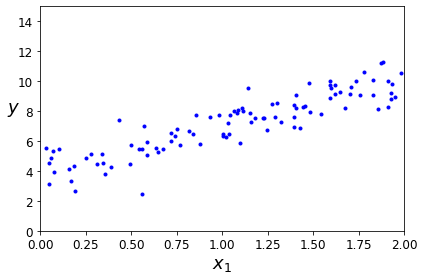


```python
X_b = np.c_[np.ones((100,1)),X] # add x0=1 to each instance
theta_best = np.linalg.inv(X_b.T.dot(X_b)).dot(X_b.T).dot(y)
theta_best
```


    array([[3.86501051],
           [3.13916179]])


```python
X_new = np.array([[0], [2]])
X_new_b = np.c_[np.ones((2, 1)), X_new]  # add x0 = 1 to each instance
y_predict = X_new_b.dot(theta_best)
y_predict
```


    array([[ 3.86501051],
           [10.14333409]])


```python
plt.plot(X_new, y_predict, "r-", linewidth=2, label="Predictions")
plt.plot(X, y, "b.")
plt.xlabel("$x_1$", fontsize=18)
plt.ylabel("$y$", rotation=0, fontsize=18)
plt.legend(loc="upper left", fontsize=14)
plt.axis([0, 2, 0, 15])
save_fig("linear_model_predictions_plot")
plt.show()
```

    Saving figure linear_model_predictions_plot
    


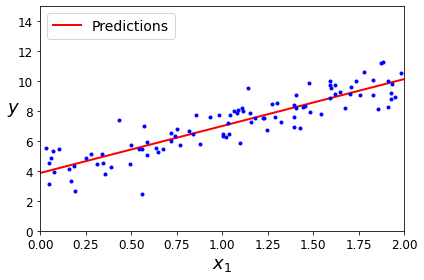


```python
from sklearn.linear_model import LinearRegression

lin_reg = LinearRegression()
lin_reg.fit(X,y)
lin_reg.intercept_,lin_reg.coef_
```


    (array([3.86501051]), array([[3.13916179]]))


```python
lin_reg.predict(X_new)
```


    array([[ 3.86501051],
           [10.14333409]])


`LinearRegression`类基于`scipy.linalg.lstsq()`函数（即“最小二乘”）,可以直接调用


```python
theta_best_svd, residuals, rank, s = np.linalg.lstsq(X_b, y, rcond=1e-6)
theta_best_svd
```


    array([[3.86501051],
           [3.13916179]])


此函数计算$\hat \theta=X^+y$，其中$X^+$是$X$的伪逆(Moore-Penrose逆)。可以调用`np.linalg.pinv()`来直接计算这个伪逆。


```python
np.linalg.pinv(X_b).dot(y)
```


    array([[3.86501051],
           [3.13916179]])


# 二、梯度下降
1.不是一个机器学习算法，是一种基于搜索的最优化方法<br/>
2.作用：最小化一个损失函数<br/>
3.梯度上升法：最大化一个效用函数<br/>
但并未所有函数都有唯一极值点，这就容易生成局部最优解而非全局最优解。<br/>
解决方案：多次运行，<font color="blue">随机化初始点</font>，梯度下降法的初始点也是一个超参数。


```python
plot_x = np.linspace(-1,6,141)
plot_y = (plot_x - 2.5) ** 2 - 1
plt.plot(plot_x,plot_y)
plt.show()
```


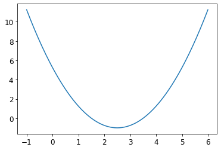


```python
def dJ(theta):
    return 2 * (theta - 2.5)

def J(theta):
    try:
        return (theta - 2.5) ** 2 - 1
    except:
        return float("inf")
```

公式：
<font size=4>$\theta_j:=\theta_j-\eta\frac{\partial}{\partial\theta_j}J(\theta_0,\theta_1,...,\theta_n)$</font>


```python
theta = 0.0
eta = 0.1
epsilon = 1e-8
while True:
    gradient = dJ(theta)
    last_theta = theta
    theta = theta - eta * gradient#eta为学习率
    
    if(abs(J(theta) - J(last_theta)) < epsilon):
        break
print(theta)
print(J(theta))
```

    2.499891109642585
    -0.99999998814289
    


```python
def gradient_descent(initial_theta,eta,n_iters=1e4,epsilon=1e-8):
    theta = initial_theta
    theta_history.append(initial_theta)
    i_iter = 0
    while i_iter < n_iters:
        gradient = dJ(theta)
        last_theta = theta
        theta = theta - eta * gradient#eta为学习率
        theta_history.append(theta)
    
        if(abs(J(theta) - J(last_theta)) < epsilon):
            break
        i_iter += 1
def plot_theta_history():
    plt.plot(plot_x,J(plot_x))
    plt.plot(np.array(theta_history),J(np.array(theta_history)),color="r",marker="+")
    plt.show()
    
```

学习率过小：


```python
eta = 0.1
theta_history = []
gradient_descent(0.,eta)
plot_theta_history(),len(theta_history)
```


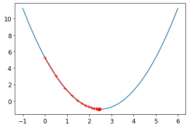


    (None, 46)


学习率过大：


```python
eta = 0.8
theta_history = []
gradient_descent(0.,eta)
plot_theta_history(),len(theta_history)
```


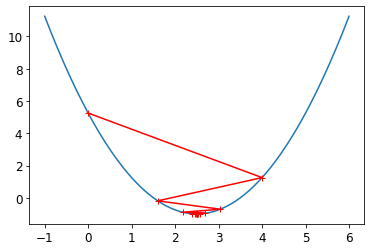


    (None, 22)


学习率大于1：


```python
eta = 1.1
theta_history = []
gradient_descent(0.,eta)
theta_history[-1]#nan即not a number,∞ - ∞ = nan
```


    nan


```python
eta = 1.1
theta_history = []
gradient_descent(0.,eta,n_iters=10)
plot_theta_history()
```


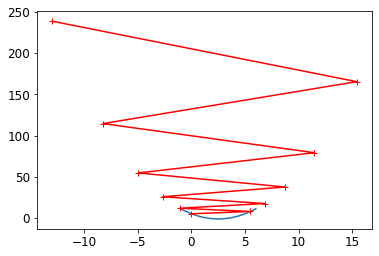


## 1.批量梯度下降
要实现梯度下降，你需要计算每个模型关于参数$\theta_j$的成本函数的梯度。换言之，你需要计算的是如果改变$\theta_j$，成本函数会改变多少。这被称为偏导数。

目标：使<font size=4>$J(\theta)=\frac{1}{2m}\sum_{i=1}^m(y^{(i)}-\hat y^{(i)})^2$</font>尽可能小<br/><br/>
&ensp;&ensp;&ensp;&ensp;&ensp;&ensp;&ensp;&ensp;<font size=4>$J(\theta)=\frac{1}{2}MSE(y,\hat y)$<br/><br/>
$\nabla J(\theta)=\frac{1}{m}·\begin{pmatrix}
\sum_{i=1}^m(y^{(i)}-X_b^{(i)}\theta)·(-X_0^{(i)})\\
\sum_{i=1}^m(y^{(i)}-X_b^{(i)}\theta)·(-X_1^{(i)})\\
\sum_{i=1}^m(y^{(i)}-X_b^{(i)}\theta)·(-X_2^{(i)})\\
...\\
\sum_{i=1}^m(y^{(i)}-X_b^{(i)}\theta)·(-X_n^{(i)})\\
\end{pmatrix}$
$
\nabla J(\theta)=\frac{1}{m}·\begin{pmatrix}
\sum_{i=1}^m(X_b^{(i)}\theta-y^{(i)})·X_0^{(i)}\\
\sum_{i=1}^m(X_b^{(i)}\theta-y^{(i)})·X_1^{(i)}\\
\sum_{i=1}^m(X_b^{(i)}\theta-y^{(i)})·X_2^{(i)}\\
...\\
\sum_{i=1}^m(X_b^{(i)}\theta-y^{(i)})·X_n^{(i)}\\
\end{pmatrix}(X_0^{(i)}=1)$
    
<font size=4>$\nabla J(\theta)=\frac{1}{m}·\begin{pmatrix}
\sum_{i=1}^m(X_b^{(i)}\theta-y^{(i)})·X_0^{(i)}\\
\sum_{i=1}^m(X_b^{(i)}\theta-y^{(i)})·X_1^{(i)}\\
\sum_{i=1}^m(X_b^{(i)}\theta-y^{(i)})·X_2^{(i)}\\
...\\
\sum_{i=1}^m(X_b^{(i)}\theta-y^{(i)})·X_n^{(i)}\\
\end{pmatrix}(X_0^{(i)}=1)$<br/><br/>
&ensp;&ensp;&ensp;&ensp;&ensp;&ensp;&ensp;$=\frac{1}{m}((X_b\theta-y)^T·X_b)^T$<br/><br/>
<font color="red">&ensp;&ensp;&ensp;&ensp;&ensp;&ensp;&ensp;$=\frac{1}{m}·X_b^T·(X_b\theta-y)$</font>
    
梯度下降步骤：
<font size=3>$\theta_j:=\theta_j-\eta\frac{\partial}{\partial\theta_j}J(\theta_0,\theta_1,...,\theta_n)$</font>


```python
eta = 0.1
n_iterations = 1000
m = 100
theta = np.random.randn(2,1)

for iteration in range(n_iterations):
    gradients = 1/m * X_b.T.dot(X_b.dot(theta) - y)
    theta = theta - eta * gradients
    
theta
```


    array([[3.86501012],
           [3.13916211]])


```python
X_new_b.dot(theta)
```


    array([[ 3.86501012],
           [10.14333433]])


```python
theta_path_bgd = []

def plot_gradient_descent(theta, eta, theta_path=None):
    m = len(X_b)
    plt.plot(X, y, "b.")
    n_iterations = 1000
    for iteration in range(n_iterations):
        if iteration < 10:
            y_predict = X_new_b.dot(theta)
            style = "b-" if iteration > 1 else "r--"
            plt.plot(X_new, y_predict, style)
        gradients = 1/m * X_b.T.dot(X_b.dot(theta) - y)
        theta = theta - eta * gradients
        if theta_path is not None:
            theta_path.append(theta)
    plt.xlabel("$x_1$", fontsize=18)
    plt.axis([0, 2, 0, 15])
    plt.title(r"$\eta = {}$".format(eta), fontsize=16)
```


```python
np.random.seed(42)
theta = np.random.randn(2,1)  # random initialization

plt.figure(figsize=(10,4))
plt.subplot(131); plot_gradient_descent(theta, eta=0.02)
plt.ylabel("$y$", rotation=0, fontsize=18)
plt.subplot(132); plot_gradient_descent(theta, eta=0.1, theta_path=theta_path_bgd)
plt.subplot(133); plot_gradient_descent(theta, eta=0.5)

save_fig("gradient_descent_plot")
plt.show()
```

    Saving figure gradient_descent_plot
    


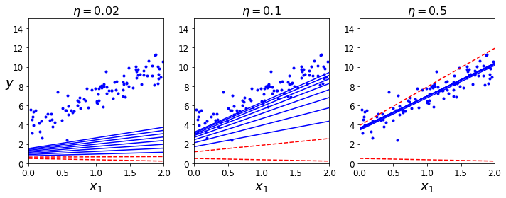


## 2.随机梯度下降
### ①批量梯度下降法BGD(Batch Gradient Descent)
缺点：每次都需要对i从1到m累加，样本数若过大，则非常耗时
### ②随机梯度下降法SGD(Stochastic Gradient Descent)
1.用一定的精度换取时间<br/>
2.跳出局部最优解<br/>
3.每次只随机取一个固定的样本i,以此作为搜索的方向（并非梯度的方向）<br/>
<font size=3>$$\begin{pmatrix}
(X_b^{(i)}\theta-y^{(i)})·X_0^{(i)}\\
(X_b^{(i)}\theta-y^{(i)})·X_1^{(i)}\\
(X_b^{(i)}\theta-y^{(i)})·X_2^{(i)}\\
...\\
(X_b^{(i)}\theta-y^{(i)})·X_n^{(i)}\\
\end{pmatrix}(X_0^{(i)}=1)=(X_b^{(i)})^T·(X_b^{(i)}\theta-y^{(i)})$$
<font size=3>4.学习率至关重要，并且随着迭代次数增加而减少<br/>
<font size=5>$\eta=\frac{1}{i\underline{}iters}$
<font size=2>$(样本少时递减过快)$
<font size=5>$→\eta=\frac{a}{i\underline{}iters+b}$<br/>
<font size=2>PS：涉及了模拟退火思想</font>
    
<font size=2>    
&ensp;&ensp;&ensp;&ensp;由于算法的随机性质，它比批量梯度下降算法下降要不规则得多。成本函数将不再是缓缓降低直到抵达最小值，而是不断上上下下，但是从总体来看，还是在慢慢下降。随着时间的推移，最终会非常接近最小值，但是即使达到了最小值，依旧还会持续反弹，永远不会停止。所以算法停下来的参数值肯定是足够好的，但不是最优的。
    
&ensp;&ensp;&ensp;&ensp;当成本函数非常不规则时，随机梯度下降其实可以帮助算法跳出局部最小值，所以相比批量梯度下降，它对找到全局最小值更有优势。
    

&ensp;&ensp;&ensp;&ensp;因此，随机性的好处在于可以逃离局部最优，但缺点是永远定位不出最小值。要解决这个困境，有一个办法是逐步降低学习率。开始的步长比较大（这有助于快速进展和逃离局部最小值），然后越来越小，让算法尽量靠近全局最小值。这个过程叫模拟退火，因为它类似于冶金时融化的金属慢慢冷却的退火过程。确定每个迭代学习率的函数叫作学习率调度。若学习率降得太快，可能会陷入局部最小值，甚至是停留在走向最小值的半途中。若学习率降得太慢，则需要太长时间才能跳到差不多最小值附近，如果提早结束训练，可能只得到一个次优的解决方案。


```python
theta_path_sgd = []
m=len(X_b)
np.random.seed(42)

n_epochs = 50
a,b = 5,50

def learning_schedule(t):
    return a / (t + b)

theta = np.random.randn(2,1)

for epoch in range(n_epochs):
    for i in range(m):
        if epoch ==0 and i<20:
            y_predict = X_new_b.dot(theta)
            style = "b-" if i > 1 else "r--"
            plt.plot(X_new,y_predict,style)
        random_index = np.random.randint(m)
        xi = X_b[random_index:random_index+1]
        yi = y[random_index:random_index+1]
        gradients = 2 * xi.T.dot(xi.dot(theta) - yi)
        eta = learning_schedule(epoch * m + i)
        theta = theta - eta * gradients
        theta_path_sgd.append(theta)

plt.plot(X, y, "b.")                                 # not shown
plt.xlabel("$x_1$", fontsize=18)                     # not shown
plt.ylabel("$y$", rotation=0, fontsize=18)           # not shown
plt.axis([0, 2, 0, 15])                              # not shown
save_fig("sgd_plot")                                 # not shown
plt.show()             
```

    Saving figure sgd_plot
    


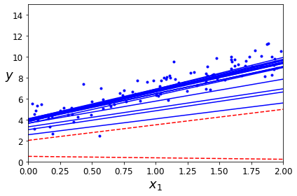


```python
theta
```


    array([[3.90521218],
           [3.15642095]])


```python
from sklearn.linear_model import SGDRegressor

sgd_reg = SGDRegressor(max_iter=1000,tol=1e-3,penalty=None,eta0=0.1,random_state=42)
sgd_reg.fit(X, y.ravel())
```


    SGDRegressor(eta0=0.1, penalty=None, random_state=42)


```python
sgd_reg.intercept_, sgd_reg.coef_
```


    (array([3.86256592]), array([3.15101583]))


# 3.小批量梯度下降


```python
theta_path_mgd = []

n_iterations = 50
minibatch_size = 20

np.random.seed(42)
theta = np.random.randn(2,1)  # random initialization

t0, t1 = 200, 1000
def learning_schedule(t):
    return t0 / (t + t1)

t = 0
for epoch in range(n_iterations):
    shuffled_indices = np.random.permutation(m)
    X_b_shuffled = X_b[shuffled_indices]
    y_shuffled = y[shuffled_indices]
    for i in range(0, m, minibatch_size):
        t += 1
        xi = X_b_shuffled[i:i+minibatch_size]
        yi = y_shuffled[i:i+minibatch_size]
        gradients = 2/minibatch_size * xi.T.dot(xi.dot(theta) - yi)
        eta = learning_schedule(t)
        theta = theta - eta * gradients
        theta_path_mgd.append(theta)
        
theta,t
```


    (array([[3.87558894],
            [3.13893713]]),
     250)


```python
theta_path_bgd = np.array(theta_path_bgd)
theta_path_sgd = np.array(theta_path_sgd)
theta_path_mgd = np.array(theta_path_mgd)

plt.figure(figsize=(7,4))
plt.plot(theta_path_sgd[:, 0], theta_path_sgd[:, 1], "r-s", linewidth=1, label="Stochastic")
plt.plot(theta_path_mgd[:, 0], theta_path_mgd[:, 1], "g-+", linewidth=2, label="Mini-batch")
plt.plot(theta_path_bgd[:, 0], theta_path_bgd[:, 1], "b-o", linewidth=3, label="Batch")
plt.legend(loc="upper left", fontsize=16)
plt.xlabel(r"$\theta_0$", fontsize=20)
plt.ylabel(r"$\theta_1$   ", fontsize=20, rotation=0)
plt.axis([2.5, 4.5, 2.3, 3.9])
save_fig("gradient_descent_paths_plot")
plt.show()
```

    Saving figure gradient_descent_paths_plot
    


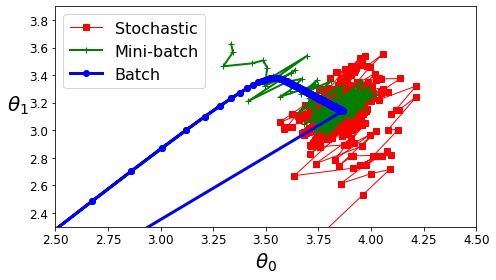


# 三、多项式回归
首先，让我们基于一个简单的二次方程式生成一些非线性数据


```python
m = 100
X = 6 * np.random.rand(m,1) - 3
y = 0.5 * X**2 + X + 2 + np.random.randn(m,1)#0.5x^2+x+C

plt.plot(X, y, "b.")
plt.xlabel("$x_1$", fontsize=18)
plt.ylabel("$y$", rotation=0, fontsize=18)
plt.axis([-3, 3, 0, 10])
save_fig("quadratic_data_plot")
plt.show()
```

    Saving figure quadratic_data_plot
    


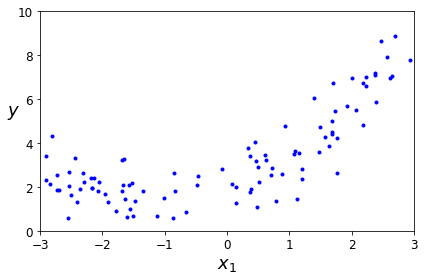


```python
from sklearn.preprocessing import PolynomialFeatures
poly_features = PolynomialFeatures(degree=2)
X_poly = poly_features.fit_transform(X)
X[0]
```


    array([0.62278195])


```python
X_poly[0]#X^0,X^1,X^2
```


    array([1.        , 0.62278195, 0.38785736])


X_poly现在包含X的原始特征以及该特征平方。


```python
lin_reg = LinearRegression()
lin_reg.fit(X_poly,y)
lin_reg.intercept_,lin_reg.coef_#C,x^0,x^1,x^2
```


    (array([1.95163088]), array([[0.        , 0.96364196, 0.4388373 ]]))


```python
lin_reg.score(X_poly,y)
```


    0.807391040468203


```python
X_new=np.linspace(-3, 3, 100).reshape(100, 1)
X_new_poly = poly_features.transform(X_new)
y_new = lin_reg.predict(X_new_poly)
plt.plot(X, y, "b.")
plt.plot(X_new, y_new, "r-", linewidth=2, label="Predictions")
plt.xlabel("$x_1$", fontsize=18)
plt.ylabel("$y$", rotation=0, fontsize=18)
plt.legend(loc="upper left", fontsize=14)
plt.axis([-3, 3, 0, 10])
save_fig("quadratic_predictions_plot")
plt.show()
```

    Saving figure quadratic_predictions_plot
    


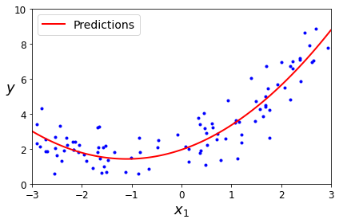


# 四、学习曲线


```python
from sklearn.preprocessing import StandardScaler
from sklearn.pipeline import Pipeline

for style, width, degree in (("g-", 1, 300), ("b--", 2, 2), ("r-+", 2, 1)):
    polybig_features = PolynomialFeatures(degree=degree, include_bias=False)
    std_scaler = StandardScaler()
    lin_reg = LinearRegression()
    polynomial_regression = Pipeline([
            ("poly_features", polybig_features),
            ("std_scaler", std_scaler),
            ("lin_reg", lin_reg),
        ])
    polynomial_regression.fit(X, y)
    y_newbig = polynomial_regression.predict(X_new)
    plt.plot(X_new, y_newbig, style, label=str(degree), linewidth=width)

plt.plot(X, y, "b.", linewidth=3)
plt.legend(loc="upper left")
plt.xlabel("$x_1$", fontsize=18)
plt.ylabel("$y$", rotation=0, fontsize=18)
plt.axis([-3, 3, 0, 10])
save_fig("high_degree_polynomials_plot")
plt.show()
```

    Saving figure high_degree_polynomials_plot
    


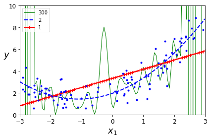


```python
from sklearn.metrics import mean_squared_error
from sklearn.model_selection import train_test_split

def plot_learning_curves(model, X, y):
    X_train, X_val, y_train, y_val = train_test_split(X, y, test_size=0.2, random_state=10)
    train_errors, val_errors = [], []
    for m in range(1, len(X_train)):
        model.fit(X_train[:m], y_train[:m])
        y_train_predict = model.predict(X_train[:m])
        y_val_predict = model.predict(X_val)
        train_errors.append(mean_squared_error(y_train[:m], y_train_predict))
        val_errors.append(mean_squared_error(y_val, y_val_predict))

    plt.plot(np.sqrt(train_errors), "r-+", linewidth=2, label="train")
    plt.plot(np.sqrt(val_errors), "b-", linewidth=3, label="val")
    plt.legend(loc="upper right", fontsize=14)   # not shown in the book
    plt.xlabel("Training set size", fontsize=14) # not shown
    plt.ylabel("RMSE", fontsize=14)              # not shown
    
lin_reg = LinearRegression()
plot_learning_curves(lin_reg, X, y)
plt.axis([0, 80, 0, 3])                         # not shown in the book
save_fig("underfitting_learning_curves_plot")   # not shown
plt.show()                                      # not shown
```

    Saving figure underfitting_learning_curves_plot
    


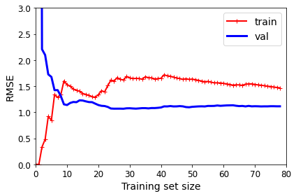


上图为欠拟合，验证集表现差且训练集和验证集误差都很大


```python
from sklearn.pipeline import Pipeline

polynomial_regression = Pipeline([
        ("poly_features", PolynomialFeatures(degree=10, include_bias=False)),
        ("lin_reg", LinearRegression()),
    ])

plot_learning_curves(polynomial_regression, X, y)
plt.axis([0, 80, 0, 3])           # not shown
save_fig("learning_curves_plot")  # not shown
plt.show()                        # not shown
```

    Saving figure learning_curves_plot
    


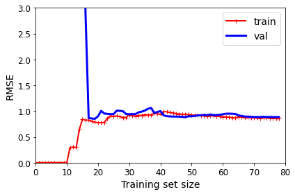


上图为过拟合，在训练集的表现好，验证集表现不好


```python
polynomial_regression = Pipeline([
        ("poly_features", PolynomialFeatures(degree=2, include_bias=False)),
        ("std_scaler", StandardScaler()),
        ("lin_reg", LinearRegression()),
    ])

plot_learning_curves(polynomial_regression, X, y)
plt.axis([0, 80, 0, 3])           # not shown
save_fig("learning_curves_plot")  # not shown
plt.show()
```

    Saving figure learning_curves_plot
    


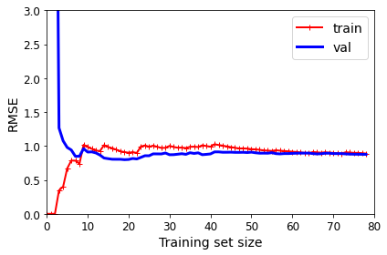


误差稳定在1.0左右，效果较线性回归好

### 偏差方差权衡
#### 1.偏差(Bias)
导致偏差的主要原因：对问题本身的假设不正确<br/>
如对非线性数据使用线性回归<br/>
会造成欠拟合

#### 2.方差(Variance)
数据的一点点扰动都会较大地影响模型<br/>
通常是因为使用的模型太复杂，如高阶多项式回归<br/>
会造成过拟合

PS:非参数学习通常都是高方差算法，因为不对数据进行任何假设<br/>
&ensp;&ensp;&ensp;而参数学习通常都是高偏差算法，因为对数据有极强的假设

3.机器学习的主要挑战来自于方差<br/>
解决高方差的通常手段：①降低模型复杂度<br/>
&ensp;&ensp;&ensp;&ensp;&ensp;&ensp;&ensp;&ensp;&ensp;&ensp;&ensp;&ensp;&ensp;&ensp;&ensp;&ensp;&ensp;&ensp;&ensp;&ensp;&ensp;&ensp;②减少数据维度；降噪<br/>
&ensp;&ensp;&ensp;&ensp;&ensp;&ensp;&ensp;&ensp;&ensp;&ensp;&ensp;&ensp;&ensp;&ensp;&ensp;&ensp;&ensp;&ensp;&ensp;&ensp;&ensp;&ensp;③增加样本数<br/>
&ensp;&ensp;&ensp;&ensp;&ensp;&ensp;&ensp;&ensp;&ensp;&ensp;&ensp;&ensp;&ensp;&ensp;&ensp;&ensp;&ensp;&ensp;&ensp;&ensp;&ensp;&ensp;④使用验证集<br/>
&ensp;&ensp;&ensp;&ensp;&ensp;&ensp;&ensp;&ensp;&ensp;&ensp;&ensp;&ensp;&ensp;&ensp;&ensp;&ensp;&ensp;&ensp;&ensp;&ensp;&ensp;&ensp;<font color="red">⑤模型正则化(Regularization)<br/>

# 五、正则化线性模型
减少过拟合的一个好方法是对模型进行正则化(即约束模型):它拥有的自由度越少，则过拟合数据的难度就越大。正则化多项式模型的一种简单方法是减少多项式的次数。

对于线性模型，正则化通常是通过约束模型的权重来实现的。现在，我们看一下岭回归、Lasso回归和弹性网络，它们实现了三种限制权重的方法。
## 1.岭回归
岭回归(也称为Tikhonov正则化)是线性回归的正则化版本：将等于$\alpha \sum_{i=1}^n\theta_i^2$的正则化项添加到成本函数。这迫使学习算法不仅拟合数据，而且还使模型权重尽可能小。注意仅在训练期间将正则化项添加到成本函数中。训练完模型后，你要使用非正则化的性能度量来评估模型的性能。

超参数$\alpha$控制要对模型进行正则化的程度。若$\alpha=0,$则岭回归仅是线性回归。如果$\alpha$非常大，则所有权重最终都非常接近于0，结果是一条经过数据均值的平线。

目标：使<font size=4>$\sum_{i=1}^m(y^{(i)}-\theta_0-\theta_1X_1^{(i)}-\theta_2X_2^{(i)}-...-\theta_nX_n^{(i)})^2$</font>尽可能小<br/><br/>
目标：使<font size=4>$J(\theta)=MSE(y,\bar y;\theta)$</font>尽可能小<br/>

解决方案：<br/>
加入模型正则化，目标：使<font size=4>$J(\theta)=MSE(y,\bar y;\theta)+\alpha \frac{1}{2}\sum_{i=1}^n\theta_i^2$</font>尽可能小

注意，<font color=blue>偏置项$\theta_0$没有进行正则化(总和从$i=1$开始，而不是0)</font>。如果我们将$\omega$定义为特征权重的向量($\theta_1$至$\theta_n$),则正则项等于$\frac{1}{2}||\omega||_2^2$,其中$||\omega||_2$表示权重向量的$l_2$范数。对于梯度下降，只需将$\alpha\omega$添加到MSE梯度向量。

<font color=blue>在执行岭回归之前缩放数据很重要，因为它对输入特征的缩放敏感。</font>大多数正则化模型都需要如此。

闭式解的岭回归：<font size=4>$\hat \theta=(X^TX+\alpha A)^{-1}X^Ty$


```python
np.random.seed(42)
m = 20
X = 3 * np.random.rand(m, 1)
y = 1 + 0.5 * X + np.random.randn(m, 1) / 1.5
X_new = np.linspace(0, 3, 100).reshape(100, 1)

from sklearn.linear_model import Ridge
ridge_reg = Ridge(alpha=1, solver="cholesky", random_state=42)
ridge_reg.fit(X, y)
ridge_reg.predict([[1.5]])
```


    array([[1.55071465]])


```python
ridge_reg = Ridge(alpha=1, solver="sag", random_state=42)
ridge_reg.fit(X, y)
ridge_reg.predict([[1.5]])
```


    array([[1.5507201]])


```python
from sklearn.linear_model import Ridge

def plot_model(model_class, polynomial, alphas, **model_kargs):
    for alpha, style in zip(alphas, ("b-", "g--", "r:")):
        model = model_class(alpha, **model_kargs) if alpha > 0 else LinearRegression()
        if polynomial:
            model = Pipeline([
                    ("poly_features", PolynomialFeatures(degree=10, include_bias=False)),
                    ("std_scaler", StandardScaler()),
                    ("regul_reg", model),
                ])
        model.fit(X, y)
        y_new_regul = model.predict(X_new)
        lw = 2 if alpha > 0 else 1
        plt.plot(X_new, y_new_regul, style, linewidth=lw, label=r"$\alpha = {}$".format(alpha))
    plt.plot(X, y, "b.", linewidth=3)
    plt.legend(loc="upper left", fontsize=15)
    plt.xlabel("$x_1$", fontsize=18)
    plt.axis([0, 3, 0, 4])

plt.figure(figsize=(8,4))
plt.subplot(121)
plot_model(Ridge, polynomial=False, alphas=(0, 10, 100), random_state=42)
plt.ylabel("$y$", rotation=0, fontsize=18)
plt.subplot(122)
plot_model(Ridge, polynomial=True, alphas=(0, 10**-5, 1), random_state=42)

save_fig("ridge_regression_plot")
plt.show()
```

    Saving figure ridge_regression_plot
    


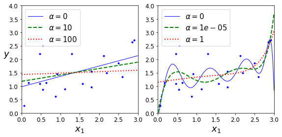


```python
sgd_reg = SGDRegressor(penalty="l2", max_iter=1000, tol=1e-3, random_state=42)
sgd_reg.fit(X, y.ravel())
sgd_reg.predict([[1.5]])
```


    array([1.47012588])


## 2.Lasso回归
线性回归的另一种正则化叫作最小绝对收缩和选择算子回归(Least Absolute Shrinkage and Selection Operator Regression,简称Lasso回归)。与岭回归一样，它也是向成本函数添加一个正则项，但它增加的是权重向量的$l_1$范数。

目的：使<font size=4>$J(\theta)=MSE(y,\bar y;\theta)+\alpha \sum_{i=1}^n|\theta_i|$</font>尽可能小<br/><br/>

Lasso回归的一个重要特点是它倾向于完全消除掉最不重要特征的权重。Lasso回归会自动执行特征选择并输出一个稀疏模型(即只有很少的特征有非零权重).


```python
from sklearn.linear_model import Lasso

plt.figure(figsize=(8,4))
plt.subplot(121)
plot_model(Lasso, polynomial=False, alphas=(0, 0.1, 1), random_state=42)
plt.ylabel("$y$", rotation=0, fontsize=18)
plt.subplot(122)
plot_model(Lasso, polynomial=True, alphas=(0, 10**-7, 1), random_state=42)

save_fig("lasso_regression_plot")
plt.show()
```

    E:\Anaconda3\lib\site-packages\sklearn\linear_model\_coordinate_descent.py:529: ConvergenceWarning: Objective did not converge. You might want to increase the number of iterations. Duality gap: 2.8028677038274386, tolerance: 0.0009294783355207351
      model = cd_fast.enet_coordinate_descent(
    

    Saving figure lasso_regression_plot
    


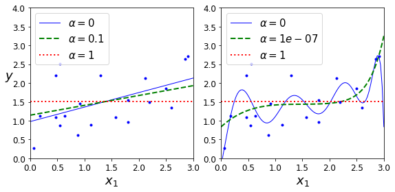


```python
from sklearn.linear_model import Lasso
lasso_reg = Lasso(alpha=0.1)
lasso_reg.fit(X, y)
lasso_reg.predict([[1.5]])
```


    array([1.53788174])


```python
sgd_reg = SGDRegressor(penalty="l1", max_iter=1000, tol=1e-3, random_state=42)
sgd_reg.fit(X, y.ravel())
sgd_reg.predict([[1.5]])
```


    array([1.47011206])


```python
%matplotlib inline
import matplotlib.pyplot as plt
import numpy as np

t1a, t1b, t2a, t2b = -1, 3, -1.5, 1.5

t1s = np.linspace(t1a, t1b, 500)
t2s = np.linspace(t2a, t2b, 500)
t1, t2 = np.meshgrid(t1s, t2s)
T = np.c_[t1.ravel(), t2.ravel()]
Xr = np.array([[1, 1], [1, -1], [1, 0.5]])
yr = 2 * Xr[:, :1] + 0.5 * Xr[:, 1:]

J = (1/len(Xr) * np.sum((T.dot(Xr.T) - yr.T)**2, axis=1)).reshape(t1.shape)

N1 = np.linalg.norm(T, ord=1, axis=1).reshape(t1.shape)
N2 = np.linalg.norm(T, ord=2, axis=1).reshape(t1.shape)

t_min_idx = np.unravel_index(np.argmin(J), J.shape)
t1_min, t2_min = t1[t_min_idx], t2[t_min_idx]

t_init = np.array([[0.25], [-1]])

def bgd_path(theta, X, y, l1, l2, core = 1, eta = 0.05, n_iterations = 200):
    path = [theta]
    for iteration in range(n_iterations):
        gradients = core * 2/len(X) * X.T.dot(X.dot(theta) - y) + l1 * np.sign(theta) + l2 * theta
        theta = theta - eta * gradients
        path.append(theta)
    return np.array(path)

fig, axes = plt.subplots(2, 2, sharex=True, sharey=True, figsize=(10.1, 8))
for i, N, l1, l2, title in ((0, N1, 2., 0, "Lasso"), (1, N2, 0,  2., "Ridge")):
    JR = J + l1 * N1 + l2 * 0.5 * N2**2
    
    tr_min_idx = np.unravel_index(np.argmin(JR), JR.shape)
    t1r_min, t2r_min = t1[tr_min_idx], t2[tr_min_idx]

    levelsJ=(np.exp(np.linspace(0, 1, 20)) - 1) * (np.max(J) - np.min(J)) + np.min(J)
    levelsJR=(np.exp(np.linspace(0, 1, 20)) - 1) * (np.max(JR) - np.min(JR)) + np.min(JR)
    levelsN=np.linspace(0, np.max(N), 10)
    
    path_J = bgd_path(t_init, Xr, yr, l1=0, l2=0)
    path_JR = bgd_path(t_init, Xr, yr, l1, l2)
    path_N = bgd_path(np.array([[2.0], [0.5]]), Xr, yr, np.sign(l1)/3, np.sign(l2), core=0)

    ax = axes[i, 0]
    ax.grid(True)
    ax.axhline(y=0, color='k')
    ax.axvline(x=0, color='k')
    ax.contourf(t1, t2, N / 2., levels=levelsN)
    ax.plot(path_N[:, 0], path_N[:, 1], "y--")
    ax.plot(0, 0, "ys")
    ax.plot(t1_min, t2_min, "ys")
    ax.set_title(r"$\ell_{}$ penalty".format(i + 1), fontsize=16)
    ax.axis([t1a, t1b, t2a, t2b])
    if i == 1:
        ax.set_xlabel(r"$\theta_1$", fontsize=16)
    ax.set_ylabel(r"$\theta_2$", fontsize=16, rotation=0)

    ax = axes[i, 1]
    ax.grid(True)
    ax.axhline(y=0, color='k')
    ax.axvline(x=0, color='k')
    ax.contourf(t1, t2, JR, levels=levelsJR, alpha=0.9)
    ax.plot(path_JR[:, 0], path_JR[:, 1], "w-o")
    ax.plot(path_N[:, 0], path_N[:, 1], "y--")
    ax.plot(0, 0, "ys")
    ax.plot(t1_min, t2_min, "ys")
    ax.plot(t1r_min, t2r_min, "rs")
    ax.set_title(title, fontsize=16)
    ax.axis([t1a, t1b, t2a, t2b])
    if i == 1:
        ax.set_xlabel(r"$\theta_1$", fontsize=16)

save_fig("lasso_vs_ridge_plot")
plt.show()
```

    Saving figure lasso_vs_ridge_plot
    


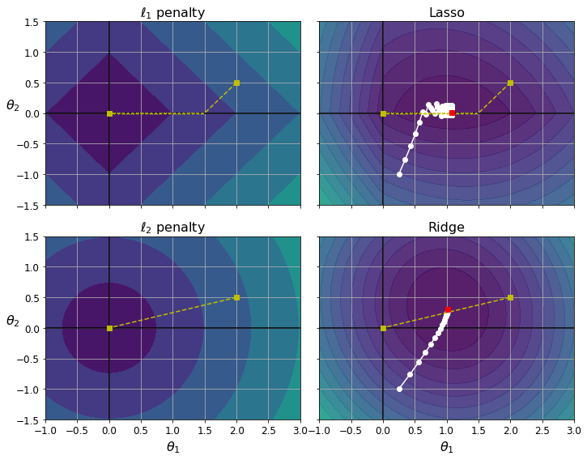


## 3.弹性网络

<font size=4>$J(\theta)=MSE(y,\bar y;\theta)+r\alpha \sum_{i=1}^n|\theta_i|+\frac{1-r}{2}\alpha \sum_{i=1}^n\theta_i^2$</font><br/><br/>
岭回归计算相对精准，但若样本过多，计算量较大。<br/><br/>
LASSO急于将某些变量归0，容易丢失数据，造成高偏差。<br/><br/>


```python
from sklearn.linear_model import ElasticNet
elastic_net = ElasticNet(alpha=0.1, l1_ratio=0.5, random_state=42)#l1_ratio对应混合比r
elastic_net.fit(X, y)
elastic_net.predict([[1.5]])
```


    array([1.54333232])


## 4.提前停止

对于梯度下降这一类迭代学习的算法，还有一个与众不同的正则化方法，就是在验证误差达到最小值时停止训练，该方法叫做提前停止法。

使用随机和小批量梯度下降时，曲线不是那么平滑，可能很难知道模型是否达到了最小值。一种解决方案是仅在验证错误超过最小值一段时间后停止(当你确信模型不会做得更好时)，然后回滚模型参数到验证误差最小的位置。


```python
np.random.seed(42)
m = 100
X = 6 * np.random.rand(m, 1) - 3
y = 2 + X + 0.5 * X**2 + np.random.randn(m, 1)

X_train, X_val, y_train, y_val = train_test_split(X[:50], y[:50].ravel(), test_size=0.5, random_state=10)
```


```python
from copy import deepcopy

poly_scaler = Pipeline([
        ("poly_features", PolynomialFeatures(degree=90, include_bias=False)),
        ("std_scaler", StandardScaler())
    ])

X_train_poly_scaled = poly_scaler.fit_transform(X_train)
X_val_poly_scaled = poly_scaler.transform(X_val)

sgd_reg = SGDRegressor(max_iter=1, tol=-np.infty, warm_start=True,
                       penalty=None, learning_rate="constant", eta0=0.0005, random_state=42)

minimum_val_error = float("inf")
best_epoch = None
best_model = None
for epoch in range(1000):
    sgd_reg.fit(X_train_poly_scaled, y_train)  # continues where it left off
    y_val_predict = sgd_reg.predict(X_val_poly_scaled)
    val_error = mean_squared_error(y_val, y_val_predict)
    if val_error < minimum_val_error:
        minimum_val_error = val_error
        best_epoch = epoch
        best_model = deepcopy(sgd_reg)
```


```python
sgd_reg = SGDRegressor(max_iter=1, tol=-np.infty, warm_start=True,
                       penalty=None, learning_rate="constant", eta0=0.0005, random_state=42)

n_epochs = 500
train_errors, val_errors = [], []
for epoch in range(n_epochs):
    sgd_reg.fit(X_train_poly_scaled, y_train)
    y_train_predict = sgd_reg.predict(X_train_poly_scaled)
    y_val_predict = sgd_reg.predict(X_val_poly_scaled)
    train_errors.append(mean_squared_error(y_train, y_train_predict))
    val_errors.append(mean_squared_error(y_val, y_val_predict))

best_epoch = np.argmin(val_errors)
best_val_rmse = np.sqrt(val_errors[best_epoch])

plt.annotate('Best model',
             xy=(best_epoch, best_val_rmse),
             xytext=(best_epoch, best_val_rmse + 1),
             ha="center",
             arrowprops=dict(facecolor='black', shrink=0.05),
             fontsize=16,
            )

best_val_rmse -= 0.03  # just to make the graph look better
plt.plot([0, n_epochs], [best_val_rmse, best_val_rmse], "k:", linewidth=2)
plt.plot(np.sqrt(val_errors), "b-", linewidth=3, label="Validation set")
plt.plot(np.sqrt(train_errors), "r--", linewidth=2, label="Training set")
plt.legend(loc="upper right", fontsize=14)
plt.xlabel("Epoch", fontsize=14)
plt.ylabel("RMSE", fontsize=14)
save_fig("early_stopping_plot")
plt.show()
```

    Saving figure early_stopping_plot
    


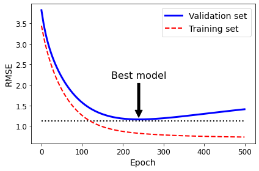


```python
best_epoch, best_model
```


    (239,
     SGDRegressor(eta0=0.0005, learning_rate='constant', max_iter=1, penalty=None,
                  random_state=42, tol=-inf, warm_start=True))


# 六、逻辑回归
## 1、估计概率
与线性回归模型一样，逻辑回归模型也是输入特征的加权和（加上偏置项），但是不同于线性回归模型直接输出结果，它输出的是结果的数理逻辑值。

### ①公式
用于解决分类问题，将样本的特征与样本发生的概率联系在一起。<br/><br/>
<font size=4>$\hat y=f(x),\hat p=f(x),\hat y=\begin{cases}
1,\hat p≥0.5\\
0,\hat p＜0.5\\
\end{cases}$<br/><br/></font>
逻辑回归既可以看作是回归算法，也可以看做是分类算法，通常作为分类算法用，只可以解决二分类问题。<br/><br/>
<font size=4>$\hat y=f(x)→\hat y=\theta^T·x_b，\hat y\in (-∞，+∞)$</font>而概率的<font size=4>$y\in[0,1]$<br/><br/></font>
所以得到新的函数<font size=4>$\hat p=\sigma(\theta^T·x_b),\sigma(t)=\frac{1}{1+e^{-t}}$(Sigmoid函数,$p\in(0,1)$)<br/><br/>
$t>0$时，$p>0.5$<br/><br/>
$t<0$时，$p<0.5$<br/><br/>
$\hat p=\sigma(\theta^T·x_b)=\frac{1}{1+e^{-\theta^T·x_b}}$<br/><br/></font>
问题：对于给定的样本数据集X,y，如何找到参数theta，使得用这样的方式可以最大程度获得样本数据集X对应的分类输出y?


```python
t = np.linspace(-10, 10, 100)
sig = 1 / (1 + np.exp(-t))
plt.figure(figsize=(9, 3))
plt.plot([-10, 10], [0, 0], "k-")
plt.plot([-10, 10], [0.5, 0.5], "k:")
plt.plot([-10, 10], [1, 1], "k:")
plt.plot([0, 0], [-1.1, 1.1], "k-")
plt.plot(t, sig, "b-", linewidth=2, label=r"$\sigma(t) = \frac{1}{1 + e^{-t}}$")
plt.xlabel("t")
plt.legend(loc="upper left", fontsize=20)
plt.axis([-10, 10, -0.1, 1.1])
save_fig("logistic_function_plot")
plt.show()
```

    Saving figure logistic_function_plot
    


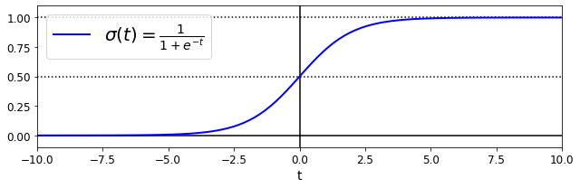


### ②损失函数
<font size=4>$cost=\begin{cases}
如果y=1,p越小,cost越大\\
如果y=0,p越大,cost越大\\
\end{cases}$<br/>&ensp;&ensp;&ensp;&ensp;&ensp;&ensp;&ensp;&ensp;&ensp;&ensp;&ensp;&ensp;&ensp;&ensp;&ensp;&ensp;&ensp;&ensp;↓<br/>
$cost=\begin{cases}
-log(\hat p)\quad\quad\quad if\quad y=1\\
-log(1-\hat p)\quad \ \ if\quad y=0\\
\end{cases}$<br/>&ensp;&ensp;&ensp;&ensp;&ensp;&ensp;&ensp;&ensp;&ensp;&ensp;&ensp;&ensp;&ensp;&ensp;&ensp;&ensp;&ensp;&ensp;↓<br/>
$cost=-ylog(\hat p)-(1-y)log(1-\hat p)$<br/>&ensp;&ensp;&ensp;&ensp;&ensp;&ensp;&ensp;&ensp;&ensp;&ensp;&ensp;&ensp;&ensp;&ensp;&ensp;&ensp;&ensp;&ensp;↓<br/>
$J(\theta)=-\frac{1}{m}\sum_{i=1}^m[y^{(i)}log(\hat p^{(i)})+(1-y^{(i)})log(1-\hat p^{(i)})]$<br/>&ensp;&ensp;&ensp;&ensp;&ensp;&ensp;&ensp;&ensp;&ensp;&ensp;&ensp;&ensp;&ensp;&ensp;&ensp;&ensp;&ensp;&ensp;↓<br/>
$J(\theta)=-\frac{1}{m}\sum_{i=1}^m[y^{(i)}log(\sigma(X_b^{(i)}\theta))+(1-y^{(i)})log(1-\sigma(X_b^{(i)}\theta))]$<br/><br/>
<font size=3>没有公式解，只能使用梯度下降法求解，并且该函数无局部最优解，只有全局最优解。

### ③损失函数的梯度
$\nabla J(\theta)=\frac{1}{m}\begin{pmatrix}
\sum_{i=1}^m(y^{(i)}-\sigma(X_b^{(i)}\theta))·(-X_0^{(i)})\\
\sum_{i=1}^m(y^{(i)}-\sigma(X_b^{(i)}\theta))·(-X_1^{(i)})\\
\sum_{i=1}^m(y^{(i)}-\sigma(X_b^{(i)}\theta))·(-X_2^{(i)})\\
...\\
\sum_{i=1}^m(y^{(i)}-\sigma(X_b^{(i)}\theta))·(-X_n^{(i)})\\
\end{pmatrix}=\frac{1}{m}\begin{pmatrix}
\sum_{i=1}^m(\sigma(X_b^{(i)}\theta-y^{(i)}))·X_0^{(i)}\\
\sum_{i=1}^m(\sigma(X_b^{(i)}\theta-y^{(i)}))·X_1^{(i)}\\
\sum_{i=1}^m(\sigma(X_b^{(i)}\theta-y^{(i)}))·X_2^{(i)}\\
...\\
\sum_{i=1}^m(\sigma(X_b^{(i)}\theta-y^{(i)}))·X_n^{(i)}\\
\end{pmatrix}(X_0^{(i)}=1)
$=<font color="red"><font size=4>$\frac{1}{m}·X_b^T·(\sigma(X_b\theta)-y)$

### ④决策边界
<font size=4>$\hat y=f(x),\hat p=f(x),\hat y=\begin{cases}
1,\hat p≥0.5，t>0时，p>0.5,即\theta^T·x_b≥0\\
0,\hat p＜0.5\ \ ，t<0时，p<0.5,即\theta^T·x_b＜0\\
\end{cases}$<br/><br/></font>
决策边界即为：<font size=4>$\theta^T·x_b=0$</font>

如果$x$有两个特征,即<font size=4>$\theta_0+\theta_1x_1+\theta_2x_2=0,x_2=\frac{-\theta_0-\theta_1x_1}{\theta_2}$</font>


```python
from sklearn import datasets
iris = datasets.load_iris()
list(iris.keys())
```


    ['data',
     'target',
     'frame',
     'target_names',
     'DESCR',
     'feature_names',
     'filename']


```python
print(iris.DESCR)
```

    .. _iris_dataset:
    
    Iris plants dataset
    --------------------
    
    **Data Set Characteristics:**
    
        :Number of Instances: 150 (50 in each of three classes)
        :Number of Attributes: 4 numeric, predictive attributes and the class
        :Attribute Information:
            - sepal length in cm
            - sepal width in cm
            - petal length in cm
            - petal width in cm
            - class:
                    - Iris-Setosa
                    - Iris-Versicolour
                    - Iris-Virginica
                    
        :Summary Statistics:
    
        ============== ==== ==== ======= ===== ====================
                        Min  Max   Mean    SD   Class Correlation
        ============== ==== ==== ======= ===== ====================
        sepal length:   4.3  7.9   5.84   0.83    0.7826
        sepal width:    2.0  4.4   3.05   0.43   -0.4194
        petal length:   1.0  6.9   3.76   1.76    0.9490  (high!)
        petal width:    0.1  2.5   1.20   0.76    0.9565  (high!)
        ============== ==== ==== ======= ===== ====================
    
        :Missing Attribute Values: None
        :Class Distribution: 33.3% for each of 3 classes.
        :Creator: R.A. Fisher
        :Donor: Michael Marshall (MARSHALL%PLU@io.arc.nasa.gov)
        :Date: July, 1988
    
    The famous Iris database, first used by Sir R.A. Fisher. The dataset is taken
    from Fisher's paper. Note that it's the same as in R, but not as in the UCI
    Machine Learning Repository, which has two wrong data points.
    
    This is perhaps the best known database to be found in the
    pattern recognition literature.  Fisher's paper is a classic in the field and
    is referenced frequently to this day.  (See Duda & Hart, for example.)  The
    data set contains 3 classes of 50 instances each, where each class refers to a
    type of iris plant.  One class is linearly separable from the other 2; the
    latter are NOT linearly separable from each other.
    
    .. topic:: References
    
       - Fisher, R.A. "The use of multiple measurements in taxonomic problems"
         Annual Eugenics, 7, Part II, 179-188 (1936); also in "Contributions to
         Mathematical Statistics" (John Wiley, NY, 1950).
       - Duda, R.O., & Hart, P.E. (1973) Pattern Classification and Scene Analysis.
         (Q327.D83) John Wiley & Sons.  ISBN 0-471-22361-1.  See page 218.
       - Dasarathy, B.V. (1980) "Nosing Around the Neighborhood: A New System
         Structure and Classification Rule for Recognition in Partially Exposed
         Environments".  IEEE Transactions on Pattern Analysis and Machine
         Intelligence, Vol. PAMI-2, No. 1, 67-71.
       - Gates, G.W. (1972) "The Reduced Nearest Neighbor Rule".  IEEE Transactions
         on Information Theory, May 1972, 431-433.
       - See also: 1988 MLC Proceedings, 54-64.  Cheeseman et al"s AUTOCLASS II
         conceptual clustering system finds 3 classes in the data.
       - Many, many more ...
    


```python
iris["feature_names"]
```


    ['sepal length (cm)',
     'sepal width (cm)',
     'petal length (cm)',
     'petal width (cm)']


```python
iris['target_names']
```


    array(['setosa', 'versicolor', 'virginica'], dtype='<U10')


```python
X = iris["data"][:, 3:]  # petal width
y = (iris["target"] == 2).astype(np.int)  # 1 if Iris virginica, else 0

from sklearn.linear_model import LogisticRegression
log_reg = LogisticRegression(solver="lbfgs", random_state=42)
log_reg.fit(X, y)

X_new = np.linspace(0, 3, 1000).reshape(-1, 1)
y_proba = log_reg.predict_proba(X_new)

plt.plot(X_new, y_proba[:, 1], "g-", linewidth=2, label="Iris virginica")
plt.plot(X_new, y_proba[:, 0], "b--", linewidth=2, label="Not Iris virginica")
plt.legend()
plt.show()
```


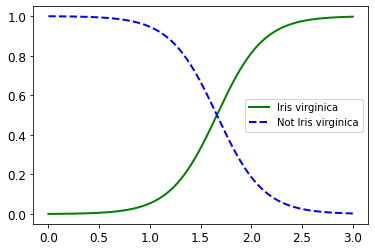


```python
X_new = np.linspace(0, 3, 1000).reshape(-1, 1)
y_proba = log_reg.predict_proba(X_new)
decision_boundary = X_new[y_proba[:, 1] >= 0.5][0]

plt.figure(figsize=(8, 3))
plt.plot(X[y==0], y[y==0], "bs")
plt.plot(X[y==1], y[y==1], "g^")
plt.plot([decision_boundary, decision_boundary], [-1, 1], "k:", linewidth=2)
plt.plot(X_new, y_proba[:, 1], "g-", linewidth=2, label="Iris virginica")
plt.plot(X_new, y_proba[:, 0], "b--", linewidth=2, label="Not Iris virginica")
plt.text(decision_boundary+0.02, 0.15, "Decision  boundary", fontsize=14, color="k", ha="center")
plt.arrow(decision_boundary, 0.08, -0.3, 0, head_width=0.05, head_length=0.1, fc='b', ec='b')
plt.arrow(decision_boundary, 0.92, 0.3, 0, head_width=0.05, head_length=0.1, fc='g', ec='g')
plt.xlabel("Petal width (cm)", fontsize=14)
plt.ylabel("Probability", fontsize=14)
plt.legend(loc="center left", fontsize=14)
plt.axis([0, 3, -0.02, 1.02])
save_fig("logistic_regression_plot")
plt.show()
```

    E:\Anaconda3\lib\site-packages\matplotlib\patches.py:1327: VisibleDeprecationWarning: Creating an ndarray from ragged nested sequences (which is a list-or-tuple of lists-or-tuples-or ndarrays with different lengths or shapes) is deprecated. If you meant to do this, you must specify 'dtype=object' when creating the ndarray
      verts = np.dot(coords, M) + (x + dx, y + dy)
    

    Saving figure logistic_regression_plot
    


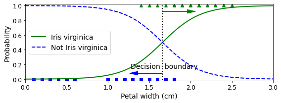


```python
decision_boundary
```


    array([1.66066066])


```python
log_reg.predict([[1.7], [1.5]])
```


    array([1, 0])


```python
from sklearn.linear_model import LogisticRegression

X = iris["data"][:, (2, 3)]  # petal length, petal width
y = (iris["target"] == 2).astype(np.int)

log_reg = LogisticRegression(solver="lbfgs", C=10**10, random_state=42)
log_reg.fit(X, y)

x0, x1 = np.meshgrid(
        np.linspace(2.9, 7, 500).reshape(-1, 1),
        np.linspace(0.8, 2.7, 200).reshape(-1, 1),
    )
X_new = np.c_[x0.ravel(), x1.ravel()]

y_proba = log_reg.predict_proba(X_new)

plt.figure(figsize=(10, 4))
plt.plot(X[y==0, 0], X[y==0, 1], "bs")
plt.plot(X[y==1, 0], X[y==1, 1], "g^")

zz = y_proba[:, 1].reshape(x0.shape)
contour = plt.contour(x0, x1, zz, cmap=plt.cm.brg)


left_right = np.array([2.9, 7])
boundary = -(log_reg.coef_[0][0] * left_right + log_reg.intercept_[0]) / log_reg.coef_[0][1]

plt.clabel(contour, inline=1, fontsize=12)
plt.plot(left_right, boundary, "k--", linewidth=3)
plt.text(3.5, 1.5, "Not Iris virginica", fontsize=14, color="b", ha="center")
plt.text(6.5, 2.3, "Iris virginica", fontsize=14, color="g", ha="center")
plt.xlabel("Petal length", fontsize=14)
plt.ylabel("Petal width", fontsize=14)
plt.axis([2.9, 7, 0.8, 2.7])
save_fig("logistic_regression_contour_plot")
plt.show()
```

    Saving figure logistic_regression_contour_plot
    


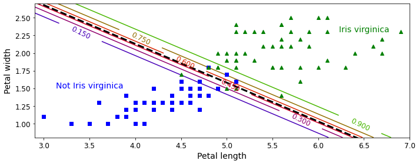


# 2.Softmax回归
逻辑回归模型经过推广，可以直接支持多个类别，而不需要训练并组合多个二元分类器。这就是Softmax回归，或者叫做多元逻辑回归。

原理很简单：给定一个实例$x$，Softmax回归模型首先计算出每个类$k$的分数$s_k(x)$，然后对这些分数应用$softmax$函数(也叫归一化指数)，估算出每个类的概率。

+ 类$k$的$softmax$分数$$s_k(x)=x^T\theta^{(k)}$$

请注意，每个类都有自己的特定参数向量$\theta^{(k)}$。

一旦为实例$x$计算了每个类的分数，就可以通过softmax函数来估计实例属于类$k$的概率$\hat p_k$。该函数计算每个分数的指数，然后对其进行归一化。

+ Softmax函数$$\hat p_k=\sigma(s(x))_k=\frac{exp(s_k(x))}{\sum_{j=1}^Kexp(s_j(x))}$$

就像逻辑回归分类器一样，Softmax回归分类器预测具有最高估计概率的类。

+ Softmax回归分类预测$$\hat y=argmax_k\sigma(s(x))_k=argmax_ks_k(x)=argmax_k((\theta^{(k)})^Tx)$$

PS:Softmax回归分类器一次只能预测一个类，因此它只能与互斥的类一起使用。

目前已经知道了模型如何进行概率估算并做出预测，那我们再来看看怎么训练。训练目标是得到一个能对目标类做出高概率估算的模型。通过交叉熵最小化来实现这个目标，因为当模型对目标类做出较低概率的估算时会受到惩罚。交叉熵经常被用于衡量一组估算出的类概率跟目标类的匹配程度。

+ 交叉熵成本函数$$J(\theta)=-\frac{1}{m}\sum\limits_{i=1}^m\sum\limits_{k=1}^Ky_k^{(i)}log(\hat p_k^{(i)})$$
$y_k^{(i)}$是属于类k的第$i$个实例的目标概率。一般而言等于1或0，具体取决于实例是否属于该类。


+ 类$k$的交叉熵梯度向量，即上述成本函数相对于$\theta^{(k)}的梯度向量$$$\nabla_{\theta(k)}J(\theta)=\frac{1}{m}\sum\limits_{i=1}^m(\hat p_k^{(i)}-y_k^{(i)})x^{(i)}$$
现在，我们可以计算每个类的梯度向量，然后使用梯度下降(或任何其他优化算法)来找到最小化成本函数的参数矩阵$\theta$。


<center><font size=4>交叉熵</font></center>

>&ensp;&ensp;&ensp;&ensp;交叉熵源于信息理论。假设你想要有效传递每天的天气信息，选项（晴、下雨等）有8个，那么可以用3bit对每个选项进行编码。但是，若我们认为几乎每天都是晴天，那么，对“晴天”用1bit(0),其他7个类用4bit(从1开始)进行编码，显然会有效率一些。交叉熵测量的是你每次发送天气选项的平均bit数。如果你对天气的假设是完美的，交叉熵将会等于天气本身的熵（也就是其本身固有的不可预测性）。但是如果你的假设是错误的（比如经常下雨），交叉熵将会变大，增加的这一部分我们称之为KL散度(Kullback-Leibler divergence,也叫作相对熵)。<br/>
&ensp;&ensp;&ensp;&ensp;两个概率分布$p$和$q$之间的交叉熵定义为$H(p,q)=-\sum_xp(x)logq(x)$(至少在离散分布时可以这样定义)。


```python
X = iris["data"][:, (2, 3)]  # petal length, petal width
y = iris["target"]

softmax_reg = LogisticRegression(multi_class="multinomial",solver="lbfgs", C=10, random_state=42)
softmax_reg.fit(X, y)
```


    LogisticRegression(C=10, multi_class='multinomial', random_state=42)


```python
x0, x1 = np.meshgrid(
        np.linspace(0, 8, 500).reshape(-1, 1),
        np.linspace(0, 3.5, 200).reshape(-1, 1),
    )
X_new = np.c_[x0.ravel(), x1.ravel()]


y_proba = softmax_reg.predict_proba(X_new)
y_predict = softmax_reg.predict(X_new)

zz1 = y_proba[:, 1].reshape(x0.shape)
zz = y_predict.reshape(x0.shape)

plt.figure(figsize=(10, 4))
plt.plot(X[y==2, 0], X[y==2, 1], "g^", label="Iris virginica")
plt.plot(X[y==1, 0], X[y==1, 1], "bs", label="Iris versicolor")
plt.plot(X[y==0, 0], X[y==0, 1], "yo", label="Iris setosa")

from matplotlib.colors import ListedColormap
custom_cmap = ListedColormap(['#fafab0','#9898ff','#a0faa0'])

plt.contourf(x0, x1, zz, cmap=custom_cmap)
contour = plt.contour(x0, x1, zz1, cmap=plt.cm.brg)
plt.clabel(contour, inline=1, fontsize=12)
plt.xlabel("Petal length", fontsize=14)
plt.ylabel("Petal width", fontsize=14)
plt.legend(loc="center left", fontsize=14)
plt.axis([0, 7, 0, 3.5])
save_fig("softmax_regression_contour_plot")
plt.show()
```

    Saving figure softmax_regression_contour_plot
    


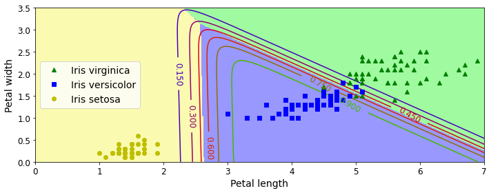


```python
softmax_reg.predict([[5, 2]])
```


    array([2])


```python
softmax_reg.predict_proba([[5, 2]])
```


    array([[6.38014896e-07, 5.74929995e-02, 9.42506362e-01]])


```python

```
